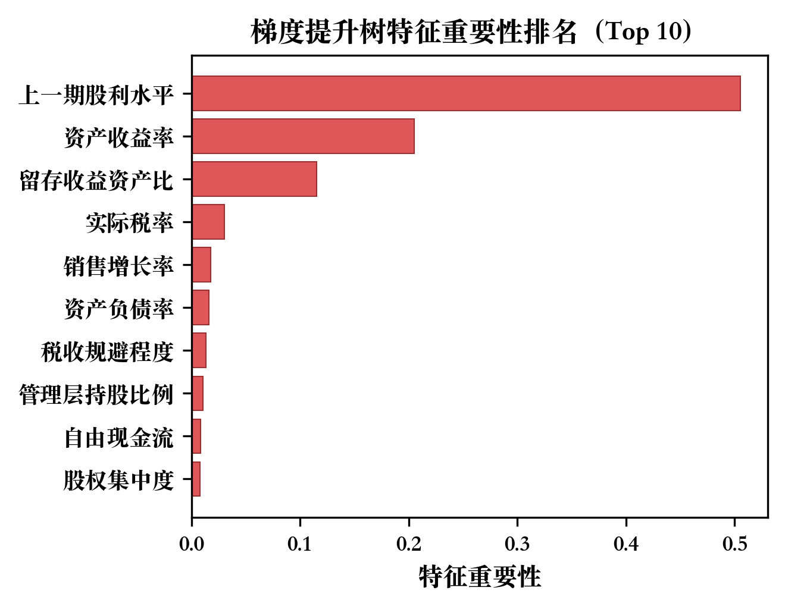
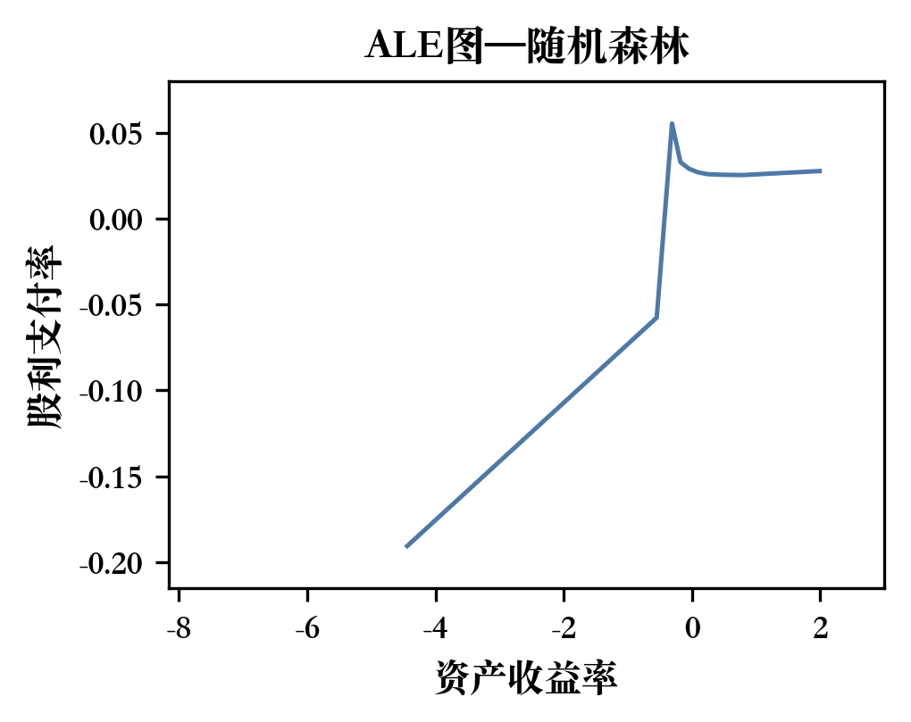
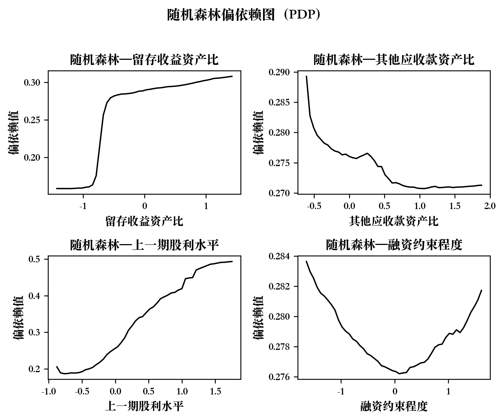

# 附录

**附表A1 RF逐年样本外R²**

| 滚动窗口 | RF 样本外 R² |
|----------|-------------|
| 2006→2007 | 0.1704 |
| 2007→2008 | 0.1347 |
| 2008→2009 | 0.0839 |
| 2009→2010 | 0.1767 |
| 2010→2011 | 0.2722 |
| 2011→2012 | 0.0786 |
| 2012→2013 | 0.1840 |
| 2013→2014 | 0.2616 |
| 2014→2015 | 0.2490 |
| 2015→2016 | 0.2429 |
| 2016→2017 | 0.3217 |
| 2017→2018 | 0.3011 |
| 2018→2019 | 0.3527 |
| 2019→2020 | 0.3981 |
| 2020→2021 | 0.3938 |
| 2021→2022 | 0.3945 |

注：数据来源于 CSMAR 数据库，作者计算。

**附表A2 PCA主成分解释方差与关键载荷**

| 主成分 | 解释方差占比 | 累积方差占比 | Top 1 载荷变量 | Top 2 载荷变量 | Top 3 载荷变量 |
|--------|------------|------------|--------------|--------------|--------------|
| PC1 | 9.88% | 9.88% | 资产收益率(+0.40) | 分析师跟踪人数(+0.33) | 留存收益资产比(+0.33) |
| PC2 | 7.30% | 17.18% | 账面市值比(+0.31) | 股权集中度(+0.31) | 公司规模(+0.30) |
| PC3 | 5.76% | 22.94% | 投资者情绪(+0.36) | 机构投资者持股(+0.33) | 管理层持股(-0.29) |
| PC4 | 4.72% | 27.66% | 融资约束程度(+0.48) | 中小股东持股(-0.41) | 股权集中度(+0.33) |
| PC5 | 4.41% | 32.07% | 资产负债率(+0.42) | 董事长持股(+0.33) | 管理层持股(+0.32) |
| PC6 | 4.17% | 36.24% | 每股经营现金流(+0.51) | 自由现金流(+0.46) | 中小股东持股(-0.22) |
| PC7 | 3.78% | 40.02% | 销售增长率(+0.39) | 市场化程度(-0.29) | 管理费用率(-0.29) |
| PC8 | 3.55% | 43.57% | 董事长薪酬(+0.46) | 董事长任期(+0.37) | 机构投资者持股(+0.27) |
| PC9–18 | 37.79% | 81.36% | — | — | — |

注：数据来源于 CSMAR 数据库，PCA 以 2006 年截面为基准拟合，作者计算。PC9–18 因单个解释方差均低于 3.5% 故合并列示。

**附表A3 PCA降维特征与原始特征的模型预测性能对比**

| 模型-特征组合 | 样本内 R² | 样本外 R² | MSE | MAE |
|-------------|----------|----------|------|------|
| RF-原始71特征 | 0.9018 | **0.2510** | 0.0776 | 0.1624 |
| RF-PCA(18)特征 | 0.8814 | 0.0576 | 0.0958 | 0.2003 |
| GBDT-原始71特征 | 0.6075 | **0.2368** | 0.0790 | 0.1646 |
| GBDT-PCA(18)特征 | 0.4741 | 0.0818 | 0.0940 | 0.1988 |

注：数据来源于 CSMAR 数据库，PCA 以 2006 年截面为基准拟合（K=18），作者计算。

**附表A4 子样本稳健性检验结果**

| 子样本 | 观测数 | 滚动窗口数 | RF 样本外 R² | GBDT 样本外 R² | RF Top 3 | GBDT Top 3 |
|--------|--------|-----------|-------------|---------------|----------|-----------|
| 全样本 | 31,469 | 16 | 0.2510 | 0.2368 | Dividend_lag, ROA, Retainedearn_ratio | Dividend_lag, ROA, Retainedearn_ratio |
| 国有企业 | 13,294 | 16 | 0.2540 | 0.2237 | Dividend_lag, ROA, Retainedearn_ratio | Dividend_lag, ROA, Retainedearn_ratio |
| 非国有企业 | 18,175 | 16 | 0.2183 | 0.1784 | Dividend_lag, ROA, Retainedearn_ratio | Dividend_lag, ROA, Retainedearn_ratio |
| 高现金流 | 15,588 | 16 | 0.2452 | 0.1872 | Dividend_lag, Retainedearn_ratio, ROA | Dividend_lag, ROA, Retainedearn_ratio |
| 低现金流 | 15,588 | 16 | 0.1913 | 0.1735 | Dividend_lag, ROA, Retainedearn_ratio | Dividend_lag, ROA, Tax_ratio |
| 2011年及之前 | 5,722 | 5 | 0.1690 | 0.1516 | Dividend_lag, ROA, Retainedearn_ratio | Dividend_lag, ROA, Retainedearn_ratio |
| 2014年及之后 | 22,421 | 8 | 0.3303 | 0.3203 | Dividend_lag, ROA, Retainedearn_ratio | Dividend_lag, ROA, Retainedearn_ratio |

注：数据来源于 CSMAR 数据库，作者计算。按产权性质和现金流水平分组为全样本二分（现金流分组因缺失值损失 293 个观测）；时间分组以半强制分红政策实施为界，2012—2013 年作为过渡期未纳入任一子样本。

**附图A1 梯度提升树特征重要性排序（Top 10，16轮滚动平均）**

**附图A2 资产收益率（ROA）的累积局部效应（RF）**

**附图A3 随机森林偏依赖图（PDP）网格**

**附图A4 梯度提升树偏依赖图（PDP）网格**

**附图A5 PCA碎石图（35个连续金融特征）**

**附图A6 PCA载荷热力图（前8个主成分）**

