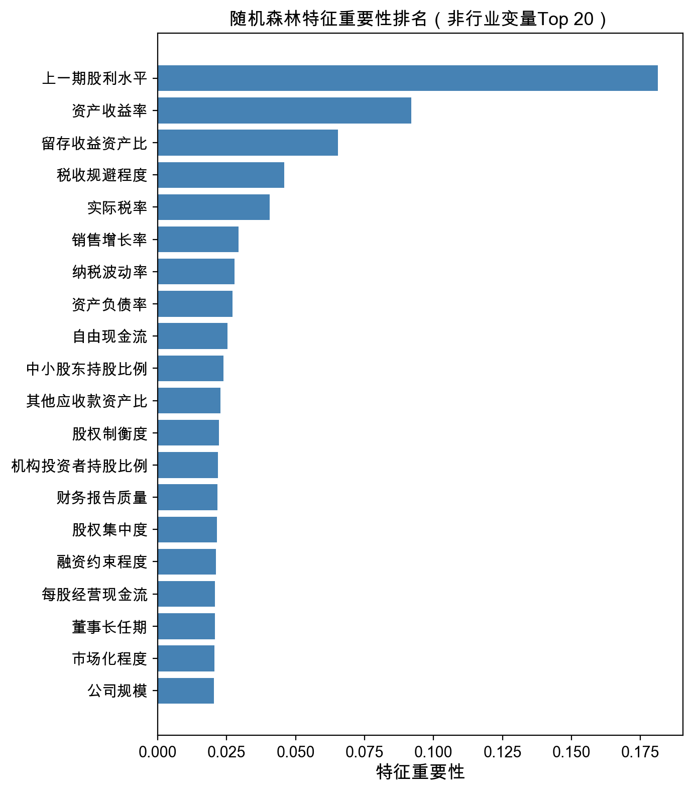
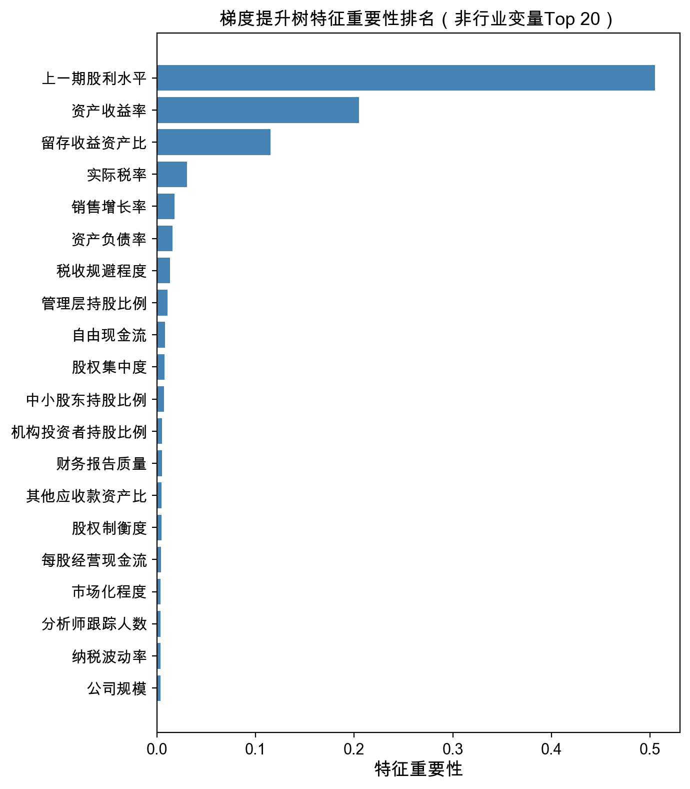
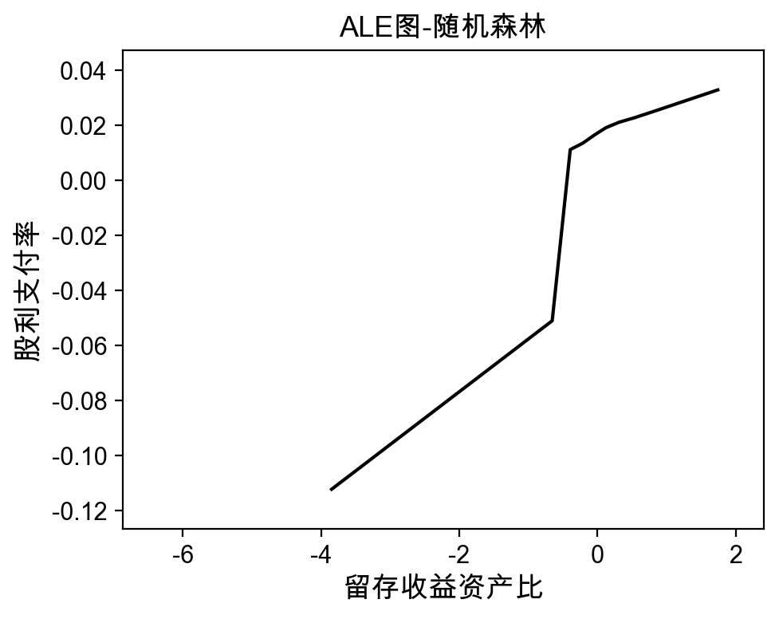
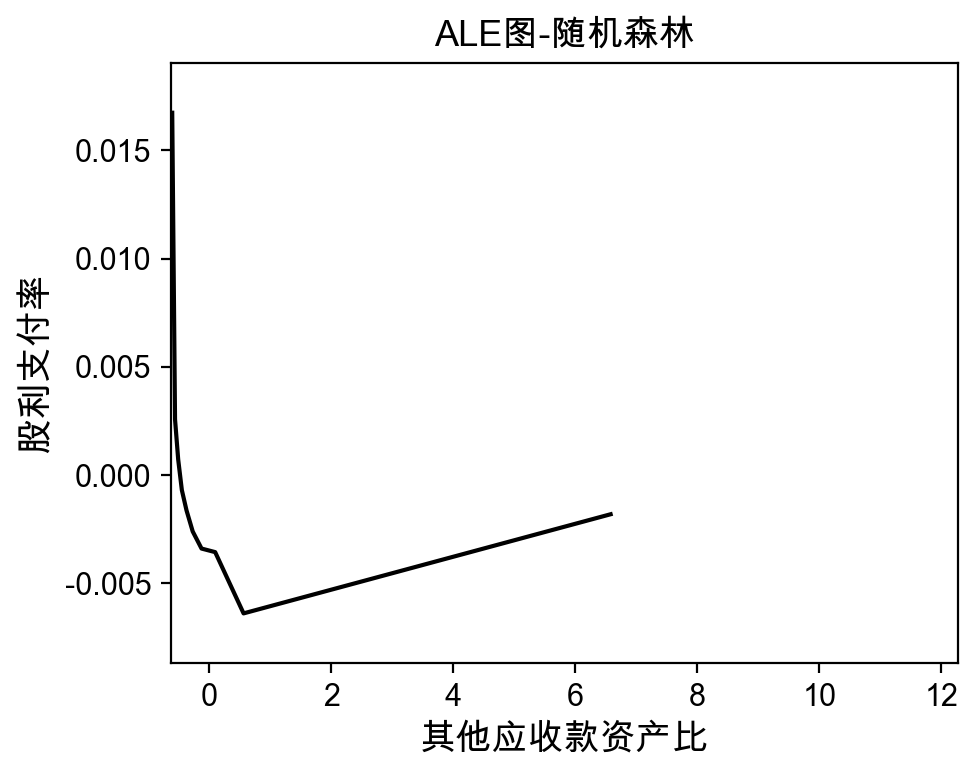
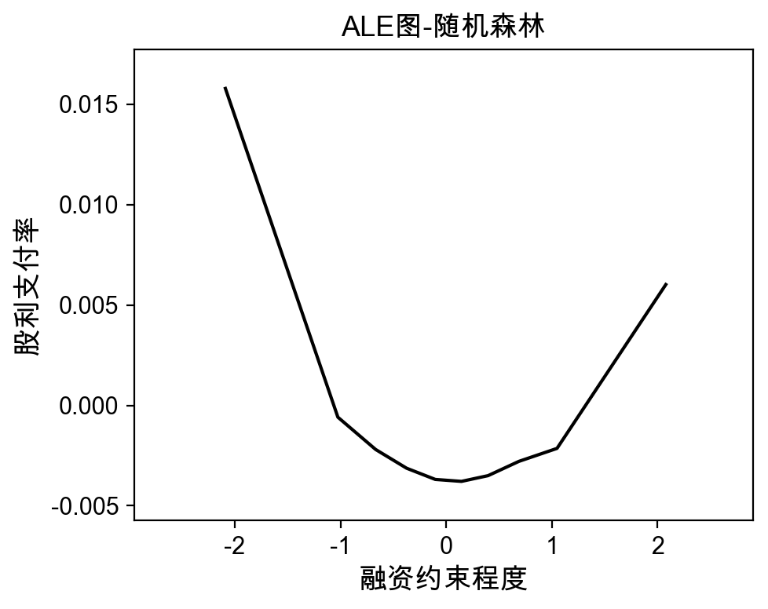
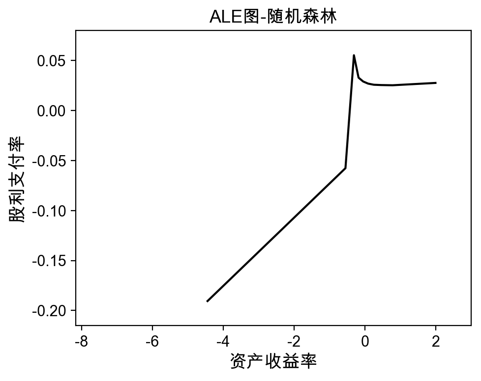
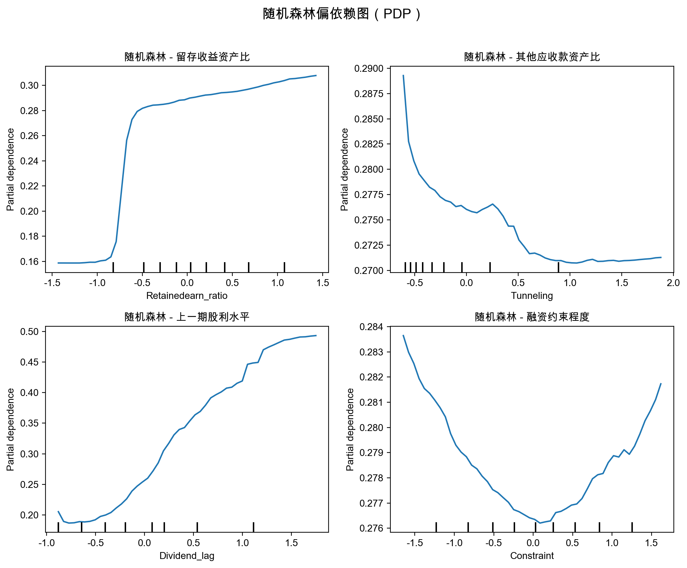
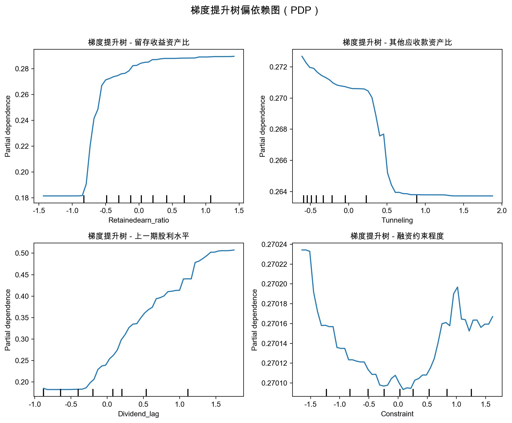

# 第三章 上市公司分红的动因预测分析

## 3.1 样本选择与数据来源

本章以 2006—2022 年沪深 A 股上市公司为研究样本，数据来源于 CSMAR 数据库。参照陈运森等（2024）的样本处理方式，剔除金融行业、ST 公司以及关键变量缺失的样本后，最终获得 31,469 个公司-年度观测值。样本覆盖 17 个年度截面，各年度观测数从 2006 年的 799 个逐年递增至 2022 年的 3,636 个，反映了中国资本市场的持续扩容趋势。

## 3.2 变量定义

### 3.2.1 被解释变量

本章采用两类被解释变量刻画上市公司分红行为。（1）**股利支付率**（Dividend_ratio1），即每股现金股利与每股收益之比，为主回归中的连续型响应变量，反映公司利润中向股东分配的比例。全样本均值为 0.2696，标准差为 0.3240，表明中国上市公司整体分红比率适中，但个体间差异显著。（2）**是否发放现金股利**（Dividend），当年发放现金股利取 1，否则取 0，为分类任务的二元响应变量。全样本中约 69.5% 的公司-年度观测值发放了现金股利。

### 3.2.2 解释变量

本章使用 35 个公司层面特征变量和 36 个证监会行业分类虚拟变量，共计 71 个候选预测因子。35 个公司特征可归为以下五类：

**（一）公司治理与代理成本类**（16 个变量）。包括管理费用率、管理层持股比例、独立董事比例、其他应收款资产比（Tunneling，大股东掏空的常用代理变量）、机构投资者持股比例、控股股东股权质押比例等。此类变量刻画了公司内部的利益冲突程度与外部监督强度，是检验代理理论预测分红动因的核心指标。

**（二）生命周期与盈利能力类**（6 个变量）。核心变量为留存收益资产比（Retainedearn_ratio），被广泛视为企业生命周期阶段的代理变量，全样本均值为 0.1625。此外，资产收益率（ROA）、自由现金流、上一期股利水平等反映了公司的盈利能力和分红持续性。

**（三）税收与融资约束类**（5 个变量）。包括实际税率、税收规避程度、纳税波动率、融资约束程度（KZ 指数）和再融资动机等。

**（四）市场环境与估值类**（8 个变量）。包括投资者情绪、托宾 Q、账面市值比、资产负债率、公司规模、分析师跟踪人数、市场化程度和产权性质等。

**（五）行业虚拟变量**（36 个）。按证监会行业分类标准设置，控制行业层面的系统性差异。

## 3.3 机器学习模型

### 3.3.1 预测框架

本章沿用陈运森等（2024）提出的"一年期滚动训练"预测范式：以 t 年截面数据作为训练集，t+1 年截面数据作为测试集，滚动执行 16 轮预测（2006→2007, 2007→2008, …, 2021→2022）。所有特征在训练前以 2006 年截面为基准进行标准化处理（StandardScaler），以消除量纲差异。这一预测框架的核心优势在于：训练与测试严格按时间切分，模拟了真实的事前预测场景，有效避免了前视偏差（look-ahead bias），使样本外 R² 具有较强的经济含义——它衡量的是模型利用历史信息预测次年分红行为的真实能力。

### 3.3.2 模型设定

本章以两类集成学习模型为核心分析工具：

**随机森林（RF）**。Breiman（2001）提出的随机森林通过 bootstrap 重抽样构建大量决策树，并在每个分裂节点随机抽取特征子集，最终取所有树的平均预测值。本章设定树的数量为 5,000 棵，每次分裂候选特征数为 19，以平衡模型的偏差与方差。RF 的特征重要性基于每个变量在所有树中分裂时带来的不纯度减少量（Gini importance）取平均。

**梯度提升树（GBDT）**。Friedman（2001）提出的梯度提升方法以前向逐步加法建模为核心思想，每轮迭代拟合上一轮残差的方向梯度。本章设定迭代次数 3,000 轮、最大树深 4、学习率 0.001、子采样率 0.7，以确保模型充分学习的同时控制过拟合风险。

作为性能基准，本章还报告了以下传统模型的预测结果：OLS 线性回归（仅使用 35 个非行业变量）、Lasso 回归（通过 L1 正则化实现特征选择）、支持向量回归（SVR）和决策树回归。

### 3.3.3 可解释性工具

为将模型的"黑箱"预测还原为具有经济含义的变量效应，本章综合使用两种可解释性工具：（1）**累积局部效应图（ALE）**，由 Apley and Zhu（2020）提出，通过条件分布而非边际分布衡量变量的局部效应，克服了传统偏依赖图（PDP）在变量高度相关时可能产生的误导性。ALE 图展示的是，当某变量值在其分布范围内变化时，模型预测值的累积偏移，直观揭示变量对被解释变量的非线性影响路径。（2）**偏依赖图（PDP）**，展示单一变量在控制其他变量后对预测值的边际效应，在变量间相关性较低时具有良好的直观性。

## 3.4 预测结果比较

### 3.4.1 模型性能对比

表1汇报了各模型在 16 轮滚动预测中的平均性能指标。在样本外预测精度（R²）这一最关键指标上，**随机森林（0.2510）和梯度提升树（0.2368）显著优于所有传统方法**——OLS 的样本外 R² 仅为 0.1565，Lasso 为 0.1805，SVR 为 0.1613，决策树甚至为负值（-0.0155），表明单棵决策树在此任务上几乎没有泛化能力。从 MSE、MAE 和 MedAE 等辅助指标来看，RF 和 GBDT 也全面领先，确认了集成学习方法在捕捉分红决策的非线性与交互效应方面的比较优势。

**表1 各模型预测性能对比（16轮滚动预测平均值）**

| 模型 | 样本内 R² | 样本外 R² | MSE | MAE | MedAE | EVS |
|------|----------|----------|------|------|-------|------|
| OLS | 0.2490 | 0.1565 | 0.0871 | 0.1834 | 0.1254 | 0.1812 |
| Lasso | 0.2386 | 0.1805 | 0.0850 | 0.1794 | 0.1229 | 0.1928 |
| Decision Tree | 0.0446 | -0.0155 | 0.1039 | 0.2167 | 0.1876 | -0.0040 |
| SVR | 0.5964 | 0.1613 | 0.0868 | 0.1788 | 0.1177 | 0.1675 |
| GBDT | 0.6075 | **0.2368** | 0.0790 | 0.1646 | 0.1008 | 0.2518 |
| RF | 0.9018 | **0.2510** | **0.0776** | **0.1624** | **0.0984** | **0.2703** |

注：数据来源于 CSMAR 数据库，作者计算。

值得注意的是，RF 的样本内 R² 高达 0.9018，与样本外 R²（0.2510）之间存在较大落差，反映了随机森林在训练数据上的强拟合特性；GBDT 的样本内 R²（0.6075）则更为温和，与样本外 R²（0.2368）的差距较小，表明其正则化机制更为有效。两种模型在样本外性能上的差异不大（RF 略优约 1.4 个百分点），且均显著优于线性基准，验证了机器学习方法在分红预测中的实用价值。

### 3.4.2 逐年预测趋势

表2汇报了 RF 逐年样本外 R² 的变化趋势。

**表2 RF逐年样本外R²**

| 滚动窗口 | RF 样本外 R² |
|----------|-------------|
| 2006→2007 | 0.1704 |
| 2007→2008 | 0.1347 |
| 2008→2009 | 0.0839 |
| 2009→2010 | 0.1767 |
| 2010→2011 | 0.2722 |
| 2011→2012 | 0.0786 |
| 2012→2013 | 0.1840 |
| 2013→2014 | 0.2616 |
| 2014→2015 | 0.2490 |
| 2015→2016 | 0.2429 |
| 2016→2017 | 0.3217 |
| 2017→2018 | 0.3011 |
| 2018→2019 | 0.3527 |
| 2019→2020 | 0.3981 |
| 2020→2021 | 0.3938 |
| 2021→2022 | 0.3945 |

注：数据来源于 CSMAR 数据库，作者计算。

从 RF 的逐年样本外 R² 来看，预测精度呈现出显著的时间趋势：早期窗口（2006→2007 至 2011→2012）的 R² 波动于 0.08 至 0.27 之间，而后期窗口（2016→2017 至 2021→2022）稳定在 0.30 至 0.39 之间。这一改善可能源于两方面原因：一是随着样本量的增长，模型可学习的结构性信息更为丰富；二是中国上市公司分红行为在半强制分红政策和市场成熟化的双重推动下，逐步呈现更强的可预测性。

## 3.5 特征重要性分析

### 3.5.1 特征重要性排序

表3汇报了 RF 和 GBDT 在 16 轮滚动预测中平均特征重要性排名前 10 的变量。两个模型的排名呈现高度一致性：

**表3 RF与GBDT特征重要性排名（Top 10）**

| 排名 | RF 变量 | RF 重要性 | GBDT 变量 | GBDT 重要性 |
|------|---------|----------|-----------|------------|
| 1 | Dividend_lag | 17.82% | Dividend_lag | 30.46% |
| 2 | ROA | 7.89% | ROA | 12.74% |
| 3 | Retainedearn_ratio | 6.31% | Retainedearn_ratio | 6.66% |
| 4 | Tax_ratio | 4.40% | Tax_ratio | 4.96% |
| 5 | Tax_avoid | 3.91% | Lev | 2.78% |
| 6 | Tax_volatility | 3.30% | Growth | 2.62% |
| 7 | Growth | 2.91% | Tax_volatility | 2.18% |
| 8 | Lev | 2.89% | Da_abs | 2.05% |
| 9 | Tunneling | 2.61% | Institution | 2.04% |
| 10 | Freecash2 | 2.53% | Tunneling | 2.00% |

注：数据来源于 CSMAR 数据库，作者计算。

图1和图2分别以柱状图展示了 RF 和 GBDT 的特征重要性排序全貌。

**图1 随机森林特征重要性排序（16轮滚动平均）**

**图2 梯度提升树特征重要性排序（16轮滚动平均）**

**排名第一的均为上一期股利水平（Dividend_lag）**，在 RF 中贡献了 17.8% 的平均重要性，在 GBDT 中更高达 30.5%。这一结果与 Lintner（1956）的股利平滑理论高度吻合——管理者倾向于维持稳定的分红水平，使上期股利成为当期最强的预测锚。

**排名第二的为资产收益率（ROA）**，在两个模型中分别贡献 7.9% 和 12.7% 的重要性。盈利能力是分红的物质基础，ROA 的高排名符合基本经济逻辑。

**排名第三的为留存收益资产比（Retainedearn_ratio）**，两个模型中均贡献约 6.3%—6.7% 的重要性。这是生命周期理论最核心的代理变量：留存收益占比高的成熟企业，投资机会减少而现金盈余充裕，更倾向于向股东分配利润，验证了 Fama and French（2001）的经典发现在中国市场的适用性。

**代理成本变量同样进入前 10 名**。其他应收款资产比（Tunneling）在 RF 和 GBDT 中分别排名第 9 和第 10，反映了大股东资金占用对分红的抑制效应；机构投资者持股比例（Institution）在两个模型中分别排名第 11 和第 9，说明外部监督力量对分红行为具有正向推动作用。

**税收相关变量表现突出**。实际税率（Tax_ratio）在两个模型中均排名第 4，税收规避程度和纳税波动率也均进入前 10，表明税收因素对分红决策的影响不容忽视，但其具体机制仍待进一步检验。

总体而言，**特征重要性排序支持假设 H1**：生命周期变量（留存收益资产比 Top 3）与代理成本变量（掏空指标 Top 10、机构投资者持股比例 Top 11）是预测分红行为最重要的变量类别之一，与理论预期一致。

### 3.5.2 非线性效应分析

ALE 图进一步揭示了关键变量对股利支付率的非线性影响路径。图3至图6展示了四个核心变量的 RF ALE 图。

**图3 留存收益资产比的累积局部效应（RF）**

**留存收益资产比**的 ALE 图呈现明显的递增趋势：当留存收益资产比从负值区间（表示累积亏损）上升至 0.3 以上时，其对股利支付率的累积局部效应从约 -0.08 上升至 +0.05，且在高值区间效应增速放缓，呈现出"先快后慢"的非线性特征。这一结果表明，企业从亏损期过渡到成熟期的过程中，分红倾向经历了从低到高的系统性转变，且到达高留存收益水平后边际效应趋于饱和——可能反映了成熟企业分红已接近稳态均衡。

**图4 其他应收款资产比（Tunneling）的累积局部效应（RF）**

**其他应收款资产比**的 ALE 图呈现显著的递减趋势：随着该变量从低值向高值变化，累积效应持续为负，且在高值区间（掏空程度严重时）加速下降。这一非线性特征说明，大股东掏空对分红的抑制效应并非线性等比例的，而是在掏空程度超过一定阈值后呈现加速恶化趋势。

**图5 融资约束程度（KZ指数）的累积局部效应（RF）**

**融资约束程度**（KZ 指数）的 ALE 图同样呈递减趋势，表明融资约束越强，股利支付率越低。这与预防性储蓄假说一致：面临严格融资约束的企业更倾向于保留现金以应对流动性风险，压低分红。

**图6 资产收益率（ROA）的累积局部效应（RF）**

**资产收益率**的 ALE 图呈现单调递增趋势且斜率较为稳定，说明盈利能力对分红的边际效应相对线性，是一个"基本面驱动"变量。

此外，图7和图8分别展示了 RF 和 GBDT 的偏依赖图（PDP）网格，呈现 Top 变量对预测值的边际效应全景。

**图7 随机森林偏依赖图（PDP）网格**

**图8 梯度提升树偏依赖图（PDP）网格**

## 3.6 子样本稳健性检验

为检验上述关键动因识别结果的稳健性，本章进一步在多个子样本上重复一年期滚动预测分析。表4汇报了各子样本的预测性能与 Top 3 特征。

**表4 子样本稳健性检验结果**

| 子样本 | 观测数 | 滚动窗口数 | RF 样本外 R² | GBDT 样本外 R² | RF Top 3 | GBDT Top 3 |
|--------|--------|-----------|-------------|---------------|----------|-----------|
| 全样本 | 31,469 | 16 | 0.2520 | 0.2368 | Dividend_lag, ROA, Retainedearn_ratio | Dividend_lag, ROA, Retainedearn_ratio |
| 国有企业 | 13,294 | 16 | 0.2540 | 0.2237 | Dividend_lag, ROA, Retainedearn_ratio | Dividend_lag, ROA, Retainedearn_ratio |
| 非国有企业 | 18,175 | 16 | 0.2183 | 0.1784 | Dividend_lag, ROA, Retainedearn_ratio | Dividend_lag, ROA, Retainedearn_ratio |
| 高现金流 | 15,588 | 16 | 0.2452 | 0.1872 | Dividend_lag, Retainedearn_ratio, ROA | Dividend_lag, ROA, Retainedearn_ratio |
| 低现金流 | 15,588 | 16 | 0.1913 | 0.1735 | Dividend_lag, ROA, Retainedearn_ratio | Dividend_lag, ROA, Tax_ratio |
| 2012年之前 | 5,722 | 5 | 0.1690 | 0.1516 | Dividend_lag, ROA, Retainedearn_ratio | Dividend_lag, ROA, Retainedearn_ratio |
| 2012年及之后 | 22,421 | 8 | 0.3303 | 0.3203 | Dividend_lag, ROA, Retainedearn_ratio | Dividend_lag, ROA, Retainedearn_ratio |

注：数据来源于 CSMAR 数据库，作者计算。

**按产权性质分组**。将样本分为国有企业（13,294 个观测值）和非国有企业（18,175 个观测值）。国有企业组的 RF 样本外 R² 为 0.2540，GBDT 为 0.2237；非国有企业组的 RF 样本外 R² 为 0.2183，GBDT 为 0.1784。两组子样本的特征重要性前 3 名变量均为上一期股利水平、ROA 和留存收益资产比，与全样本完全一致。国有企业组的预测精度略高于非国有企业组，可能反映了国有企业分红行为的合规驱动特征使其更具可预测性。

**按现金流水平分组**。将样本按自由现金流中位数分为高现金流组和低现金流组（各 15,588 个观测值）。高现金流组的 RF 样本外 R² 为 0.2452，GBDT 为 0.1872；低现金流组的 RF 为 0.1913，GBDT 为 0.1735。值得注意的是，高现金流组中留存收益资产比（RF Top 2）的排名超过了 ROA（RF Top 3），反映了在现金流充裕的企业中，生命周期阶段对分红决策的主导性更为突出；高现金流组的 GBDT 中自由现金流（Freecash2）也进入了前 5 名。

**按时间窗口分组**。将样本分为 2012 年之前（5,722 个观测值）和 2012 年及之后（22,421 个观测值）两个子期。后期子样本的预测精度大幅优于前期——RF 样本外 R² 从 0.1690 提升至 0.3303，GBDT 从 0.1516 提升至 0.3203。特征重要性前 3 名在两个子期均保持稳定。后期预测精度的显著提升可能反映了两方面因素：一是样本量的增长提供了更丰富的训练信息，二是 2012 年后半强制分红政策的持续强化使企业分红行为更加规则化，提高了可预测性。

综上，子样本分析确认了 RF 和 GBDT 识别出的关键动因——生命周期变量、代理成本变量和盈利能力变量——在不同分组口径下均保持稳健，支持假设 H1。

## 3.7 本章小结

本章通过一年期滚动预测框架，系统比较了 6 种模型在预测中国上市公司股利支付率方面的性能，并利用特征重要性和 ALE 图识别了驱动分红行为的关键因素。主要发现包括：

**第一**，集成学习方法（RF 和 GBDT）的样本外预测精度显著优于传统线性模型，RF 的平均样本外 R² 为 0.2510，GBDT 为 0.2368，而 OLS 仅为 0.1565，验证了非线性方法在分红预测中的比较优势。

**第二**，特征重要性分析表明，上一期股利水平、资产收益率和留存收益资产比是预测分红行为最重要的三个变量，在 RF 和 GBDT 中均稳定居于前三名。其中，留存收益资产比作为生命周期代理变量的突出地位，与 Fama and French（2001）和陈运森等（2024）的发现一致。

**第三**，代理成本变量（其他应收款资产比、机构投资者持股比例）和融资约束变量同样进入重要性排名前列，且通过 ALE 图呈现出经济直觉一致的非线性效应模式，为代理理论和融资约束假说在中国情境下的适用性提供了补充证据。

**第四**，上述关键动因识别结果在按产权性质、现金流水平和时间窗口划分的子样本中均保持稳健，**假设 H1 得到支持**。

这些被机器学习系统性筛选出的关键动因——尤其是生命周期变量和代理成本变量——是否以及如何受到外部监管政策的影响？第四章将以 2023 年《现金分红指引》修订为准自然实验，通过双重差分方法对这一问题展开因果评估。
