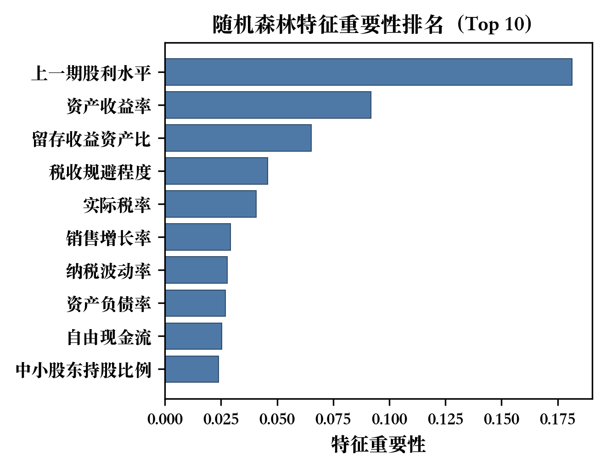
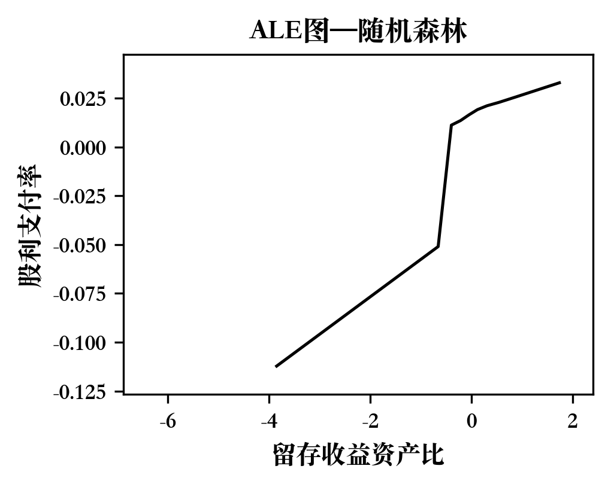
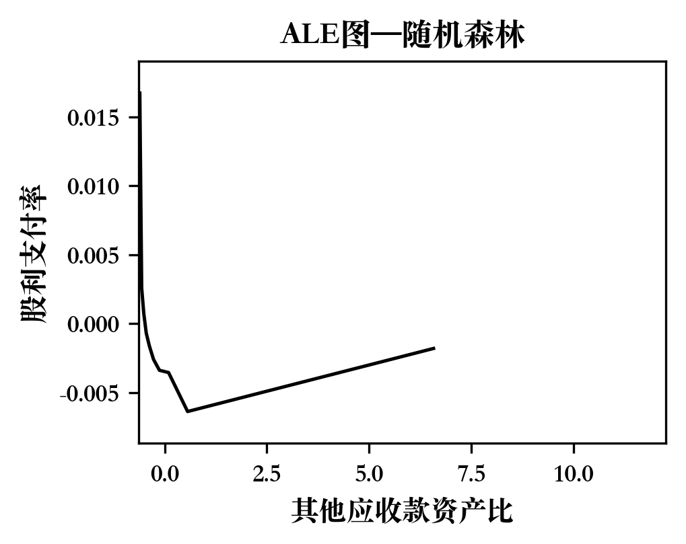
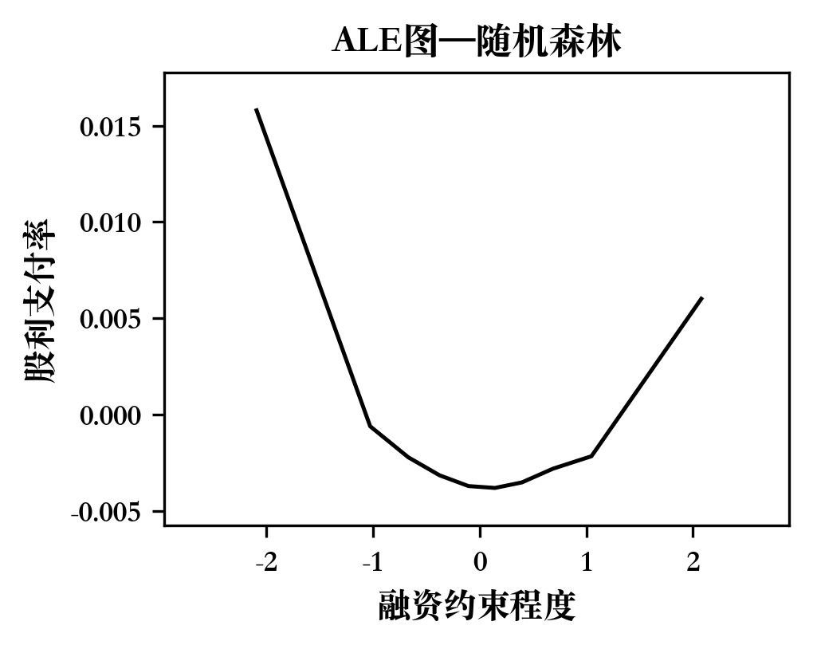
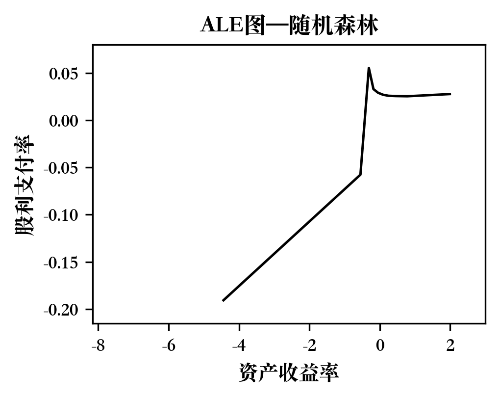
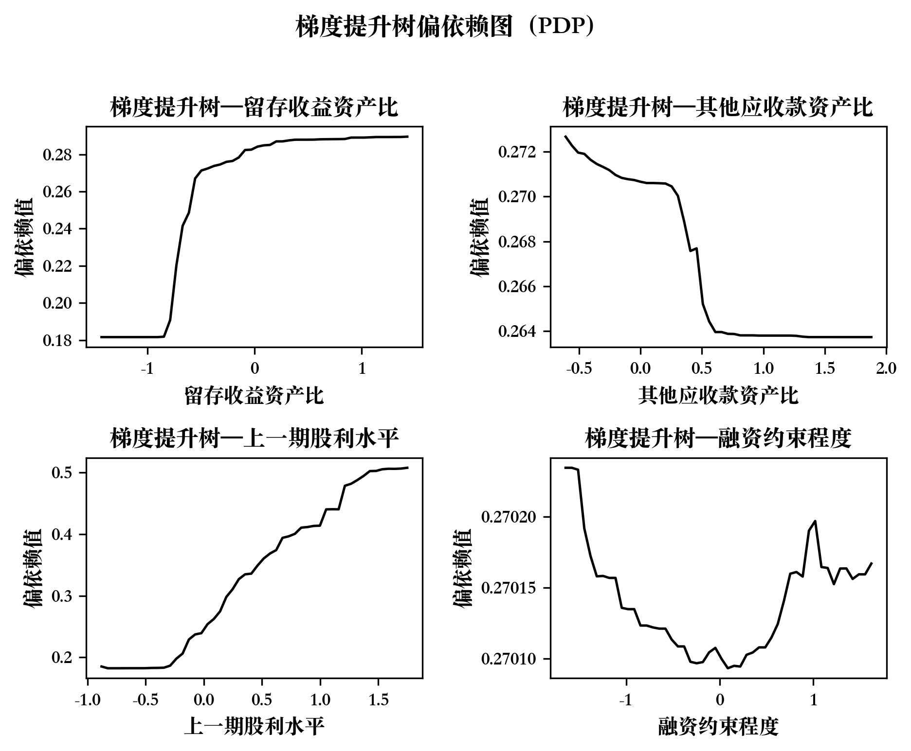
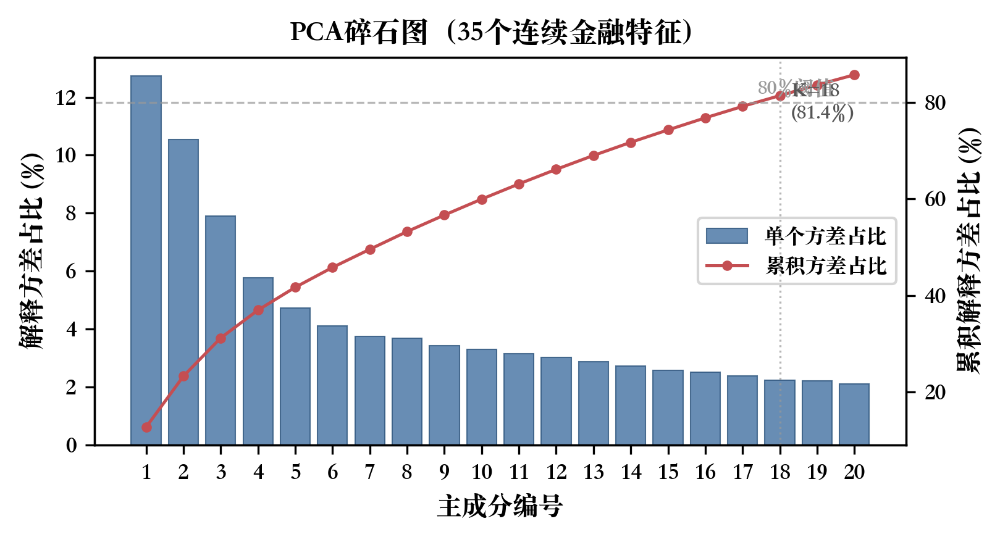
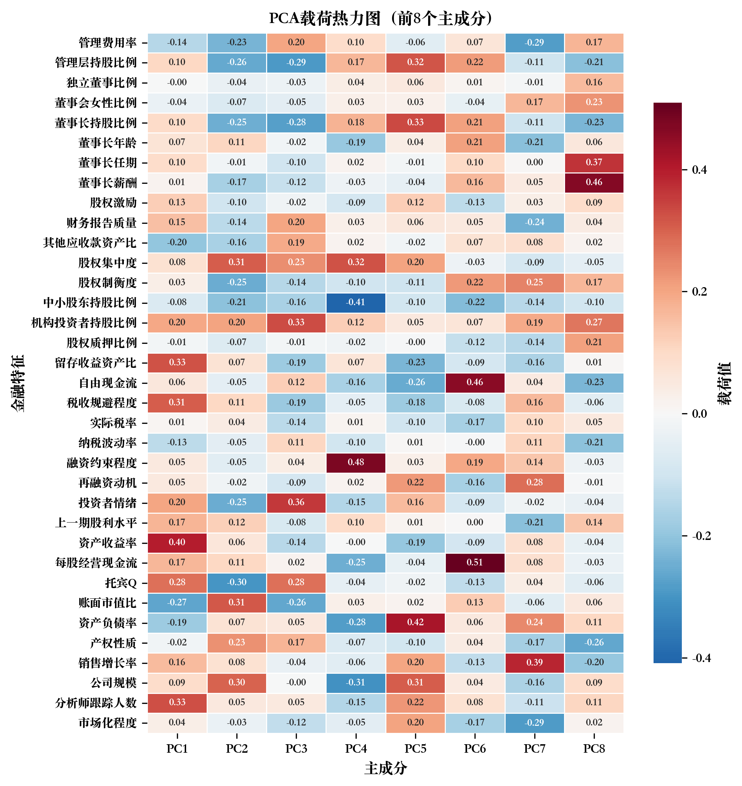

# 第三章 上市公司分红的动因预测分析

## 3.1 样本选择与数据来源

本章以 2006—2022 年沪深 A 股上市公司为研究样本，数据来源于 CSMAR 数据库。参照陈运森等（2024）的样本处理方式，依次剔除以下样本：（1）金融行业上市公司；（2）ST、*ST 及 PT 公司；（3）关键财务变量（资产收益率、资产负债率、留存收益资产比等）缺失的观测值。最终获得 31,469 个公司-年度观测值，涵盖 17 个年度截面。各年度观测数从 2006 年的 799 个增至 2022 年的 3,636 个。

## 3.2 变量定义

### 3.2.1 被解释变量

本章采用两类被解释变量刻画上市公司分红行为。（1）**股利支付率**（Dividend_ratio1），定义为每股现金股利与每股收益之比。对于每股收益为零或负的观测值，股利支付率赋值为 0。该变量为主回归中的连续型响应变量，全样本均值为 0.2696，标准差为 0.3240。（2）**是否发放现金股利**（Dividend），当年发放现金股利取 1，否则取 0。全样本中约 69.5% 的观测值发放了现金股利。本章以股利支付率的预测为主要分析任务，是否分红的二元分类任务作为补充参考。

### 3.2.2 解释变量

本章使用 35 个公司层面特征变量和 36 个证监会行业分类虚拟变量，共计 71 个候选预测因子。35 个公司特征可归为以下五类：

**（一）公司治理与代理成本类**（16 个变量）。包括管理费用率、管理层持股比例、独立董事比例、其他应收款资产比（Tunneling，参照李增泉等（2004）和 Jiang et al.（2010），以其他应收款占总资产之比衡量大股东资金占用）、机构投资者持股比例、控股股东股权质押比例等。此类变量刻画了公司内部的利益冲突程度与外部监督强度。

**（二）生命周期与盈利能力类**（6 个变量）。核心变量为留存收益资产比（Retainedearn_ratio），即留存收益与总资产之比，参照 DeAngelo et al.（2006）作为企业生命周期阶段的代理变量，全样本均值为 0.1625。此外还包括资产收益率（ROA）、自由现金流、上一期股利水平等，反映公司的盈利能力和分红持续性。

**（三）税收与融资约束类**（5 个变量）。包括实际税率、税收规避程度、纳税波动率、融资约束程度（KZ 指数，参照 Kaplan and Zingales（1997）构建）和再融资动机等。

**（四）市场环境与估值类**（8 个变量）。包括投资者情绪、托宾 Q、账面市值比、资产负债率、公司规模、分析师跟踪人数、市场化程度和产权性质等。

**（五）行业虚拟变量**（36 个）。按证监会行业分类标准设置，控制行业层面的系统性差异。

## 3.3 机器学习模型

### 3.3.1 预测框架

本章沿用陈运森等（2024）提出的"一年期滚动训练"预测范式：以 t 年截面数据作为训练集，t+1 年截面数据作为测试集，滚动执行 16 轮预测（2006→2007, 2007→2008, …, 2021→2022）。所有特征在每轮训练前以当轮训练集为基准进行标准化处理（StandardScaler），以消除量纲差异。该框架的核心优势在于训练与测试严格按时间切分，模拟真实的事前预测场景，避免了前视偏差（look-ahead bias）。因此，样本外 R² 衡量的是模型利用历史信息预测次年分红行为的能力，具有较强的经济含义。

### 3.3.2 模型设定

本章以两类集成学习模型为核心分析工具：

**随机森林（RF）**。Breiman（2001）提出的随机森林通过 bootstrap 重抽样构建大量决策树，并在每个分裂节点随机抽取特征子集，最终取所有树的平均预测值。本章设定树的数量为 5,000 棵，每次分裂候选特征数为 19，以平衡偏差与方差。特征重要性基于各变量在所有树中分裂时带来的均方误差（MSE）降低量取平均（即不纯度降低法）。

**梯度提升树（GBDT）**。Friedman（2001）提出的梯度提升方法以前向逐步加法建模为核心思想，每轮迭代拟合上一轮残差的方向梯度。本章设定迭代次数 3,000 轮、最大树深 4、学习率 0.001、子采样率 0.7，以确保模型充分学习的同时控制过拟合风险。

作为性能基准，本章还报告了以下传统模型的预测结果：OLS 线性回归、Lasso 回归（通过 L1 正则化实现特征选择）、支持向量回归（SVR）和决策树回归。其中，OLS 仅使用 35 个连续特征而未加入行业虚拟变量，其余模型均使用全部 71 个特征；因此 OLS 的 R² 可能因特征数量较少而偏低，对其结果的比较需考虑这一口径差异。

### 3.3.3 可解释性工具

为将模型的"黑箱"预测还原为具有经济含义的变量效应，本章综合使用两种可解释性工具。（1）**累积局部效应图（ALE）**，由 Apley and Zhu（2020）提出，通过条件分布而非边际分布衡量变量的局部效应，克服了偏依赖图（PDP）在变量高度相关时的误导性。ALE 图展示某变量值在其分布范围内变化时模型预测值的累积偏移，直观揭示非线性影响路径。（2）**偏依赖图（PDP）**，展示单一变量在控制其他变量后对预测值的边际效应，在变量间相关性较低时直观性较好。需要说明的是，ALE 和 PDP 反映的是变量与预测结果之间的统计关联，而非因果效应；因果推断将在第四章通过准自然实验展开。

## 3.4 预测结果比较

### 3.4.1 模型性能对比

表1汇报了各模型在 16 轮滚动预测中的平均性能指标。在样本外 R² 这一核心指标上，**随机森林（0.2510）和梯度提升树（0.2368）明显优于所有传统方法**：OLS 的样本外 R² 为 0.1565，Lasso 为 0.1805，SVR 为 0.1613，决策树为负值（-0.0155），表明单棵决策树在此任务上几乎没有泛化能力。MSE、MAE 和 MedAE 等辅助指标也呈现一致的排序，确认了集成学习方法在捕捉分红决策非线性关联方面的比较优势。

**表1 各模型预测性能对比（16轮滚动预测平均值）**

| 模型 | 样本内 R² | 样本外 R² | MSE | MAE | MedAE | EVS |
|------|----------|----------|------|------|-------|------|
| OLS | 0.2490 | 0.1565 | 0.0871 | 0.1834 | 0.1254 | 0.1812 |
| Lasso | 0.2386 | 0.1805 | 0.0850 | 0.1794 | 0.1229 | 0.1928 |
| Decision Tree | 0.0446 | -0.0155 | 0.1039 | 0.2167 | 0.1876 | -0.0040 |
| SVR | 0.5964 | 0.1613 | 0.0868 | 0.1788 | 0.1177 | 0.1675 |
| GBDT | 0.6075 | **0.2368** | 0.0790 | 0.1646 | 0.1008 | 0.2518 |
| RF | 0.9018 | **0.2510** | **0.0776** | **0.1624** | **0.0984** | **0.2703** |

注：数据来源于 CSMAR 数据库，作者计算。

RF 的样本内 R² 高达 0.9018，与样本外 R²（0.2510）之间落差较大，反映了随机森林在训练数据上的强拟合特性。GBDT 的样本内 R²（0.6075）与样本外 R²（0.2368）的差距较小，正则化机制对过拟合的控制更为有效。两种模型的样本外性能差异不大（RF 高出约 1.4 个百分点），但均明显优于线性基准，表明集成学习方法能够捕捉到传统线性模型遗漏的非线性结构。

### 3.4.2 逐年预测趋势

表2汇报了 RF 逐年样本外 R² 的变化趋势。

**表2 RF逐年样本外R²**

| 滚动窗口 | RF 样本外 R² |
|----------|-------------|
| 2006→2007 | 0.1704 |
| 2007→2008 | 0.1347 |
| 2008→2009 | 0.0839 |
| 2009→2010 | 0.1767 |
| 2010→2011 | 0.2722 |
| 2011→2012 | 0.0786 |
| 2012→2013 | 0.1840 |
| 2013→2014 | 0.2616 |
| 2014→2015 | 0.2490 |
| 2015→2016 | 0.2429 |
| 2016→2017 | 0.3217 |
| 2017→2018 | 0.3011 |
| 2018→2019 | 0.3527 |
| 2019→2020 | 0.3981 |
| 2020→2021 | 0.3938 |
| 2021→2022 | 0.3945 |

注：数据来源于 CSMAR 数据库，作者计算。

RF 的逐年样本外 R² 呈现明显的上升趋势：早期窗口（2006→2007 至 2011→2012）的 R² 波动于 0.08 至 0.27 之间，而后期窗口（2016→2017 至 2021→2022）稳定在 0.30 至 0.40 之间。这一改善可能与两方面因素有关：一是后期训练集的样本量更大，模型可学习的结构性信息更为丰富；二是2012年以来证监会持续推进半强制分红政策（如2013年《上市公司监管指引第3号》），使企业分红行为逐步规范化，可预测性随之增强。

## 3.5 特征重要性分析

### 3.5.1 特征重要性排序

表3汇报了 RF 和 GBDT 在 16 轮滚动预测中平均特征重要性排名前 10 的变量。两个模型的 Top 10 变量高度重叠，前 3 名完全一致：

**表3 RF与GBDT特征重要性排名（Top 10）**

| 排名 | RF 变量 | RF 重要性 | GBDT 变量 | GBDT 重要性 |
|------|---------|----------|-----------|------------|
| 1 | Dividend_lag | 17.82% | Dividend_lag | 30.46% |
| 2 | ROA | 7.89% | ROA | 12.74% |
| 3 | Retainedearn_ratio | 6.31% | Retainedearn_ratio | 6.66% |
| 4 | Tax_ratio | 4.40% | Tax_ratio | 4.96% |
| 5 | Tax_avoid | 3.91% | Lev | 2.78% |
| 6 | Tax_volatility | 3.30% | Growth | 2.62% |
| 7 | Growth | 2.91% | Tax_volatility | 2.18% |
| 8 | Lev | 2.89% | Da_abs | 2.05% |
| 9 | Tunneling | 2.61% | Institution | 2.04% |
| 10 | Freecash2 | 2.53% | Tunneling | 2.00% |

注：数据来源于 CSMAR 数据库，作者计算。

图1和图2分别以柱状图展示了 RF 和 GBDT 的特征重要性排序全貌。

**图1 随机森林特征重要性排序（16轮滚动平均）**

**图2 梯度提升树特征重要性排序（16轮滚动平均）**

**排名第一的均为上一期股利水平（Dividend_lag）**，在 RF 中贡献了 17.8% 的平均重要性，在 GBDT 中高达 30.5%。这一结果与 Lintner（1956）的股利平滑理论一致：管理者倾向于维持稳定的分红水平，上期股利因而成为当期最强的预测锚。特征重要性衡量的是变量对预测精度的贡献，不直接给出效应方向，但结合 ALE 图（见下文）可进一步判断方向与非线性形态。

**排名第二的为资产收益率（ROA）**，在两个模型中分别贡献 7.9% 和 12.7% 的重要性。盈利能力是分红的物质基础，ROA 的高排名符合基本财务逻辑。

**排名第三的为留存收益资产比（Retainedearn_ratio）**，两个模型中均贡献约 6.3%—6.7% 的重要性。该变量是生命周期理论中衡量企业成熟度的核心代理变量（DeAngelo et al., 2006）：留存收益占比高的企业通常投资机会减少而现金盈余充裕，分红倾向更高，与 Fama and French（2001）的发现一致。

**代理成本变量进入前 10 名**。其他应收款资产比（Tunneling）在 RF 和 GBDT 中分别排名第 9 和第 10，机构投资者持股比例（Institution）分别排名第 11 和第 9。这两个变量从"侵占"与"监督"两侧刻画了代理问题对分红的影响。

**税收相关变量表现突出**。实际税率（Tax_ratio）在两个模型中均排名第 4，税收规避程度和纳税波动率也均进入前 10，表明税收因素与分红决策之间存在较强的统计关联，其具体作用机制有待进一步检验。

总体而言，特征重要性排序**与假设 H1 的预测一致**：生命周期变量（留存收益资产比 Top 3）与代理成本变量（掏空指标 Top 10、机构投资者持股 Top 9—11）是预测分红行为贡献最大的变量类别。

### 3.5.2 非线性效应分析

ALE 图进一步揭示了关键变量对股利支付率的非线性影响路径。图3至图6展示了四个核心变量的 RF ALE 图。

**图3 留存收益资产比的累积局部效应（RF）**

**留存收益资产比**的 ALE 图呈现明显的递增趋势：当留存收益资产比从负值区间（表示累积亏损）上升至 0.3 以上时，其对股利支付率的累积局部效应从约 -0.08 上升至 +0.05，且在高值区间效应增速放缓，呈现出"先快后慢"的非线性特征。这一结果表明，企业从亏损期过渡到成熟期的过程中，分红倾向经历了从低到高的系统性转变，且到达高留存收益水平后边际效应趋于饱和——可能反映了成熟企业分红已接近稳态均衡。

**图4 其他应收款资产比（Tunneling）的累积局部效应（RF）**

**其他应收款资产比**的 ALE 图呈现递减趋势：当该变量从接近 0 上升至 0.05 以上时，累积局部效应从约 0 降至约 -0.03，且在高值区间加速下降。这一非线性形态表明，大股东资金占用对分红的抑制关联并非线性等比例的，而是在掏空程度超过一定阈值后呈现加速恶化的特征。

**图5 融资约束程度（KZ指数）的累积局部效应（RF）**

**融资约束程度**（KZ 指数）的 ALE 图同样呈递减趋势，KZ 指数从低值区间上升至高值区间时，累积效应下降约 0.03—0.04 个单位。这与预防性储蓄假说的预测一致：面临较强融资约束的企业倾向于保留现金以应对流动性风险，分红水平相应较低。

**图6 资产收益率（ROA）的累积局部效应（RF）**

**资产收益率**的 ALE 图呈现单调递增趋势且斜率较为稳定，说明盈利能力对分红的边际效应相对线性，是一个"基本面驱动"变量。

此外，图7和图8分别展示了 RF 和 GBDT 的偏依赖图（PDP）网格，呈现 Top 变量对预测值的边际效应全景。

**图7 随机森林偏依赖图（PDP）网格**

**图8 梯度提升树偏依赖图（PDP）网格**

从 PDP 网格可以观察到，两个模型对核心变量的边际效应模式基本一致：上一期股利水平与股利支付率呈单调正向关联，ROA 呈正向关联，留存收益资产比呈正向但高值区间趋于平缓，资产负债率呈负向关联。RF 与 GBDT 的 PDP 曲线形态高度相似，进一步增强了特征重要性排序结论的可信度。

## 3.6 主成分降维与潜在经济维度分析

上述特征重要性分析从"单变量贡献"角度识别了关键预测因子。然而，35 个连续金融特征之间往往存在较强的多重共线性——例如，ROA、留存收益资产比和自由现金流同属盈利与生命周期维度。为从"降维"角度揭示这些特征背后的潜在经济结构，本节对 35 个连续金融特征（不含 36 个行业虚拟变量）进行主成分分析（PCA），从互补视角验证特征重要性排序的结论。

### 3.6.1 主成分提取与碎石分析

以 2006 年截面数据为基准（与前文 StandardScaler 拟合策略一致），对标准化后的 35 个连续金融特征执行 PCA。图9的碎石图展示了各主成分的解释方差占比及累积趋势。按照累积解释方差不低于 80% 的标准，需保留前 18 个主成分（累积解释方差为 81.36%），说明 35 个金融特征的信息较为分散，不存在少数几个主成分即可概括大部分变异的情形。前 3 个主成分分别解释了约 9.9%、7.3% 和 5.8% 的方差，单个主成分的解释力相对有限，反映了分红决策受到多维度因素的共同驱动。

**图9 PCA碎石图（35个连续金融特征）**

表4列示了前 18 个主成分的解释方差及各主成分上载荷绝对值最大的前 3 个变量。

**表4 PCA主成分解释方差与关键载荷**

| 主成分 | 解释方差占比 | 累积方差占比 | Top 1 载荷变量 | Top 2 载荷变量 | Top 3 载荷变量 |
|--------|------------|------------|--------------|--------------|--------------|
| PC1 | 9.88% | 9.88% | 资产收益率(+0.40) | 分析师跟踪人数(+0.33) | 留存收益资产比(+0.33) |
| PC2 | 7.30% | 17.18% | 账面市值比(+0.31) | 股权集中度(+0.31) | 公司规模(+0.30) |
| PC3 | 5.76% | 22.94% | 投资者情绪(+0.36) | 机构投资者持股(+0.33) | 管理层持股(-0.29) |
| PC4 | 4.72% | 27.66% | 融资约束程度(+0.48) | 中小股东持股(-0.41) | 股权集中度(+0.33) |
| PC5 | 4.41% | 32.07% | 资产负债率(+0.42) | 董事长持股(+0.33) | 管理层持股(+0.32) |
| PC6 | 4.17% | 36.24% | 每股经营现金流(+0.51) | 自由现金流(+0.46) | 中小股东持股(-0.22) |
| PC7 | 3.78% | 40.02% | 销售增长率(+0.39) | 市场化程度(-0.29) | 管理费用率(-0.29) |
| PC8 | 3.55% | 43.57% | 董事长薪酬(+0.46) | 董事长任期(+0.37) | 机构投资者持股(+0.27) |
| PC9–18 | 37.79% | 81.36% | — | — | — |

注：数据来源于 CSMAR 数据库，PCA 以 2006 年截面为基准拟合，作者计算。PC9–18 因单个解释方差均低于 3.5% 故合并列示。

### 3.6.2 主成分载荷的经济解读

图10以热力图形式展示了前 8 个主成分在全部 35 个特征上的载荷值，直观呈现变量与主成分之间的对应关系。

**图10 PCA载荷热力图（前8个主成分）**

从载荷模式可提炼出若干具有经济含义的潜在维度：PC1 以资产收益率、分析师跟踪人数和留存收益资产比为主导，可解读为**"盈利能力与市场关注度"维度**，集中反映了高盈利、高关注度的成熟企业特征。PC2 以账面市值比、股权集中度和公司规模为主导，代表**"公司规模与估值"维度**。PC3 中投资者情绪和机构持股为正载荷、管理层持股为负载荷，对应**"市场情绪与外部监督"维度**。PC4 以融资约束为最高正载荷并与中小股东持股形成反向关系，可解读为**"融资约束与股权结构"维度**。PC6 中现金流和自由现金流占主导，代表**"现金充裕度"维度**。

从载荷模式与特征重要性的交叉验证来看：PC1 中载荷最大的 ROA 和留存收益资产比恰好是特征重要性 Top 3 中的两个核心变量，表明"盈利能力与生命周期"维度在两种分析视角下均居于主导地位。PC3 和 PC4 中出现的机构投资者持股、融资约束等变量则与特征重要性中的代理成本类变量一致。PC6 中的现金流变量对应了特征重要性中自由现金流的贡献。这些交叉印证表明，生命周期与代理成本维度是分红行为背后的主要候选经济维度，**与假设 H1 的预测一致**。

### 3.6.3 降维后的预测性能检验

为定量评估主成分特征的信息浓缩程度，分别使用 PCA 提取的 18 个主成分和原始 71 个特征训练 RF 与 GBDT 模型，在同一 16 轮滚动框架下对比预测性能。如表5所示，降维后模型的样本外 R² 出现较大幅度下降：RF 从 0.2510 降至 0.0576，GBDT 从 0.2368 降至 0.0818。

**表5 PCA降维特征与原始特征的模型预测性能对比**

| 模型-特征组合 | 样本内 R² | 样本外 R² | MSE | MAE |
|-------------|----------|----------|------|------|
| RF-原始71特征 | 0.9018 | **0.2510** | 0.0776 | 0.1624 |
| RF-PCA(18)特征 | 0.8814 | 0.0576 | 0.0958 | 0.2003 |
| GBDT-原始71特征 | 0.6075 | **0.2368** | 0.0790 | 0.1646 |
| GBDT-PCA(18)特征 | 0.4741 | 0.0818 | 0.0940 | 0.1988 |

注：数据来源于 CSMAR 数据库，PCA 以 2006 年截面为基准拟合（K=18），作者计算。

R² 的大幅下降可归因于以下因素的联合作用：其一，PCA 仅对 35 个连续特征降维，原始特征集中 36 个行业虚拟变量所携带的行业异质性信息在 PCA 中被排除；其二，PCA 作为线性变换，无法保留特征之间的非线性交互关系，而 RF 和 GBDT 恰恰依赖变量间的高阶交互效应获取预测能力。由于上述两个因素同时变化，无法将 R² 下降精确归因于某一单一因素，但该结果至少表明，行业效应和非线性交互是集成学习模型预测分红行为的重要信息来源。

## 3.7 子样本稳健性检验

为检验上述关键动因识别结果的稳健性，本章进一步在多个子样本上重复一年期滚动预测分析。表6汇报了各子样本的预测性能与 Top 3 特征。

**表6 子样本稳健性检验结果**

| 子样本 | 观测数 | 滚动窗口数 | RF 样本外 R² | GBDT 样本外 R² | RF Top 3 | GBDT Top 3 |
|--------|--------|-----------|-------------|---------------|----------|-----------|
| 全样本 | 31,469 | 16 | 0.2510 | 0.2368 | Dividend_lag, ROA, Retainedearn_ratio | Dividend_lag, ROA, Retainedearn_ratio |
| 国有企业 | 13,294 | 16 | 0.2540 | 0.2237 | Dividend_lag, ROA, Retainedearn_ratio | Dividend_lag, ROA, Retainedearn_ratio |
| 非国有企业 | 18,175 | 16 | 0.2183 | 0.1784 | Dividend_lag, ROA, Retainedearn_ratio | Dividend_lag, ROA, Retainedearn_ratio |
| 高现金流 | 15,588 | 16 | 0.2452 | 0.1872 | Dividend_lag, Retainedearn_ratio, ROA | Dividend_lag, ROA, Retainedearn_ratio |
| 低现金流 | 15,588 | 16 | 0.1913 | 0.1735 | Dividend_lag, ROA, Retainedearn_ratio | Dividend_lag, ROA, Tax_ratio |
| 2011年及之前 | 5,722 | 5 | 0.1690 | 0.1516 | Dividend_lag, ROA, Retainedearn_ratio | Dividend_lag, ROA, Retainedearn_ratio |
| 2014年及之后 | 22,421 | 8 | 0.3303 | 0.3203 | Dividend_lag, ROA, Retainedearn_ratio | Dividend_lag, ROA, Retainedearn_ratio |

注：数据来源于 CSMAR 数据库，作者计算。按产权性质和现金流水平分组为全样本二分（现金流分组因缺失值损失 293 个观测）；时间分组以半强制分红政策实施为界，2012—2013 年作为过渡期未纳入任一子样本。

**按产权性质分组**。国有企业组（13,294 个观测值）的 RF 样本外 R² 为 0.2540，GBDT 为 0.2237；非国有企业组（18,175 个观测值）的 RF 为 0.2183，GBDT 为 0.1784。两组的特征重要性 Top 3 均为上一期股利水平、ROA 和留存收益资产比，与全样本一致。国有企业组预测精度略高，可能与国有企业分红行为受政策合规驱动、模式更为规则化有关。

**按现金流水平分组**。按自由现金流中位数将样本分为高、低两组（各 15,588 个观测值，293 个观测值因自由现金流缺失被排除）。高现金流组的 RF 样本外 R² 为 0.2452，GBDT 为 0.1872；低现金流组的 RF 为 0.1913，GBDT 为 0.1735。高现金流组中留存收益资产比（RF Top 2）的排名超过了 ROA（RF Top 3），表明在现金流充裕的企业中，生命周期阶段对分红预测的贡献更为突出。

**按时间窗口分组**。以半强制分红政策实施为时间分界，将样本分为 2011 年及之前（5,722 个观测值，5 轮滚动窗口）和 2014 年及之后（22,421 个观测值，8 轮滚动窗口）两个子期，2012—2013 年作为政策过渡期不纳入子样本。后期子样本的预测精度大幅优于前期：RF 样本外 R² 从 0.1690 提升至 0.3303，GBDT 从 0.1516 提升至 0.3203。特征重要性 Top 3 在两个子期均保持稳定。后期预测精度的提升可能与两方面因素有关：一是后期训练集样本量更大，二是半强制分红政策实施后企业分红行为更加规范化。

综上，子样本分析确认了 RF 和 GBDT 识别出的关键预测因子——生命周期变量、代理成本变量和盈利能力变量——在不同分组口径下均保持稳健，与假设 H1 的预测一致。

## 3.8 本章小结

本章通过一年期滚动预测框架，比较了 6 种模型在预测中国上市公司股利支付率方面的性能，并利用特征重要性与 ALE 图识别了关键预测因子。主要发现如下：

**第一**，集成学习方法（RF 和 GBDT）的样本外预测精度明显优于传统线性模型（RF 的 R² 为 0.2510，OLS 仅为 0.1565），表明分红决策中存在传统线性模型无法捕捉的非线性结构。

**第二**，上一期股利水平、资产收益率和留存收益资产比是预测贡献最大的三个变量，在两个模型中均稳定居于前三名，与 Lintner（1956）的股利平滑理论和 Fama and French（2001）的生命周期假说一致。

**第三**，代理成本变量（其他应收款资产比、机构投资者持股比例）和融资约束变量进入重要性排名前列，且 ALE 图呈现出与经济直觉一致的非线性关联模式。

**第四**，上述关键预测因子在按产权性质、现金流水平和时间窗口划分的子样本中均保持稳健，特征重要性排序与主成分降维的交叉验证**均与假设 H1 的预测一致**。

需要强调的是，本章的分析本质上是预测性而非因果性的。特征重要性反映的是变量对预测精度的贡献，ALE/PDP 反映的是统计关联而非因果效应。这些被机器学习系统性筛选出的关键预测因子——尤其是生命周期变量和代理成本变量——是否以及如何受到外部监管政策的因果影响？第四章将以 2023 年《现金分红指引》修订为准自然实验，通过双重差分方法对这一问题展开因果评估。
