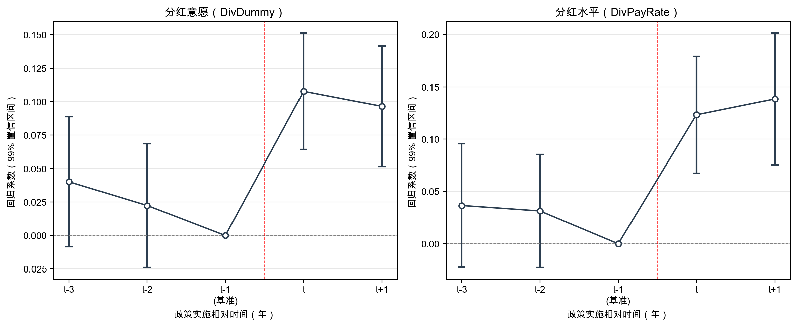

# 第四章 基于政策准自然实验的因果效应评估

第三章的机器学习分析从预测视角识别出生命周期、代理成本和盈利能力是驱动中国上市公司分红行为的核心经济维度。然而，预测分析本质上揭示的是变量间的统计关联，难以回答"外部监管政策能否有效改变企业分红行为"这一因果问题。本章以2023年《上市公司现金分红指引》修订为准自然实验，运用双重差分（DID）方法评估该政策对上市公司分红意愿和分红水平的因果效应，并检验政策效应在不同企业群体间的异质性，为假设H2和H3提供实证证据。

## 4.1 政策背景与准自然实验设计

### 4.1.1 政策背景

中国资本市场长期面临"重融资、轻回报"的结构性问题，部分上市公司持续低分红甚至不分红，损害了中小投资者的利益。为强化上市公司回报股东的意识，中国证监会于2023年12月发布修订后的《上市公司现金分红指引》（以下简称"2023指引"），对上市公司现金分红提出了更为明确的量化标准和监管约束。该政策的核心条款包括：第一，量化分红门槛——要求上市公司最近三年累计现金分红金额不低于年均净利润的30%，或累计分红总额不低于5000万元；第二，强化"不分红即解释"机制——对不符合分红条件的公司实施更严格的信息披露要求；第三，差异化监管——根据公司盈利状况和现金流特征制定差异化的分红标准。

2023指引的修订构成了一次具有明确政策边界的外生监管冲击，为运用双重差分方法评估分红政策效应提供了理想的准自然实验条件。

### 4.1.2 处理组与对照组划分

本章基于政策实施前（2020—2022年）企业的历史分红行为划分处理组和对照组。**处理组**（treat=1）为政策实施前现金分红未达监管门槛的公司，具体标准为：2020—2022年年均现金分红金额低于年均净利润的30%，或累计现金分红低于5000万元。**对照组**（treat=0）为政策实施前已满足分红门槛的公司，该类企业在政策实施前已具有较高分红水平，受政策的边际约束较弱。

该分组策略的外生性基于以下论证：第一，处理变量取决于政策实施前三年的历史分红水平，公司无法在政策发布前预判并策略性调整分组归属；第二，2023指引对所有A股上市公司同时生效，不存在自选择进入处理组的通道；第三，政策时点在样本期中明确固定，不随公司行为变化。

## 4.2 双重差分模型设定

本章采用双向固定效应DID模型，基准回归方程如下：

$$Y_{it} = \alpha_i + \lambda_t + \beta \cdot DID_{it} + \gamma' X_{it} + \varepsilon_{it}$$

其中，$Y_{it}$为被解释变量，包括分红意愿（DivDummy）和分红水平（DivPayRate）；$\alpha_i$为公司固定效应，控制不随时间变化的个体异质性；$\lambda_t$为年份固定效应，控制宏观时间趋势；$DID_{it} = treat_i \times post_t$为核心解释变量，$treat_i$为处理组虚拟变量，$post_t$为政策实施后虚拟变量（2023年及之后取1）；$X_{it}$为控制变量向量；$\varepsilon_{it}$为误差项。标准误聚类到公司层面，以纠正组内自相关导致的标准误低估问题。核心参数$\beta$衡量的是政策冲击对处理组分红行为的平均处理效应（ATT）。

## 4.3 变量与数据

### 4.3.1 样本选择

本章以2020—2024年沪深A股上市公司为研究样本，数据来源于CSMAR数据库。剔除金融行业和ST公司后，最终获得2,306家上市公司的9,004个公司-年度观测值。样本期覆盖政策前3年（2020—2022年）和政策后2年（2023—2024年），其中处理组4,879个观测值（54.2%），对照组4,125个观测值（45.8%）。

### 4.3.2 变量定义

**被解释变量**包括两个：（1）分红意愿（DivDummy），当年发放现金股利取1，否则取0，全样本均值为0.914；（2）分红水平（DivPayRate），即现金股利支付率，全样本均值为0.420。

**控制变量**包括11个公司层面特征：公司规模（SIZE）、上市年龄（AGE）、资产负债率（LEV）、资产收益率（ROA）、营业收入增长率（GROWTH）、经营现金流与总资产之比（CFO）、前五大股东持股集中度（TOP）、独立董事比例（INDEP）、管理层持股比例（MH）、地区银行业集中度（HHI_BANK）和市场化程度指数（MKT）。

### 4.3.3 描述性统计

表7汇报了主要变量的描述性统计结果。

**表7 第四章主要变量描述性统计**

| 变量 | N | 均值 | 标准差 | 最小值 | P25 | 中位数 | P75 | 最大值 |
|------|-------|------|--------|--------|------|--------|------|--------|
| DivDummy | 9,004 | 0.914 | 0.281 | 0 | 1 | 1 | 1 | 1 |
| DivPayRate | 9,004 | 0.420 | 0.371 | 0 | 0.210 | 0.330 | 0.511 | 2.353 |
| treat | 9,004 | 0.542 | 0.498 | 0 | 0 | 1 | 1 | 1 |
| post | 9,004 | 0.378 | 0.485 | 0 | 0 | 0 | 1 | 1 |
| SIZE | 9,004 | 22.839 | 1.351 | 20.399 | 21.842 | 22.652 | 23.633 | 26.951 |
| AGE | 9,004 | 2.363 | 0.869 | 0 | 1.792 | 2.565 | 3.135 | 3.466 |
| LEV | 9,004 | 0.422 | 0.181 | 0.070 | 0.279 | 0.422 | 0.556 | 0.823 |
| ROA | 9,004 | 0.055 | 0.044 | 0.002 | 0.023 | 0.045 | 0.076 | 0.225 |
| GROWTH | 9,004 | 0.117 | 0.278 | -0.468 | -0.036 | 0.078 | 0.212 | 1.443 |
| CFO | 9,004 | 0.063 | 0.061 | -0.107 | 0.027 | 0.060 | 0.098 | 0.244 |

注：数据来源于CSMAR数据库，作者计算。限于篇幅，仅列示部分变量。

## 4.4 因果效应评估

### 4.4.1 平行趋势检验

双重差分方法的核心假设是：在不存在政策干预的反事实情形下，处理组与对照组的被解释变量应遵循相同的时间趋势。为验证这一假设，本章采用事件研究法估计动态DID模型，以政策实施前一年（t-1，即2022年）为基准期，检验政策前各期的处理效应是否显著异于零。

图11展示了DivDummy和DivPayRate的事件研究系数及其99%置信区间。

**图11 平行趋势检验（事件研究图）**

对于分红意愿（DivDummy），t-3期系数为0.0402（t=2.127），在99%置信水平下不显著（置信区间包含零），t-2期系数为0.0224（t=1.249），同样不显著，表明政策前处理组与对照组的分红意愿趋势平行。政策实施当年（t=0）系数跳升至0.1077（t=6.379，1%水平显著），政策后一年（t+1）系数为0.0965（t=5.519，1%水平显著），呈现出政策实施后的明显"断裂"。对于分红水平（DivPayRate），政策前各期系数均不显著（t-3: 0.0366, t=1.597; t-2: 0.0314, t=1.499），政策实施后系数显著为正且逐年递增（t=0: 0.1234; t+1: 0.1386），平行趋势假设得到支持。

### 4.4.2 基准回归结果

表8汇报了基准DID回归结果。在控制公司固定效应和年份固定效应后，DID系数在所有规格中均在1%水平上显著为正。

**表8 基准DID回归结果**

| | (1) DivDummy | (2) DivDummy | (3) DivPayRate | (4) DivPayRate |
|---|---|---|---|---|
| did | 0.0805*** | 0.0828*** | 0.1238*** | 0.1081*** |
| | (6.669) | (6.764) | (7.065) | (6.412) |
| 控制变量 | 否 | 是 | 否 | 是 |
| 公司FE | 是 | 是 | 是 | 是 |
| 年份FE | 是 | 是 | 是 | 是 |
| N | 9,004 | 9,004 | 9,004 | 9,004 |
| R²(组内) | 0.024 | 0.041 | 0.042 | 0.073 |

注：括号内为t值，基于公司层面聚类稳健标准误。\*\*\* p<0.01, \*\* p<0.05, \* p<0.1。数据来源于CSMAR数据库，作者计算。

以加入控制变量的规格为基准，DID系数在分红意愿（DivDummy）上为0.0828（t=6.764），表明2023指引使处理组企业的分红概率相对于对照组**提高了约8.3个百分点**。DID系数在分红水平（DivPayRate）上为0.1081（t=6.412），表明政策使处理组企业的股利支付率相对于对照组**提高了约10.8个百分点**。上述结果在加入和不加入控制变量的两种规格下均高度稳定，**假设H2得到支持**：监管政策冲击显著提升了企业的现金分红意愿与支付水平。

### 4.4.3 稳健性检验

为确保基准回归结果的可靠性，本章从多个维度进行稳健性检验。

**（一）安慰剂检验。** 为排除基准结果由随机因素驱动的可能性，本章参照参考文献的做法进行100次随机政策时间的安慰剂检验：每次迭代中，对每家公司随机抽取一个年份作为伪政策时点，据此重新构造伪DID变量并估计系数。该检验仅随机化政策时间而保持处理组身份不变，严格遵循"反事实政策时间"的安慰剂逻辑。图12展示了安慰剂系数的核密度分布。

**图12 安慰剂检验（100次随机模拟）**

如图12所示，安慰剂系数均集中分布在零值附近（DivDummy: 均值=-0.0027, 标准差=0.0085; DivPayRate: 均值=-0.0026, 标准差=0.0108），呈近似正态分布，而真实DID系数（DivDummy: 0.0828; DivPayRate: 0.1081，红色虚线）远离安慰剂分布的尾部（超过3个标准差之外），确认了基准回归捕捉到的是真实的政策效应而非统计噪声。

**（二）PSM-DID。** 为缓解处理组与对照组在可观测特征上的潜在不平衡，本章采用倾向得分匹配（PSM）方法：以全部控制变量为协变量，使用Logit模型估计倾向得分，并进行10近邻匹配（卡尺0.05，共同支撑域条件）。匹配后剔除未匹配观测，得到8,937个有效观测值。PSM-DID结果显示，DID系数在DivDummy上为0.0837（t=7.92），在DivPayRate上为0.1089（t=7.45），均在1%水平上显著，与基准回归高度一致。

**（三）排除替代性解释。** 为排除资本留存和资产扩张作为竞争性解释的可能性，本章在基准模型中加入DID与资本留存率（Capital_AR）、DID与资产增长率（Asset_GR）的交互项。结果显示，DID主效应始终显著为正（DivDummy: 0.0801—0.0851; DivPayRate: 0.1044—0.1099），而交互项均不显著，表明政策效应独立于资本留存和资产扩张行为。

**（四）剔除再融资样本。** 为排除再融资动机对分红行为的干扰，本章剔除样本期内存在再融资行为的公司（159个观测值）后重新估计。结果显示，DID系数在DivDummy上为0.0854（t值保持显著），在DivPayRate上为0.1078，与基准回归结论一致。

**（五）Hausman-Taylor估计。** 考虑到DID变量可能受不可观测的时不变因素影响，本章采用Hausman-Taylor工具变量方法，将DID变量设为时变内生变量，纳入年份和行业虚拟变量进行估计。结果显示，DID系数在DivDummy上为0.0798（z=8.59），在DivPayRate上为0.0960（z=7.79），均在1%水平上显著，与基准回归结论一致。

**（六）熵平衡匹配。** 作为PSM-DID的替代方案，本章进一步采用熵平衡（Entropy Balancing）方法：通过对控制组重新赋权，使其在所有控制变量的一阶矩上与处理组精确匹配，随后以熵平衡权重进行加权回归。结果显示，DID系数在DivDummy上为0.0917（t=7.31），在DivPayRate上为0.1106（t=5.71），均在1%水平上显著，进一步确认了基准结论的稳健性。

表9汇总了上述稳健性检验结果。

**表9 稳健性检验结果汇总**

| 稳健性检验 | DivDummy did系数 | 显著性 | DivPayRate did系数 | 显著性 | N |
|-----------|-----------------|--------|-------------------|--------|-------|
| 基准回归 | 0.0828 | *** | 0.1081 | *** | 9,004 |
| PSM-DID | 0.0837 | *** | 0.1089 | *** | 8,937 |
| Hausman-Taylor估计 | 0.0798 | *** | 0.0960 | *** | 9,004 |
| 熵平衡匹配 | 0.0917 | *** | 0.1106 | *** | 9,004 |
| 排除资本留存（did主效应） | 0.0851 | *** | 0.1099 | *** | 9,004 |
| 排除资产增长（did主效应） | 0.0801 | *** | 0.1044 | *** | 9,004 |
| 剔除再融资样本 | 0.0854 | *** | 0.1078 | *** | 8,845 |

注：PSM-DID采用Logit模型10近邻匹配（卡尺0.05），Hausman-Taylor将did设为时变内生变量，熵平衡使控制变量一阶矩精确匹配。\*\*\* p<0.01, \*\* p<0.05, \* p<0.1。数据来源于CSMAR数据库，作者计算。

综合上述七项稳健性检验，基准回归得出的政策正向因果效应在多种估计方法、匹配策略和样本口径下均保持高度稳健。DID系数在0.0798—0.0917（DivDummy）和0.0960—0.1106（DivPayRate）的区间内波动，核心结论不受方法选择的影响。

### 4.4.4 异质性分析

为检验假设H3——政策效应在不同企业群体间的异质性——本章从代理成本、产权性质、机构持股和法治水平四个维度进行分组回归，并通过Bootstrap组间差异检验（bdiff命令，200次重复抽样）考察组间差异的统计显著性。表10汇报了异质性分析结果。

**表10 异质性分析结果**

| 异质性维度 | 分组 | DivDummy did系数 | 显著性 | DivPayRate did系数 | 显著性 |
|-----------|------|-----------------|--------|-------------------|--------|
| **代理成本** | 低代理成本 | 0.0538 | *** | 0.0791 | *** |
| | 高代理成本 | 0.1067 | *** | 0.1435 | *** |
| | 组间差异 | 0.0529 | ** | 0.0644 | ** |
| **产权性质** | 非国有企业 | 0.0995 | *** | 0.1234 | *** |
| | 国有企业 | 0.0645 | *** | 0.1004 | *** |
| | 组间差异 | 0.0350 | | 0.0230 | |
| **机构持股** | 低机构持股 | 0.0855 | *** | 0.1116 | *** |
| | 高机构持股 | 0.0598 | * | 0.0854 | ** |
| | 组间差异 | 0.0257 | | 0.0262 | |
| **法治水平** | 低法治水平 | 0.0909 | *** | 0.1248 | *** |
| | 高法治水平 | 0.0681 | *** | 0.0848 | *** |
| | 组间差异 | 0.0228 | | 0.0400 | |

注：组间差异基于Bootstrap差异检验（bdiff, 200次重复抽样, seed=123）。组间差异系数为绝对值，方向详见正文。\*\*\* p<0.01, \*\* p<0.05, \* p<0.1。数据来源于CSMAR数据库，作者计算。

**按代理成本分组。** 这是与假设H3最直接相关的异质性维度。高代理成本组的DID系数（DivDummy: 0.1067; DivPayRate: 0.1435）显著大于低代理成本组（DivDummy: 0.0538; DivPayRate: 0.0791），且组间差异在5%水平上统计显著（DivDummy: diff=0.053, p=0.025; DivPayRate: diff=0.064, p=0.020）。这一结果表明，**政策对代理问题更突出的企业产生了更强的分红提升效应**，与假设H3的预期一致。其经济含义在于：代理成本高的企业在政策干预前更倾向于侵占或留存利润，2023指引通过设定分红底线和强化信息披露要求，有效约束了管理层和大股东的自利行为，迫使其将更多利润分配给股东。

**按产权性质分组。** 非国有企业组的DID系数（DivDummy: 0.0995; DivPayRate: 0.1234）高于国有企业组（DivDummy: 0.0645; DivPayRate: 0.1004），但组间差异未达到统计显著水平。这一结果可从两方面理解：国有企业通常面临更强的合规压力和行政约束，其分红行为本身受政策影响的边际空间较小；非国有企业在政策前的分红自主性更大，因此受政策的边际冲击更为明显。

**按机构持股水平分组。** 低机构持股组的政策效应（DivDummy: 0.0855; DivPayRate: 0.1116）高于高机构持股组（DivDummy: 0.0598; DivPayRate: 0.0854），但组间差异不显著。这与预期一致：机构投资者作为外部监督力量，在政策实施前已通过投票权和对话机制推动企业分红，使得政策的边际贡献相对较小。

**按法治水平分组。** 低法治水平地区的政策效应（DivDummy: 0.0909; DivPayRate: 0.1248）略高于高法治水平地区（DivDummy: 0.0681; DivPayRate: 0.0848），组间差异不显著。可能的解释是：法治水平较低的地区，企业对股东权益的保护相对薄弱，政策的强制约束对这些企业的边际效应更大。

综合异质性分析结果，**假设H3得到支持**：代理问题更突出的企业对政策冲击的响应显著更强，组间差异在5%水平上具有统计显著性。产权性质、机构持股和法治水平维度虽呈现出方向一致的异质性模式（均为外部治理较弱的企业政策效应更强），但组间差异未达到常规统计显著水平，提供了方向性证据。

### 4.4.5 经济后果分析

本章进一步考察政策冲击是否产生了积极的市场后果。以交易量、换手率、买卖价差和错误定价为被解释变量，使用DID模型估计政策对市场微观结构的影响。表11汇报了经济后果分析结果。

**表11 经济后果分析**

| 被解释变量 | did系数 | t值 | 显著性 | N |
|-----------|--------|------|--------|------|
| 交易量（当月） | 0.0754 | 2.160 | ** | 9,003 |
| 交易量（次月） | 0.0603 | 1.638 | | 9,001 |
| 换手率（当月） | 0.1785 | 2.156 | ** | 9,003 |
| 换手率（次月） | 0.1529 | 1.733 | * | 9,001 |
| 买卖价差（当月） | -0.0011 | -1.496 | | 9,003 |
| 买卖价差（次月） | -0.0012 | -1.696 | * | 9,001 |
| 错误定价（当月） | -0.0510 | -2.136 | ** | 9,003 |
| 错误定价（次月） | -0.0530 | -2.042 | ** | 9,001 |

注：控制变量包括SIZE1、AGE、LEV、ROA、CFO、INDEP、TOP、MH、MB、PRICE、BETA（错误定价模型不含MB和PRICE）。公司FE和年份FE均已控制，标准误聚类到公司层面。\*\*\* p<0.01, \*\* p<0.05, \* p<0.1。

结果显示，政策冲击显著提高了处理组企业的**交易量**（当月系数0.0754，5%水平显著）和**换手率**（当月系数0.1785，5%水平显著），表明分红政策改善了市场流动性。同时，政策显著降低了处理组企业的**错误定价程度**（当月和次月系数均在5%水平显著为负），说明分红政策通过提升信息透明度和改善公司治理，有助于提高市场定价效率。买卖价差呈下降趋势但统计显著性较弱，提供了市场交易成本降低的边际证据。

## 4.5 本章小结

本章以2023年《上市公司现金分红指引》修订为准自然实验，运用双重差分方法系统评估了分红监管政策的因果效应。主要发现如下：

**第一**，基准回归结果显示，2023指引显著提升了处理组企业的分红意愿（约8.3个百分点）和分红水平（约10.8个百分点），**假设H2得到支持**。该结果在平行趋势检验、安慰剂检验、PSM-DID、Hausman-Taylor估计、熵平衡匹配、排除替代性解释和剔除再融资样本等七项稳健性检验下均保持稳定，DID系数在0.0798—0.0917（DivDummy）和0.0960—0.1106（DivPayRate）的区间内波动。

**第二**，异质性分析表明，政策效应在代理成本高的企业中显著更强（Bootstrap组间差异检验在5%水平上显著），**假设H3得到支持**。这一发现从因果推断角度呼应了第三章机器学习分析中代理成本变量（Tunneling）进入特征重要性Top 10的结论——代理问题不仅是预测分红行为的重要因素，也是调节政策效应强度的关键机制。

**第三**，经济后果分析表明，分红政策产生了积极的市场效应：处理组企业的交易量和换手率显著提高，错误定价程度显著降低，说明政策通过改善公司治理和信息透明度，提升了市场流动性和定价效率。

综上，本章从因果推断视角为监管政策的有效性提供了实证支持，并揭示了代理成本作为政策效应异质性调节因素的重要角色。结合第三章的机器学习预测证据，本文构建了"相关性识别（ML）→因果验证（DID）"的互补分析框架，从多个维度回答了"上市公司为何分红"以及"政策能否改变分红行为"这两个核心问题。
