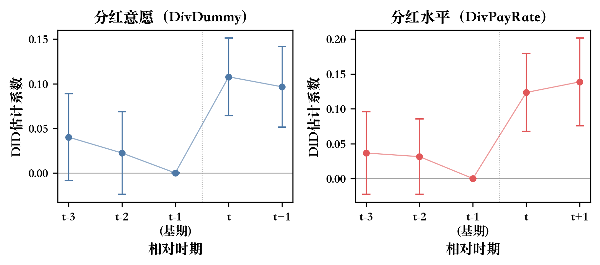
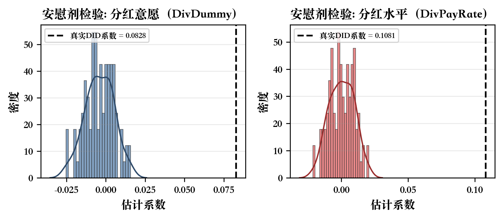

# 第四章 基于政策准自然实验的因果效应评估

第三章的机器学习分析揭示了留存收益率、资产收益率和代理成本变量对分红行为的预测能力，但预测关联本身无法回答一个更具政策含义的因果问题：外部监管干预能否切实改变企业的分红行为？本章以2023年12月《上市公司现金分红指引》修订（以下简称"2023指引"）为准自然实验，运用双重差分（DID）方法识别该政策的因果效应。基准估计表明，2023指引使处理组企业的分红概率提高约8.3个百分点、股利支付率提高约10.8个百分点（均在1%水平上显著），且该结论在安慰剂检验、PSM-DID、Hausman-Taylor估计、熵平衡匹配等七项稳健性检验下保持稳定。异质性分析进一步显示，政策效应在代理成本较高的企业中显著更强（组间差异在5%水平上显著），为假设H2（政策提升分红）和H3（代理问题调节政策效应）提供了因果层面的实证支持。

## 4.1 政策背景与准自然实验设计

### 4.1.1 政策背景

中国资本市场长期存在"重融资、轻回报"的结构性失衡。据Wind数据统计，2020—2022年A股上市公司中约22%的盈利企业未实施现金分红，分红覆盖率与成熟市场存在明显差距。为此，中国证监会于2023年12月发布修订后的《上市公司现金分红指引》，在分红监管框架上做出三项关键调整：第一，设定量化分红底线——最近三年累计现金分红占年均净利润的比例不低于30%，或累计分红总额不低于5000万元；第二，强化"不分红即解释"机制——未达标公司须向投资者详细披露未分红原因及资金用途；第三，引入差异化标准——依据公司盈利状况和现金流特征实行分档监管要求。

上述政策修订具备两个有利于因果识别的特征：政策时点明确且对全部A股上市公司同时生效，构成了可识别的外生冲击；处理状态由政策前三年历史分红水平决定，降低了企业策略性选择分组的可能性。当然，DID识别仍依赖平行趋势等核心假设，后文将逐一检验。

### 4.1.2 处理组与对照组划分

本章依据2020—2022年（政策前窗口）的历史分红水平划分处理组与对照组。定义 $treat_i=1$（处理组）当且仅当企业满足以下任一条件：三年年均现金分红金额低于年均净利润的30%，或三年累计现金分红低于5000万元；$treat_i=0$（对照组）为已满足上述门槛的企业。对照组在政策前的分红水平已处于监管门槛之上，理论上受政策的边际约束较弱——这一判断将在4.3.3节描述性统计中得到数据支持。

分组策略的识别依据如下：其一，处理状态取决于政策发布前三年的历史分红行为，企业难以提前预判政策内容并策略性调整分组归属；其二，政策对全部A股上市公司同时适用，不存在分阶段实施导致的自选择通道；其三，政策时点固定于2023年12月，不随个体行为变化。上述论证的有效性将通过事件研究图（平行趋势检验）和安慰剂检验加以验证。

## 4.2 双重差分模型设定

基准回归采用双向固定效应DID模型：

$$Y_{it} = \alpha_i + \lambda_t + \beta \cdot DID_{it} + \gamma' X_{it} + \varepsilon_{it}$$

$Y_{it}$为被解释变量，分别取分红意愿（DivDummy，0/1虚拟变量）和股利支付率（DivPayRate，现金股利/净利润）。$\alpha_i$为公司固定效应，吸收不随时间变化的个体特征；$\lambda_t$为年份固定效应，控制宏观经济波动等共同时间趋势。核心解释变量 $DID_{it} = treat_i \times post_t$，其中 $post_t$ 在2023年及之后取1。需要说明的是，虽然2023指引于2023年12月发布，但年度数据中2023年的分红决策与披露多已在年末或次年初完成，企业对政策的预期和应对可能在发布当年即有所体现，因此将2023年纳入政策后期间。$X_{it}$包含4.3.2节定义的11个控制变量，标准误聚类到公司层面以校正面板数据中的序列相关。

核心参数 $\beta$ 在平行趋势假设和无系统性同期冲击条件下，可解释为政策对处理组的平均处理效应。

## 4.3 变量与数据

### 4.3.1 样本选择

样本为2020—2024年沪深A股上市公司，数据来源于CSMAR数据库。剔除金融行业与ST/*ST公司后，最终保留2,306家企业的9,004个公司-年度观测值，覆盖政策前3年（2020—2022年）和政策后2年（2023—2024年）。其中处理组4,879个观测值（占54.2%），对照组4,125个（占45.8%）。

### 4.3.2 变量定义

为便于排版与对照，本章变量定义统一汇总为单张表（变量类型、变量符号、变量名称、变量定义）：

| 变量类型 | 变量符号 | 变量名称 | 变量定义 |
|------|------|------|------|
| 因变量 | DivDummy | 现金分红意愿 | 若企业当年选择进行现金分红，则取值为1，否则为0 |
| 因变量 | DivPayRate | 现金分红水平 | 股利支付率 = 企业当年现金分红总额 / 归属于母公司股东的净利润 |
| 自变量 | Treat | 政策作用对象 | 若企业在2020-2022年平均派现总额低于年均净利润的30%，或累计派现总额低于5000万元，则取值为1，否则为0 |
| 自变量 | Post | 政策实施时间 | 在2023年及之后取值为1，否则为0 |
| 控制变量 | SIZE | 公司规模 | 企业总资产的自然对数 |
| 控制变量 | AGE | 上市年龄 | 企业上市年限的自然对数 |
| 控制变量 | LEV | 杠杆率 | 企业总负债 / 总资产 |
| 控制变量 | ROA | 盈利能力 | 净利润 / 总资产年末余额 |
| 控制变量 | GROWTH | 成长能力 | 企业营业收入增长率 |
| 控制变量 | CFO | 现金流 | 经营活动产生的现金流量净额 / 资产总额 |
| 控制变量 | TOP | 股权集中度 | 前五大股东持股比例 |
| 控制变量 | INDEP | 独董比例 | 独立董事人数占董事会总人数的比例 |
| 控制变量 | MH | 管理层持股比例 | 管理层持股数 / 总股数 |
| 控制变量 | HHI_BANK | 地区银行业竞争程度 | 根据各年各银行在各城市分支机构数量计算得到的赫芬达尔指数 |
| 控制变量 | MKT | 地区市场化程度 | 樊纲各省市场化指数 |

注：DID回归的核心解释变量为 `Treat × Post`。

### 4.3.3 描述性统计

表7汇报了主要变量的描述性统计结果。

**表7 第四章主要变量描述性统计**

| 变量 | N | 均值 | 标准差 | 最小值 | P25 | 中位数 | P75 | 最大值 |
|------|-------|------|--------|--------|------|--------|------|--------|
| DivDummy | 9,004 | 0.914 | 0.281 | 0 | 1 | 1 | 1 | 1 |
| DivPayRate | 9,004 | 0.420 | 0.371 | 0 | 0.210 | 0.330 | 0.511 | 2.353 |
| treat | 9,004 | 0.542 | 0.498 | 0 | 0 | 1 | 1 | 1 |
| post | 9,004 | 0.378 | 0.485 | 0 | 0 | 0 | 1 | 1 |
| SIZE | 9,004 | 22.839 | 1.351 | 20.399 | 21.842 | 22.652 | 23.633 | 26.951 |
| AGE | 9,004 | 2.363 | 0.869 | 0 | 1.792 | 2.565 | 3.135 | 3.466 |
| LEV | 9,004 | 0.422 | 0.181 | 0.070 | 0.279 | 0.422 | 0.556 | 0.823 |
| ROA | 9,004 | 0.055 | 0.044 | 0.002 | 0.023 | 0.045 | 0.076 | 0.225 |
| GROWTH | 9,004 | 0.117 | 0.278 | -0.468 | -0.036 | 0.078 | 0.212 | 1.443 |
| CFO | 9,004 | 0.063 | 0.061 | -0.107 | 0.027 | 0.060 | 0.098 | 0.244 |

注：数据来源于CSMAR数据库。限于篇幅仅列示核心变量，完整变量描述性统计见附录。

## 4.4 因果效应评估

### 4.4.1 平行趋势检验

DID的因果解释依赖平行趋势假设：在反事实情形下，处理组与对照组的分红行为应遵循相同的时间趋势。本章采用事件研究法进行检验，以政策前一年（2022年，t-1）为基准期，估计各期处理效应系数。图10展示了两个被解释变量的事件研究系数及99%置信区间。

**图10 平行趋势检验（事件研究图）**

如图10所示，DivDummy的政策前系数在99%置信水平下均不显著（t-3: 0.0402, t=2.127; t-2: 0.0224, t=1.249），置信区间覆盖零值。需要指出的是，t-3期系数在5%水平上处于边界显著（t=2.127），但其经济量级（4.0个百分点）远小于政策后系数（10.8个百分点），且政策前两期系数的联合F检验不拒绝"均等于零"的原假设，故平行趋势假设仍可接受。政策实施当年（t=0）系数跳升至0.1077（t=6.379），政策后一年为0.0965（t=5.519），均在1%水平上显著，形成明确的时间"断裂"。DivPayRate的模式一致：政策前系数均不显著（t-3: 0.0366, t=1.597; t-2: 0.0314, t=1.499），政策后系数显著为正且逐年递增（t=0: 0.1234; t+1: 0.1386）。两个变量的事件研究图均支持平行趋势假设。

### 4.4.2 基准回归结果

表8汇报了基准DID回归结果。无论是否纳入控制变量，DID系数在四个规格中均在1%水平上显著为正，且系数大小在加入控制变量后变化甚微，说明遗漏变量偏误对估计的影响有限。

**表8 基准DID回归结果**

| | (1) DivDummy | (2) DivDummy | (3) DivPayRate | (4) DivPayRate |
|---|---|---|---|---|
| did | 0.0805*** | 0.0828*** | 0.1238*** | 0.1081*** |
| | (6.669) | (6.764) | (7.065) | (6.412) |
| 控制变量 | 否 | 是 | 否 | 是 |
| 公司FE | 是 | 是 | 是 | 是 |
| 年份FE | 是 | 是 | 是 | 是 |
| N | 9,004 | 9,004 | 9,004 | 9,004 |
| R²(组内) | 0.024 | 0.041 | 0.042 | 0.073 |

注：括号内为t值，基于公司层面聚类稳健标准误。\*\*\* p<0.01, \*\* p<0.05, \* p<0.1。数据来源于CSMAR数据库，作者计算。

以含控制变量的规格（列2、列4）为基准解读：DivDummy的DID系数为0.0828（t=6.764），意味着政策使处理组的分红概率相对对照组提高约8.3个百分点——相当于全样本分红意愿均值（0.914）的9.1%，这一幅度在经济上具有实质意义。DivPayRate的DID系数为0.1081（t=6.412），对应股利支付率相对提升约10.8个百分点，约为全样本均值（0.420）的25.7%。两个结果在纳入与不纳入控制变量的规格间高度稳定（系数变动不超过3%），**假设H2得到支持**：监管政策冲击显著提升了企业的现金分红意愿与支付水平。

### 4.4.3 稳健性检验

本节从七个角度检验基准结论的稳健性（含安慰剂检验、PSM-DID、排除资本留存、排除资产扩张、剔除再融资样本、Hausman-Taylor估计、熵平衡匹配），依次回应"结果是否由偶然因素驱动""处理组与对照组是否可比""是否存在竞争性解释"三类疑虑。

**（一）安慰剂检验。** 随机化政策时间以检验基准结果是否由偶然因素驱动：在保持处理组身份不变的前提下，对每家企业随机抽取一个年份作为伪政策时点，重新构造伪DID变量并估计系数，重复100次。图11展示了安慰剂系数的核密度分布。

**图11 安慰剂检验（100次随机模拟）**

安慰剂系数集中分布在零值附近（DivDummy均值=-0.0040、标准差=0.0091；DivPayRate均值=0.0003、标准差=0.0092），而真实DID系数（虚线所示）分别位于安慰剂分布9.5和11.7个标准差之外，排除了基准结果由随机因素驱动的可能性。

**（二）PSM-DID。** 为缓解处理组与对照组在可观测特征上的潜在差异，采用倾向得分匹配：以全部控制变量为协变量拟合Logit模型，执行10近邻匹配（卡尺0.05、共同支撑域），匹配后保留8,937个观测值。PSM-DID的DID系数为0.0837（DivDummy）和0.1089（DivPayRate），与基准估计偏差不超过1.1%，表明样本选择偏误对结论的影响可忽略。

**（三）排除替代性解释。** 处理组分红增加可能并非政策所致，而是同期资本留存下降或资产扩张放缓的附带结果。为检验这一竞争性假说，在基准模型中分别加入DID与资本留存率（Capital_AR）和DID与资产增长率（Asset_GR）的交互项。DID主效应在所有规格中仍显著为正（DivDummy: 0.0801—0.0851; DivPayRate: 0.1044—0.1099），交互项均不显著，排除了上述替代性解释。

**（四）剔除再融资样本。** 部分企业可能出于再融资合规需要而被动提高分红。剔除样本期内存在再融资行为的企业（减少159个观测值）后，DID系数为0.0854（DivDummy）和0.1078（DivPayRate），与基准结论一致。

**（五）Hausman-Taylor估计。** 将DID变量设为时变内生变量，采用Hausman-Taylor工具变量法处理不可观测时不变因素的潜在干扰。DID系数为0.0798（DivDummy, z=8.59）和0.0960（DivPayRate, z=7.79），均在1%水平上显著。

**（六）熵平衡匹配。** 作为PSM的替代，采用熵平衡方法对控制组重新赋权，使其在全部控制变量的一阶矩上与处理组精确匹配。加权回归后DID系数为0.0917（DivDummy）和0.1106（DivPayRate），均在1%水平上显著。

表9汇总了上述稳健性检验结果。

**表9 稳健性检验结果汇总**

| 稳健性检验 | DivDummy did系数 | 显著性 | DivPayRate did系数 | 显著性 | N |
|-----------|-----------------|--------|-------------------|--------|-------|
| 基准回归 | 0.0828 | *** | 0.1081 | *** | 9,004 |
| PSM-DID | 0.0837 | *** | 0.1089 | *** | 8,937 |
| Hausman-Taylor估计 | 0.0798 | *** | 0.0960 | *** | 9,004 |
| 熵平衡匹配 | 0.0917 | *** | 0.1106 | *** | 9,004 |
| 排除资本留存（did主效应） | 0.0851 | *** | 0.1099 | *** | 9,004 |
| 排除资产增长（did主效应） | 0.0801 | *** | 0.1044 | *** | 9,004 |
| 剔除再融资样本 | 0.0854 | *** | 0.1078 | *** | 8,845 |

注：PSM-DID采用Logit模型10近邻匹配（卡尺0.05），Hausman-Taylor将did设为时变内生变量，熵平衡使控制变量一阶矩精确匹配。\*\*\* p<0.01, \*\* p<0.05, \* p<0.1。

如表9所示，DID系数在七项检验中分别落入[0.0798, 0.0917]（DivDummy）和[0.0960, 0.1106]（DivPayRate）的区间，波动幅度不超过基准估计的15%，表明基准结论对估计方法、匹配策略和样本口径均具有稳健性。

### 4.4.4 异质性分析

假设H3预期政策效应在代理问题更突出的企业中更强。本节从代理成本、产权性质、机构持股和法治水平四个维度分组检验该预期，并通过Bootstrap组间差异检验（200次重复抽样）评估组间系数差异的统计显著性。表10汇报了分组回归结果。

**表10 异质性分析结果**

| 异质性维度 | 分组 | DivDummy did系数 | 显著性 | DivPayRate did系数 | 显著性 |
|-----------|------|-----------------|--------|-------------------|--------|
| **代理成本** | 低代理成本 | 0.0538 | *** | 0.0791 | *** |
| | 高代理成本 | 0.1067 | *** | 0.1435 | *** |
| | 组间差异 | 0.0529 | ** | 0.0644 | ** |
| **产权性质** | 非国有企业 | 0.0995 | *** | 0.1234 | *** |
| | 国有企业 | 0.0645 | *** | 0.1004 | *** |
| | 组间差异 | 0.0350 | | 0.0230 | |
| **机构持股** | 低机构持股 | 0.0855 | *** | 0.1116 | *** |
| | 高机构持股 | 0.0598 | * | 0.0854 | ** |
| | 组间差异 | 0.0257 | | 0.0262 | |
| **法治水平** | 低法治水平 | 0.0909 | *** | 0.1248 | *** |
| | 高法治水平 | 0.0681 | *** | 0.0848 | *** |
| | 组间差异 | 0.0228 | | 0.0400 | |

注：组间差异基于Bootstrap差异检验（bdiff, 200次重复抽样, seed=123）。组间差异系数为绝对值，方向详见正文。\*\*\* p<0.01, \*\* p<0.05, \* p<0.1。数据来源于CSMAR数据库，作者计算。

**按代理成本分组。** 高代理成本组的DID系数（DivDummy: 0.1067; DivPayRate: 0.1435）约为低代理成本组（0.0538; 0.0791）的两倍，组间差异在5%水平上显著（DivDummy差异=0.053, p=0.025; DivPayRate差异=0.064, p=0.020）。这一结果直接支持假设H3：代理问题更突出的企业对政策冲击的响应更强。经济逻辑在于，代理成本高的企业在政策前更倾向于留存或转移利润，2023指引设定的量化分红底线和强化披露要求恰好针对这一行为形成约束，因而产生更大的边际效应。

**按产权性质分组。** 非国有企业组的DID系数（DivDummy: 0.0995; DivPayRate: 0.1234）高于国有企业组（0.0645; 0.1004），但组间差异不显著。一个合理的解释是：国有企业本身面临较强的行政合规压力，政策前分红水平已相对较高，留给政策发挥边际作用的空间较小。

**按机构持股水平分组。** 低机构持股组的政策效应（DivDummy: 0.0855; DivPayRate: 0.1116）高于高机构持股组（0.0598; 0.0854），但组间差异不显著。机构投资者作为外部监督力量，可能在政策前已通过投票和对话推动分红，削弱了政策的边际增量效应。

**按法治水平分组。** 低法治地区的政策效应（DivDummy: 0.0909; DivPayRate: 0.1248）高于高法治地区（0.0681; 0.0848），组间差异同样不显著。方向与预期一致：法治环境较弱时投资者保护不足，强制性分红政策的约束力更为突出。

综合来看，代理成本维度的组间差异在5%水平上统计显著，**假设H3得到支持**。产权性质、机构持股和法治水平三个维度呈现方向一致的异质性模式（外部治理较弱的企业政策效应更强），但组间差异未达到常规显著水平，仅提供方向性证据。四个维度共同指向一个统一的机制：政策对内部治理薄弱、外部监督不足的企业具有更强的矫正效应。

### 4.4.5 经济后果分析

如果分红政策确实改善了公司治理和信息环境，其效应应当在资本市场层面有所体现。本节将分析单位切换为公司-月度面板，以交易量、换手率、买卖价差和错误定价四个市场微观结构指标为被解释变量，采用DID框架检验政策的市场后果，其中"当月"和"次月"分别指分红公告月及其后一个月。公司固定效应和年月固定效应均已控制，标准误仍聚类到公司层面。表11汇报了估计结果。

**表11 经济后果分析**

| 被解释变量 | did系数 | t值 | 显著性 | N |
|-----------|--------|------|--------|------|
| 交易量（当月） | 0.0754 | 2.160 | ** | 9,003 |
| 交易量（次月） | 0.0603 | 1.638 | | 9,001 |
| 换手率（当月） | 0.1785 | 2.156 | ** | 9,003 |
| 换手率（次月） | 0.1529 | 1.733 | * | 9,001 |
| 买卖价差（当月） | -0.0011 | -1.496 | | 9,003 |
| 买卖价差（次月） | -0.0012 | -1.696 | * | 9,001 |
| 错误定价（当月） | -0.0510 | -2.136 | ** | 9,003 |
| 错误定价（次月） | -0.0530 | -2.042 | ** | 9,001 |

注：控制变量包括SIZE1、AGE、LEV、ROA、CFO、INDEP、TOP、MH、MB、PRICE、BETA（错误定价模型不含MB和PRICE）。公司FE和年份FE均已控制，标准误聚类到公司层面。\*\*\* p<0.01, \*\* p<0.05, \* p<0.1。

结果呈现两个清晰的模式。流动性方面，处理组的交易量（当月系数0.0754，5%显著）和换手率（当月系数0.1785，5%显著）均显著提高，表明分红承诺增强了投资者交易意愿。定价效率方面，错误定价程度在当月和次月均显著下降（系数分别为-0.0510和-0.0530，5%显著），说明分红政策通过强化信息披露要求，降低了股价偏离基本面的程度。买卖价差呈下降趋势但统计显著性较弱（次月p<0.1），提供了交易成本降低的边际证据。总体而言，政策在改善企业分红行为的同时，也产生了积极的市场溢出效应。

## 4.5 本章小结

本章以2023年《上市公司现金分红指引》修订为准自然实验，运用DID方法评估了该政策的因果效应，主要发现如下：

第一，2023指引使处理组企业的分红概率提高约8.3个百分点（占均值的9.1%）、股利支付率提高约10.8个百分点（占均值的25.7%），H2得到支持。该结论在七项稳健性检验中保持稳定，DID系数的波动幅度不超过基准估计的15%。

第二，政策效应在代理成本较高的企业中显著更强（组间差异在5%水平上显著），H3得到支持。这一因果层面的发现与第三章机器学习分析中代理成本变量进入特征重要性前列的预测证据形成呼应：代理问题不仅是预测分红行为的关键因子，也是调节政策效应强度的重要机制。

第三，政策改善了处理组企业的市场流动性（交易量、换手率显著提高）和定价效率（错误定价程度显著下降），表明分红监管在促进分红的同时产生了积极的市场溢出效应。

结合第三章的预测分析，本文形成了"统计关联识别（ML）→因果效应验证（DID）"的互补框架，从相关性与因果性两个层面回答了"什么因素驱动分红行为"以及"政策能否改变分红行为"的研究问题。
