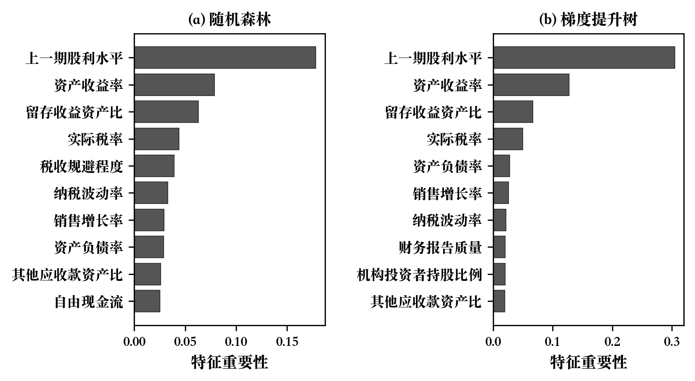
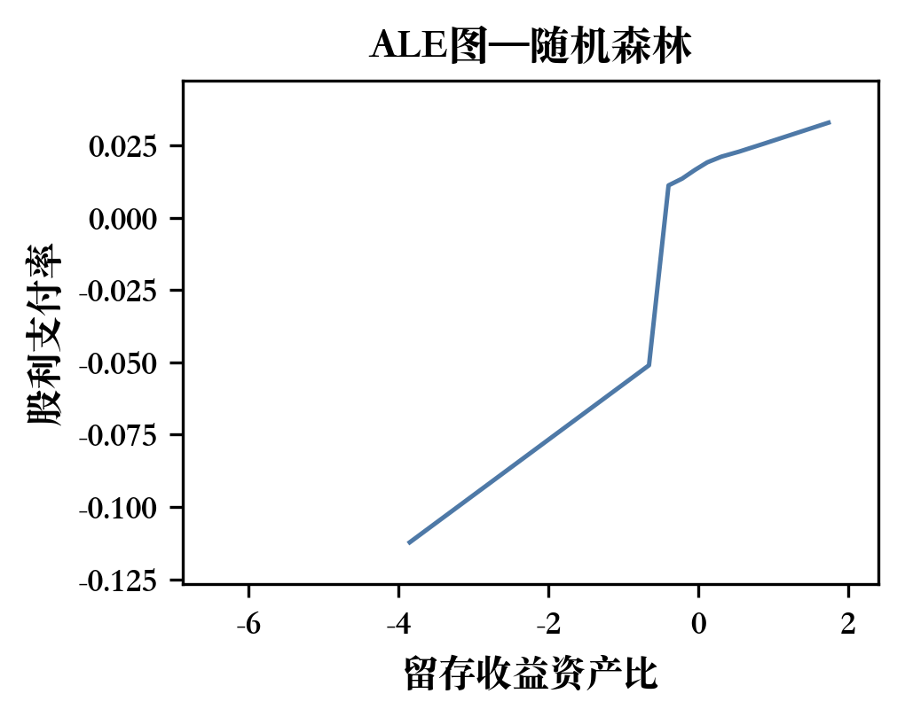
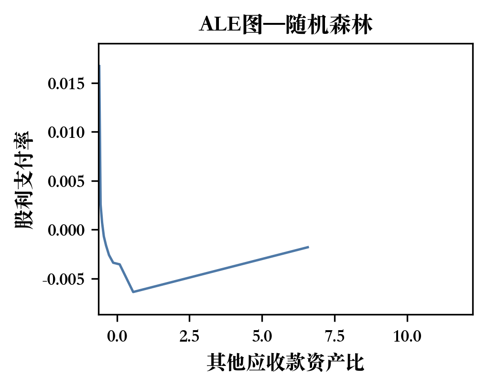
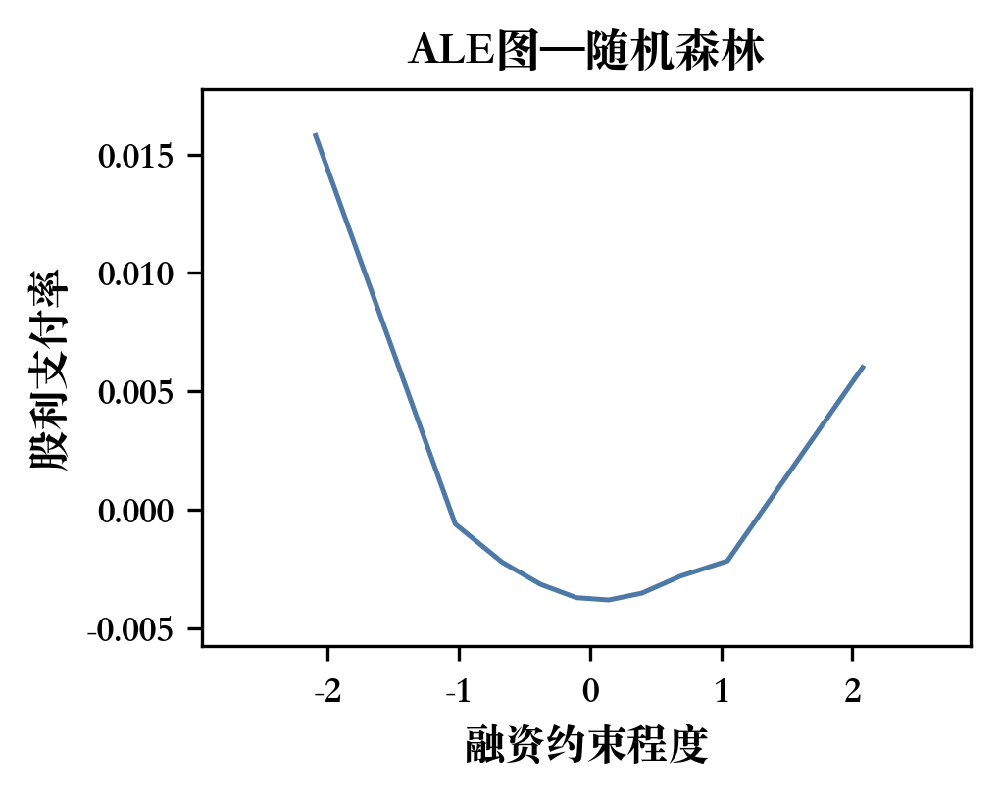

<!-- 论文完整版 — 生成时间：2026-03-03 21:20:23 +0800 -->
<!-- 说明：该文件为答辩前质检与格式迁移用主稿，排版以学校模板 docx 为准。 -->

<!-- SOURCE: output/paper/abstract_draft.md -->
<!-- SECTION: 摘要 -->
# 摘要

中国上市公司为何分红？本文构建"机器学习预测 + 双重差分因果推断"的双路径框架，从统计关联与因果识别两个层面回答这一问题。第一路径以2006—2022年沪深A股为样本，采用随机森林和梯度提升树在一年期滚动预测框架下比较71个候选特征，发现集成学习模型的样本外R²约为0.25，显著优于OLS（0.16）；特征重要性排序中，上期股利水平、资产收益率和留存收益资产比稳居前三，代理成本变量（其他应收款资产比）进入前十且对分红表现出非线性抑制效应。第二路径以2023年《上市公司现金分红指引》修订为准自然实验，基于2020—2024年双向固定效应DiD模型估计发现，政策使处理组分红概率提高约8.3个百分点、股利支付率提高约10.8个百分点（均在1%水平显著），且高代理成本企业的政策效应显著更强。上述结论在平行趋势、安慰剂、PSM-DiD等多项稳健性检验下保持稳定。本文表明，生命周期与代理成本是理解中国企业分红行为的核心维度，"硬约束"分红监管对代理问题突出的企业效果尤为明显。

**关键词：** 上市公司分红；机器学习预测；双重差分法；代理成本；公司治理

# Abstract

Why do Chinese listed firms pay dividends? This paper combines machine learning prediction with a difference-in-differences (DiD) quasi-natural experiment to address this question from both predictive and causal perspectives. Using 2006–2022 data on Shanghai-Shenzhen A-share firms, Random Forest and Gradient Boosting models in a one-year rolling framework achieve an out-of-sample R² of approximately 0.25, substantially outperforming OLS (0.16). Lagged dividends, return on assets, and retained-earnings-to-assets ratio rank as the top three predictors, while agency cost proxies enter the top ten and exhibit nonlinear suppressive effects on payouts. Exploiting the 2023 revision of China's Cash Dividend Guidelines as a policy shock, two-way fixed effects DiD estimates show that the regulation raised treated firms' dividend probability by 8.3 percentage points and payout ratio by 10.8 percentage points (both significant at 1%), with significantly stronger effects among high-agency-cost firms. Results survive parallel trends, placebo, and PSM-DiD checks. Life cycle stage and agency costs emerge as the core dimensions of Chinese firms' dividend behavior, and binding dividend regulation is most effective where agency problems are acute.

**Keywords:** Corporate Dividends; Machine Learning Prediction; Difference-in-Differences; Agency Costs; Corporate Governance

<!-- SOURCE: output/paper/chapter1_introduction_draft.md -->
<!-- SECTION: 第一章 绪论 -->
# 第一章 绪论

## 1.1 研究背景

现金分红是上市公司向股东返还利润的直接形式，也是投资者现金回报的重要来源。自 Modigliani and Miller（1961）提出分红无关性命题后，学界始终在回答同一个核心问题：在理论上分红不应影响公司价值，但在现实市场中企业仍持续发放现金股利且价格反应明显。理论与事实的长期错位构成了"股利之谜"（dividend puzzle）。既有研究先后从信号传递、代理冲突、企业生命周期和投资者迎合等机制给出解释，但不同机制在不同制度环境下的相对权重仍未达成一致。

中国资本市场的分红问题更具特殊性与现实紧迫性。长期以来，部分上市公司存在"重融资、轻回报"的倾向，持续低分红甚至不分红的现象损害了中小投资者的利益，也制约了资本市场的健康发展。为引导上市公司合理分红，中国证监会自2001年起通过系列政策文件将分红水平与再融资资格挂钩，逐步推行"半强制"分红制度。2023年12月，证监会发布修订后的《上市公司现金分红指引》（以下简称"2023指引"），在量化分红门槛、强化"不分红即解释"机制和差异化监管等方面提出了更为刚性的要求，标志着分红监管从"软约束"迈向"硬约束"的制度转折。这一政策冲击为研究监管干预对企业分红行为的因果效应提供了理想的准自然实验条件。

在方法论层面，传统分红研究主要依赖线性回归框架，通过估计系数的显著性识别分红动因。然而，高维变量之间的共线性和交互效应限制了线性模型的识别能力，预设的函数形式也可能遗漏重要的非线性关系。近年来，机器学习方法在经济学中的应用日益广泛，陈运森等（2024）率先将随机森林和梯度提升树引入中国分红研究，证明了非线性方法在动因识别方面的比较优势。这一方法论进步为从"系数显著性检验"转向"预测重要性评估"提供了新的分析工具。

## 1.2 研究问题与目标

基于上述背景，本文聚焦两个相互关联的核心问题：

**第一，哪些公司特征是驱动中国上市公司分红决策的关键因素？** 既有文献从代理成本、生命周期、融资约束等多个维度探讨了分红动因，但不同变量的相对重要性在各研究中的结论并不完全一致。本文借助机器学习方法的特征重要性评估功能，在高维变量空间中系统筛选和排序预测因子，为回答"何种公司特征主导分红倾向"提供基于样本外预测能力的量化证据。

**第二，外部监管政策能否有效改变企业分红行为？** 2023指引的"硬约束"修订构成了近年来最重要的分红监管冲击，但系统性的因果评估证据仍然有限。本文以该政策为准自然实验，运用双重差分方法估计政策对企业分红意愿和分红水平的因果效应，并检验效应在不同企业群体间的异质性。

围绕上述两个问题，本文提出三项可检验假设：假设H1预期生命周期与代理成本相关变量在机器学习模型中具有最高预测重要性；假设H2预期2023指引对处理组企业的分红意愿和支付水平产生显著的正向因果效应；假设H3预期政策效应在代理问题更突出的企业中更为强烈。

## 1.3 研究思路、方法与技术路线

本文采用"机器学习预测 + 准自然实验因果推断"的双路径研究设计，力图从统计关联与因果识别两个层面互补地回答上述研究问题。

**第一路径：机器学习预测分析（第三章）。** 以2006—2022年沪深A股上市公司为样本，以71个候选特征（含35个公司层面变量和36个行业虚拟变量）为预测因子，采用随机森林（RF）和梯度提升树（GBDT）两种集成学习模型，在"一年期滚动训练"框架下执行16轮样本外预测。通过特征重要性排序和累积局部效应（ALE）图，识别驱动分红行为的关键变量并刻画其非线性效应；辅以主成分分析从降维视角提供互补验证，并在多个子样本上检验结果的稳健性。

**第二路径：DID准自然实验评估（第四章）。** 以2023年《现金分红指引》修订为政策冲击，以2020—2024年沪深A股上市公司为样本，构建双向固定效应DID模型估计政策的平均处理效应。在平行趋势检验、安慰剂检验、PSM-DID、Hausman-Taylor估计、熵平衡匹配等多种识别策略下验证因果效应的稳健性，并从代理成本、产权性质、机构持股和法治水平四个维度考察政策效应的异质性。

两条路径之间存在逻辑联结：第三章通过机器学习识别出的关键动因（代理成本、生命周期变量），为第四章异质性分析中的分组维度提供了实证依据；第四章的因果评估则为第三章发现的统计关联赋予了因果解释的可能。

全文结构如下：第一章为绪论；第二章回顾文献并提出研究假设；第三章报告机器学习预测分析的结果（对应H1）；第四章报告DID准自然实验的结果（对应H2和H3）；第五章总结研究结论、政策启示与研究局限。

## 1.4 可能的创新与不足

本文的可能创新之处包括以下几点。第一，构建了"ML预测 + DID评估"的双路径分析框架，将分红动因识别与政策因果评估整合于统一研究中。现有文献通常将两类问题分别处理，本文尝试在方法与结论层面建立两者的对话，使"何种特征驱动分红"与"政策能否改变分红"得到互补回答。第二，以2023年《现金分红指引》修订这一最新政策冲击为准自然实验，提供了"硬约束"分红监管因果效应的系统性证据。第三，在机器学习可解释性分析中，结合特征重要性排序与主成分降维，从两个互补视角验证了驱动分红行为的核心经济维度。

本文的不足之处需予以说明。第一，机器学习分析与DID分析使用的是两套不同的样本和变量体系，两条路径的结论联结更多基于逻辑推演而非统一的估计框架，整合程度存在进一步提升的空间。第二，DID分析的样本期仅覆盖2020—2024年，政策后窗口期为两年，长期效应有待未来数据延长后进一步检验。第三，本文的处理组与对照组划分基于政策实施前的历史分红水平，虽然论证了其外生性，但无法完全排除所有不可观测混淆因素的影响。第四，受限于数据可得性，部分异质性维度（如产权性质、法治水平）的组间差异未达到统计显著水平，对应结论仅具方向性参考意义。

<!-- SOURCE: output/paper/chapter2_lit_review.md -->
<!-- SECTION: 第二章 文献综述与理论基础 -->
# 第二章 文献综述与理论基础

## 2.1 经典股利理论回顾

"公司为何分红"是公司金融的核心问题，即"股利之谜"（dividend puzzle）。Modigliani and Miller（1961）的无关性命题给出了零摩擦基准：在无税收、无交易成本、无信息不对称的理想条件下，投资者可通过自制股利复制任意现金流模式，分红政策本身不改变公司价值。然而现实中企业普遍稳定派息且市场对分红公告反应显著，这要求在MM基准之外引入市场摩擦机制加以解释。

这一理论推进先由Lintner（1956）的经验事实奠定基础——管理者设定目标派息比率并对盈利变化做平滑渐进调整（"股利平滑模型"），随后沿三条机制路径展开。信号理论（Miller and Rock，1985）将分红视为管理层向外部投资者传递未来现金流预期的代价性信号，使市场得以区分高低质量企业。代理理论（Jensen，1986）指出自由现金流过多会诱发管理者的帝国构建动机与过度投资行为，分红通过压缩管理层可支配资源缓解股东-管理者冲突；La Porta等（2000）进一步在跨国截面上验证了法律投资者保护质量与股利水平的正相关关系，将代理逻辑从公司层面延伸至制度层面。迎合理论（Baker and Wurgler，2004）则将需求侧纳入视野，发现管理者会顺应投资者对分红股票的阶段性溢价偏好调整分红政策。

在上述摩擦机制之上，生命周期假说将分红决策置于企业动态演化框架。DeAngelo et al.（2006）系统提出并验证了"企业生命周期解释分红"的经典框架：企业由成长期进入成熟期后，留存收益累积与投资机会下降共同提高分红倾向。这一视角将信号与代理机制整合为一条动态主线——生命周期阶段决定分红能力，代理冲突决定分红意愿。在中国情境下，监管约束、产权结构和投资者保护差异使信号机制的有效性存在争议，而代理冲突与生命周期特征在经验检验中表现出更稳定的解释力。基于此，本文聚焦代理成本与生命周期两条主线，并在政策冲击维度检验其调节效应。

## 2.2 上市公司分红动因的相关实证研究

### 2.2.1 公司治理与代理成本视角

代理冲突是解释中国上市公司分红行为差异的核心视角。与成熟市场侧重股东-管理者的第一类代理冲突不同，中国资本市场更为突出的是大股东与中小股东之间的第二类代理冲突。Chen等（2009）指出，控股股东可能将分红作为合法的利益输送渠道，通过主导利润分配决策将现金从上市公司抽离。马鹏飞和董竹（2019）进一步发现，掏空程度更高的公司存在更明显的股利折价，说明市场对分红信号的解读受制于代理冲突强度。这意味着分红行为在不同治理环境下的经济含义可能系统性相反：治理较好的企业中，分红约束了自由现金流、传递正面信号；而掏空动机强的企业中，分红可能充当tunneling工具。

机构投资者监督是缓解代理冲突的重要外部机制。Short等（2002）在英国市场发现机构持股比例与股利水平正相关。陈运森等（2021）则利用投服中心行权的准自然实验发现，中小股东权利保护的改善提升了公司治理质量和股利支付合规性，为治理机制影响分红行为提供了因果证据。

在变量筛选层面，陈运森等（2024）的机器学习结果确认，其他应收款资产比（掏空代理变量）和机构持股比例在样本外预测中持续具有较高重要性（方法细节见2.2.4节）。上述"治理信号"与"利益输送"的分歧暗示，政策效应可能沿代理成本维度呈现系统性异质性——代理问题越严重的企业，外部强制分红约束的边际效果可能越大。

### 2.2.2 生命周期与融资约束视角

生命周期假说提供了分红能力的供给侧解释：成长期企业将利润留存用于扩张，成熟期企业现金盈余充裕而高质量投资项目减少，更倾向于将超额现金返还股东。Fama and French（2001）在美国市场以盈利能力、规模与投资机会为核心变量，发现留存收益占比高的成熟企业显著更可能支付股利，确立了"留存收益资产比"（RE/TA）作为生命周期阶段代理变量的研究范式。DeAngelo et al.（2006）在2.1节所述框架基础上进一步提供了直接经验证据，确认RE/TA是预测分红概率最稳健的单一变量。Denis and Osobov（2008）将这一结论扩展至六个主要资本市场，发现生命周期假说在不同法律传统和投资者保护环境下均具有解释力。Singh等（2023）在印度等新兴市场的验证进一步增强了这一逻辑的跨市场稳健性。在中国情境下，陈运森等（2024）的ML结果确认RE/TA在分红预测中占据最高的特征重要性权重（方法细节见2.2.4节）。

融资约束是生命周期逻辑的重要补充。面临严格外部融资约束的企业倾向于"预防性储蓄"，压低分红以维持流动性缓冲；融资渠道畅通的企业则可通过外部资本市场满足再投资需求，从而更充分地向股东分配盈余。Song等（2025）从供给侧发现，数字金融的发展通过缓解企业融资约束显著提升了中国中小上市公司的股利支付倾向，为融资渠道影响分红行为提供了外生识别证据。综合来看，生命周期阶段决定分红能力、融资约束调节分红空间，两者共同构成分红的供给侧解释框架。

### 2.2.3 监管政策与市场反应视角

半强制分红监管总体上提高了市场对企业分红的预期，并为因果识别提供了政策变异。自2001年起，监管部门通过系列文件将分红水平与再融资资格挂钩，形成"未达分红门槛且有再融资需求"的高约束组与"已达标或再融资需求弱"的低约束组，由此产生处理组与对照组的可比variation。李常青等（2010）采用事件研究法发现，政策公告窗口内样本公司累计超额收益显著为正，表明市场将监管强化解读为分红概率上升信号。

半强制政策的行为效应集中于"边际合规者"而非全体企业。魏志华等（2014）基于DID发现，政策实施后低分红且再融资动机强的企业在分红意愿和股利支付率上的提升幅度显著高于对照组，说明政策主要通过约束边际合规者推动行为改变。陈云玲（2014）进一步确认历次政策收紧均抬升了整体分红水平。刘星等（2016）则表明治理质量调节了政策传导强度——治理较弱企业的合规反应更为敏感，被迫提高分红的可能性更高。

2023年《上市公司现金分红指引》修订将政策从"软约束"推向"硬约束"，显著提高了受约束企业的分红意愿与股利支付率。卿小权等（2025）基于2020—2024年沪深A股主板非平衡面板数据，以政策前分红达标状态划分处理组（未达监管分红要求、受新规约束更强的公司）与对照组（已达标或约束较弱的公司），DID估计发现政策使处理组分红意愿和股利支付率均显著上升；异质性分析显示，效应在非国有企业、低法治地区和高代理成本企业中更为突出。该研究为2023年硬约束政策的因果效应提供了初步证据，但其异质性分析主要依赖分样本回归，尚未将机制变量的预测重要性与政策效应直接联结——这一空缺构成本文第4章的重要切入点。

### 2.2.4 机器学习方法的引入

传统线性回归在识别分红驱动因素时面临两项局限：高维变量共线性使系数估计不稳定，且线性模型无法有效捕捉变量间的非线性关系与交互效应。机器学习方法通过集成学习和非参数建模部分克服了上述问题，但需要注意其核心优势在于prediction而非causal inference——ML可以系统排序哪些变量对分红的预测贡献最大，但变量重要性本身不等于因果效应。

陈运森等（2024）将机器学习方法系统引入中国分红研究。该研究以随机森林（RF，Breiman，2001）和梯度提升树（GBDT，Friedman，2001）为核心模型，采用逐年滚动预测框架，样本外预测绩效显著优于OLS，确认生命周期变量和代理成本变量是分红决策的首要预测因子。在可解释性层面，该研究借助累积局部效应图（ALE，Apley and Zhu，2020）将黑箱模型的预测贡献还原为具有经济含义的非线性边际效应。这一范式——从"系数显著性"转向"预测重要性与可解释性并重"——构成本文第3章的方法论基础，而第4章的DID分析则从因果维度补充ML无法回答的政策效应问题。

## 2.3 文献评述

上述文献在三个层面已形成共识。机制层面，代理成本与生命周期是解释中国上市公司分红行为最稳健的两类变量：掏空指标、机构持股比例与留存收益资产比在回归分析和机器学习预测中均呈现一致的方向与显著性。政策层面，历次现金分红监管强化总体提高了分红概率与分红水平，合规动机强、再融资需求明确的企业响应最为显著。方法层面，ML相较传统线性回归在样本外预测和变量重要性排序上表现更优，已在分红研究中得到验证。

分歧同样明确，且各自对应一个待回答的研究问题。第一，分红在中国市场究竟传递正面信号还是充当利益输送通道？现有证据表明，代理冲突强度不同的企业中分红的经济含义可能系统性相反——治理较好的企业以分红传递盈利信号，控股股东掏空严重的企业则可能借分红实施合法利益转移，两种机制并行存在但缺乏统一量化框架。第二，2023年"硬约束"政策究竟改善了治理质量还是仅引发了合规表象？卿小权等（2025）的DID估计确认了政策的正向平均处理效应，但政策能否真正压缩代理成本、而非仅仅抬高形式分红比率，现有文献尚未提供充分识别。第三，代理成本变量与生命周期变量的解释力排序是否跨样本期间、跨估计方法稳定？随着行业构成与数据窗口的变化，两类变量的相对重要性存在波动，需要在更长样本和多种方法下进行交叉验证。

上述分歧直接构成本文的研究动机，并指向三项可操作的推进方向。第一，现有研究将"分红动因识别"与"政策因果评估"分置于不同文献中独立处理，缺乏在统一框架内用同一组机制变量同时回答"谁更可能分红"和"政策如何改变分红"的尝试。本文构建"ML预测 + DID评估"的双路径设计：第3章通过随机森林和梯度提升树筛选出关键预测因子，第4章将这些因子直接映射为DID异质性分析的分组变量，建立从变量筛选到政策效应的内部联结。第二，卿小权等（2025）已对2023年《现金分红指引》进行了DID估计，本文在此基础上推进两点：一是将ML筛选出的代理成本和生命周期变量作为异质性维度嵌入DID框架，为"政策对谁更有效"提供机制解释；二是在更完整的样本窗口下实施平行趋势、安慰剂和替代处理组定义等稳健性检验。第三，第3章提供prediction维度的变量重要性证据，第4章提供causal维度的政策效应证据，两章互补——ML回答"哪些公司特征主导分红倾向"，DID回答"监管冲击如何改变分红行为"。基于这一逻辑，下节提出三项可检验假设。

## 2.4 理论框架与研究假设

本文提出三项可检验假设，三者构成递进链条：H1通过ML筛选出驱动分红的关键变量类别，H2检验政策冲击的平均因果效应，H3将H1识别的关键变量直接用作H2异质性分析的分组依据，从而在统一框架内连接"谁更可能分红"与"政策对谁更有效"。

**假设H1（预测筛选假设）**：代理成本决定管理层将自由现金流用于分红还是截留，生命周期阶段决定企业是否具备持续分红的现金盈余结构。本文预期，在随机森林和梯度提升树两个模型中，代理成本类变量（如其他应收款资产比、机构持股比例）和生命周期类变量（如留存收益资产比）至少各有1个稳定进入特征重要性前10名，且这一排序在逐年滚动预测中保持跨年一致性。第3章基于43个候选特征实施逐年滚动预测，比较RF与GBDT的特征重要性排序及其稳定性，对H1加以检验。

**假设H2（政策因果效应假设）**：2023年《上市公司现金分红指引》硬约束修订提高了低分红企业的不合规成本，迫使原本处于低分红均衡的公司增加股利支付；该约束还通过压缩管理层可支配自由现金流发挥额外治理功能。本文预期，政策实施后处理组相对对照组的分红意愿（DivDummy）与分红比率（DivPayRate）均显著上升。第4章以沪深A股主板2020—2024年面板数据实施双向固定效应DID估计，识别有效性依赖两项核心假设：政策前处理组与对照组的分红趋势平行（parallel trends），且不存在仅作用于处理组的同步政策冲击（no concurrent shocks）。平行趋势检验、安慰剂检验和替代处理组定义用于评估上述假设的合理性。

**假设H3（异质性处理效应假设）**：代理成本越高的企业，政策前越可能处于"低分红—高自由现金流占用"状态，硬约束带来的边际调整空间越大。本文预期，政策效应在高代理成本组显著强于低代理成本组。具体操作上，第4章以第3章ML筛选出的代理成本核心变量（如其他应收款资产比）按样本中位数将企业划分为高/低代理成本组，分别实施DID估计并比较组间系数差异；产权性质、机构持股水平和地区法治水平作为辅助异质性维度，检验结论的多维稳健性。

<!-- SOURCE: output/paper/chapter3_ml_prediction_draft.md -->
<!-- SECTION: 第三章 机器学习预测分析 -->
# 第三章 上市公司分红的动因预测分析

## 3.1 样本选择与数据来源

本章以 2006—2022 年沪深 A 股上市公司为研究样本，数据来源于 CSMAR 数据库。参照陈运森等（2024）的样本处理方式，依次剔除以下样本：（1）金融行业上市公司；（2）ST、*ST 及 PT 公司；（3）关键财务变量（资产收益率、资产负债率、留存收益资产比等）缺失的观测值。最终获得 31,469 个公司-年度观测值，涵盖 17 个年度截面。各年度观测数从 2006 年的 799 个增至 2022 年的 3,636 个。

## 3.2 变量定义

### 3.2.1 被解释变量

本章采用两类被解释变量刻画上市公司分红行为。（1）**股利支付率**（Dividend_ratio1），定义为每股现金股利与每股收益之比。对于每股收益为零或负的观测值，股利支付率赋值为 0。该变量为主回归中的连续型响应变量，全样本均值为 0.2696，标准差为 0.3240。（2）**是否发放现金股利**（Dividend），当年发放现金股利取 1，否则取 0。全样本中约 69.5% 的观测值发放了现金股利。本章以股利支付率的预测为主要分析任务，是否分红的二元分类任务作为补充参考。

### 3.2.2 解释变量

本章使用 35 个公司层面特征变量和 36 个证监会行业分类虚拟变量，共计 71 个候选预测因子。35 个公司特征可归为以下五类：

**（一）公司治理与代理成本类**（16 个变量）。包括管理费用率、管理层持股比例、独立董事比例、其他应收款资产比（Tunneling，参照李增泉等（2004）和 Jiang et al.（2010），以其他应收款占总资产之比衡量大股东资金占用）、机构投资者持股比例、控股股东股权质押比例等。此类变量刻画了公司内部的利益冲突程度与外部监督强度。

**（二）生命周期与盈利能力类**（6 个变量）。核心变量为留存收益资产比（Retainedearn_ratio），即留存收益与总资产之比，参照 DeAngelo et al.（2006）作为企业生命周期阶段的代理变量，全样本均值为 0.1625。此外还包括资产收益率（ROA）、自由现金流、上一期股利水平等，反映公司的盈利能力和分红持续性。

**（三）税收与融资约束类**（5 个变量）。包括实际税率、税收规避程度、纳税波动率、融资约束程度（KZ 指数，参照 Kaplan and Zingales（1997）构建）和再融资动机等。

**（四）市场环境与估值类**（8 个变量）。包括投资者情绪、托宾 Q、账面市值比、资产负债率、公司规模、分析师跟踪人数、市场化程度和产权性质等。

**（五）行业虚拟变量**（36 个）。按证监会行业分类标准设置，控制行业层面的系统性差异。

## 3.3 机器学习模型

### 3.3.1 预测框架

本章沿用陈运森等（2024）提出的"一年期滚动训练"预测范式：以 t 年截面数据作为训练集，t+1 年截面数据作为测试集，滚动执行 16 轮预测（2006→2007, 2007→2008, …, 2021→2022）。所有特征在每轮训练前以当轮训练集为基准进行标准化处理（StandardScaler），以消除量纲差异。该框架的核心优势在于训练与测试严格按时间切分，模拟真实的事前预测场景，避免了前视偏差（look-ahead bias）。因此，样本外 R² 衡量的是模型利用历史信息预测次年分红行为的能力，具有较强的经济含义。

### 3.3.2 模型设定

本章以两类集成学习模型为核心分析工具：

**随机森林（RF）**。Breiman（2001）提出的随机森林通过 bootstrap 重抽样构建大量决策树，并在每个分裂节点随机抽取特征子集，最终取所有树的平均预测值。本章设定树的数量为 5,000 棵，每次分裂候选特征数为 19，以平衡偏差与方差。特征重要性基于各变量在所有树中分裂时带来的均方误差（MSE）降低量取平均（即不纯度降低法）。

**梯度提升树（GBDT）**。Friedman（2001）提出的梯度提升方法以前向逐步加法建模为核心思想，每轮迭代拟合上一轮残差的方向梯度。本章设定迭代次数 3,000 轮、最大树深 4、学习率 0.001、子采样率 0.7，以确保模型充分学习的同时控制过拟合风险。

作为性能基准，本章还报告了以下传统模型的预测结果：OLS 线性回归、Lasso 回归（通过 L1 正则化实现特征选择）、支持向量回归（SVR）和决策树回归。其中，OLS 仅使用 35 个连续特征而未加入行业虚拟变量，其余模型均使用全部 71 个特征；因此 OLS 的 R² 可能因特征数量较少而偏低，对其结果的比较需考虑这一口径差异。

### 3.3.3 可解释性工具

为将模型的"黑箱"预测还原为具有经济含义的变量效应，本章综合使用两种可解释性工具。（1）**累积局部效应图（ALE）**，由 Apley and Zhu（2020）提出，通过条件分布而非边际分布衡量变量的局部效应，克服了偏依赖图（PDP）在变量高度相关时的误导性。ALE 图展示某变量值在其分布范围内变化时模型预测值的累积偏移，直观揭示非线性影响路径。（2）**偏依赖图（PDP）**，展示单一变量在控制其他变量后对预测值的边际效应，在变量间相关性较低时直观性较好。需要说明的是，ALE 和 PDP 反映的是变量与预测结果之间的统计关联，而非因果效应；因果推断将在第四章通过准自然实验展开。

## 3.4 预测结果比较

### 3.4.1 模型性能对比

表1汇报了各模型在 16 轮滚动预测中的平均性能指标。在样本外 R² 这一核心指标上，**随机森林（0.2510）和梯度提升树（0.2368）明显优于所有传统方法**：OLS 的样本外 R² 为 0.1565，Lasso 为 0.1805，SVR 为 0.1613，决策树为负值（-0.0155），表明单棵决策树在此任务上几乎没有泛化能力。MSE、MAE 和 MedAE 等辅助指标也呈现一致的排序，确认了集成学习方法在捕捉分红决策非线性关联方面的比较优势。

**表1 各模型预测性能对比（16轮滚动预测平均值）**

| 模型 | 样本内 R² | 样本外 R² | MSE | MAE | MedAE | EVS |
|------|----------|----------|------|------|-------|------|
| OLS | 0.2490 | 0.1565 | 0.0871 | 0.1834 | 0.1254 | 0.1812 |
| Lasso | 0.2386 | 0.1805 | 0.0850 | 0.1794 | 0.1229 | 0.1928 |
| Decision Tree | 0.0446 | -0.0155 | 0.1039 | 0.2167 | 0.1876 | -0.0040 |
| SVR | 0.5964 | 0.1613 | 0.0868 | 0.1788 | 0.1177 | 0.1675 |
| GBDT | 0.6075 | **0.2368** | 0.0790 | 0.1646 | 0.1008 | 0.2518 |
| RF | 0.9018 | **0.2510** | **0.0776** | **0.1624** | **0.0984** | **0.2703** |

注：数据来源于 CSMAR 数据库，作者计算。

RF 的样本内 R² 高达 0.9018，与样本外 R²（0.2510）之间落差较大，反映了随机森林在训练数据上的强拟合特性。GBDT 的样本内 R²（0.6075）与样本外 R²（0.2368）的差距较小，正则化机制对过拟合的控制更为有效。两种模型的样本外性能差异不大（RF 高出约 1.4 个百分点），但均明显优于线性基准，表明集成学习方法能够捕捉到传统线性模型遗漏的非线性结构。

### 3.4.2 逐年预测趋势

表2汇报了 RF 逐年样本外 R² 的变化趋势。

**表2 RF逐年样本外R²**

| 滚动窗口 | RF 样本外 R² |
|----------|-------------|
| 2006→2007 | 0.1704 |
| 2007→2008 | 0.1347 |
| 2008→2009 | 0.0839 |
| 2009→2010 | 0.1767 |
| 2010→2011 | 0.2722 |
| 2011→2012 | 0.0786 |
| 2012→2013 | 0.1840 |
| 2013→2014 | 0.2616 |
| 2014→2015 | 0.2490 |
| 2015→2016 | 0.2429 |
| 2016→2017 | 0.3217 |
| 2017→2018 | 0.3011 |
| 2018→2019 | 0.3527 |
| 2019→2020 | 0.3981 |
| 2020→2021 | 0.3938 |
| 2021→2022 | 0.3945 |

注：数据来源于 CSMAR 数据库，作者计算。

RF 的逐年样本外 R² 呈现明显的上升趋势：早期窗口（2006→2007 至 2011→2012）的 R² 波动于 0.08 至 0.27 之间，而后期窗口（2016→2017 至 2021→2022）稳定在 0.30 至 0.40 之间。这一改善可能与两方面因素有关：一是后期训练集的样本量更大，模型可学习的结构性信息更为丰富；二是2012年以来证监会持续推进半强制分红政策（如2013年《上市公司监管指引第3号》），使企业分红行为逐步规范化，可预测性随之增强。

## 3.5 特征重要性分析

### 3.5.1 特征重要性排序

表3汇报了 RF 和 GBDT 在 16 轮滚动预测中平均特征重要性排名前 10 的变量。两个模型的 Top 10 变量高度重叠，前 3 名完全一致：

**表3 RF与GBDT特征重要性排名（Top 10）**

| 排名 | RF 变量 | RF 重要性 | GBDT 变量 | GBDT 重要性 |
|------|---------|----------|-----------|------------|
| 1 | Dividend_lag | 17.82% | Dividend_lag | 30.46% |
| 2 | ROA | 7.89% | ROA | 12.74% |
| 3 | Retainedearn_ratio | 6.31% | Retainedearn_ratio | 6.66% |
| 4 | Tax_ratio | 4.40% | Tax_ratio | 4.96% |
| 5 | Tax_avoid | 3.91% | Lev | 2.78% |
| 6 | Tax_volatility | 3.30% | Growth | 2.62% |
| 7 | Growth | 2.91% | Tax_volatility | 2.18% |
| 8 | Lev | 2.89% | Da_abs | 2.05% |
| 9 | Tunneling | 2.61% | Institution | 2.04% |
| 10 | Freecash2 | 2.53% | Tunneling | 2.00% |

注：数据来源于 CSMAR 数据库，作者计算。

图1以柱状图展示了 RF 和 GBDT 的特征重要性排序。

**图1 随机森林与梯度提升树特征重要性排序（Top 10，16轮滚动平均）**

**排名第一的均为上一期股利水平（Dividend_lag）**，在 RF 中贡献了 17.8% 的平均重要性，在 GBDT 中高达 30.5%。这一结果与 Lintner（1956）的股利平滑理论一致：管理者倾向于维持稳定的分红水平，上期股利因而成为当期最强的预测锚。特征重要性衡量的是变量对预测精度的贡献，不直接给出效应方向，但结合 ALE 图（见下文）可进一步判断方向与非线性形态。

**排名第二的为资产收益率（ROA）**，在两个模型中分别贡献 7.9% 和 12.7% 的重要性。盈利能力是分红的物质基础，ROA 的高排名符合基本财务逻辑。

**排名第三的为留存收益资产比（Retainedearn_ratio）**，两个模型中均贡献约 6.3%—6.7% 的重要性。该变量是生命周期理论中衡量企业成熟度的核心代理变量（DeAngelo et al., 2006）：留存收益占比高的企业通常投资机会减少而现金盈余充裕，分红倾向更高，与 Fama and French（2001）的发现一致。

**代理成本变量进入前 10 名**。其他应收款资产比（Tunneling）在 RF 和 GBDT 中分别排名第 9 和第 10，机构投资者持股比例（Institution）分别排名第 11 和第 9。这两个变量从"侵占"与"监督"两侧刻画了代理问题对分红的影响。

**税收相关变量表现突出**。实际税率（Tax_ratio）在两个模型中均排名第 4，税收规避程度和纳税波动率也均进入前 10，表明税收因素与分红决策之间存在较强的统计关联，其具体作用机制有待进一步检验。

总体而言，特征重要性排序**与假设 H1 的预测一致**：生命周期变量（留存收益资产比 Top 3）与代理成本变量（掏空指标 Top 10、机构投资者持股 Top 9—11）是预测分红行为贡献最大的变量类别。

### 3.5.2 非线性效应分析

ALE 图进一步揭示了关键变量对股利支付率的非线性影响路径。图2至图5展示了四个核心变量的 RF ALE 图。

**图2 留存收益资产比的累积局部效应（RF）**

**留存收益资产比**的 ALE 图呈现明显的递增趋势：当留存收益资产比从负值区间（表示累积亏损）上升至 0.3 以上时，其对股利支付率的累积局部效应从约 -0.08 上升至 +0.05，且在高值区间效应增速放缓，呈现出"先快后慢"的非线性特征。这一结果表明，企业从亏损期过渡到成熟期的过程中，分红倾向经历了从低到高的系统性转变，且到达高留存收益水平后边际效应趋于饱和——可能反映了成熟企业分红已接近稳态均衡。

**图3 其他应收款资产比（Tunneling）的累积局部效应（RF）**

**其他应收款资产比**的 ALE 图呈现递减趋势：当该变量从接近 0 上升至 0.05 以上时，累积局部效应从约 0 降至约 -0.03，且在高值区间加速下降。这一非线性形态表明，大股东资金占用对分红的抑制关联并非线性等比例的，而是在掏空程度超过一定阈值后呈现加速恶化的特征。

**图4 融资约束程度（KZ指数）的累积局部效应（RF）**

**融资约束程度**（KZ 指数）的 ALE 图同样呈递减趋势，KZ 指数从低值区间上升至高值区间时，累积效应下降约 0.03—0.04 个单位。这与预防性储蓄假说的预测一致：面临较强融资约束的企业倾向于保留现金以应对流动性风险，分红水平相应较低。

**图5 资产收益率（ROA）的累积局部效应（RF）**

**资产收益率**的 ALE 图呈现单调递增趋势且斜率较为稳定，说明盈利能力对分红的边际效应相对线性，是一个"基本面驱动"变量。

此外，图6和图7分别展示了 RF 和 GBDT 的偏依赖图（PDP）网格，呈现 Top 变量对预测值的边际效应全景。

**图6 随机森林偏依赖图（PDP）网格**

**图7 梯度提升树偏依赖图（PDP）网格**

从 PDP 网格可以观察到，两个模型对核心变量的边际效应模式基本一致：上一期股利水平与股利支付率呈单调正向关联，ROA 呈正向关联，留存收益资产比呈正向但高值区间趋于平缓，资产负债率呈负向关联。RF 与 GBDT 的 PDP 曲线形态高度相似，进一步增强了特征重要性排序结论的可信度。

## 3.6 主成分降维与潜在经济维度分析

上述特征重要性分析从"单变量贡献"角度识别了关键预测因子。然而，35 个连续金融特征之间往往存在较强的多重共线性——例如，ROA、留存收益资产比和自由现金流同属盈利与生命周期维度。为从"降维"角度揭示这些特征背后的潜在经济结构，本节对 35 个连续金融特征（不含 36 个行业虚拟变量）进行主成分分析（PCA），从互补视角验证特征重要性排序的结论。

### 3.6.1 主成分提取与碎石分析

以 2006 年截面数据为基准（与前文 StandardScaler 拟合策略一致），对标准化后的 35 个连续金融特征执行 PCA。图8的碎石图展示了各主成分的解释方差占比及累积趋势。按照累积解释方差不低于 80% 的标准，需保留前 18 个主成分（累积解释方差为 81.36%），说明 35 个金融特征的信息较为分散，不存在少数几个主成分即可概括大部分变异的情形。前 3 个主成分分别解释了约 9.9%、7.3% 和 5.8% 的方差，单个主成分的解释力相对有限，反映了分红决策受到多维度因素的共同驱动。

**图8 PCA碎石图（35个连续金融特征）**

表4列示了前 18 个主成分的解释方差及各主成分上载荷绝对值最大的前 3 个变量。

**表4 PCA主成分解释方差与关键载荷**

| 主成分 | 解释方差占比 | 累积方差占比 | Top 1 载荷变量 | Top 2 载荷变量 | Top 3 载荷变量 |
|--------|------------|------------|--------------|--------------|--------------|
| PC1 | 9.88% | 9.88% | 资产收益率(+0.40) | 分析师跟踪人数(+0.33) | 留存收益资产比(+0.33) |
| PC2 | 7.30% | 17.18% | 账面市值比(+0.31) | 股权集中度(+0.31) | 公司规模(+0.30) |
| PC3 | 5.76% | 22.94% | 投资者情绪(+0.36) | 机构投资者持股(+0.33) | 管理层持股(-0.29) |
| PC4 | 4.72% | 27.66% | 融资约束程度(+0.48) | 中小股东持股(-0.41) | 股权集中度(+0.33) |
| PC5 | 4.41% | 32.07% | 资产负债率(+0.42) | 董事长持股(+0.33) | 管理层持股(+0.32) |
| PC6 | 4.17% | 36.24% | 每股经营现金流(+0.51) | 自由现金流(+0.46) | 中小股东持股(-0.22) |
| PC7 | 3.78% | 40.02% | 销售增长率(+0.39) | 市场化程度(-0.29) | 管理费用率(-0.29) |
| PC8 | 3.55% | 43.57% | 董事长薪酬(+0.46) | 董事长任期(+0.37) | 机构投资者持股(+0.27) |
| PC9–18 | 37.79% | 81.36% | — | — | — |

注：数据来源于 CSMAR 数据库，PCA 以 2006 年截面为基准拟合，作者计算。PC9–18 因单个解释方差均低于 3.5% 故合并列示。

### 3.6.2 主成分载荷的经济解读

图9以热力图形式展示了前 8 个主成分在全部 35 个特征上的载荷值，直观呈现变量与主成分之间的对应关系。

**图9 PCA载荷热力图（前8个主成分）**

从载荷模式可提炼出若干具有经济含义的潜在维度：PC1 以资产收益率、分析师跟踪人数和留存收益资产比为主导，可解读为**"盈利能力与市场关注度"维度**，集中反映了高盈利、高关注度的成熟企业特征。PC2 以账面市值比、股权集中度和公司规模为主导，代表**"公司规模与估值"维度**。PC3 中投资者情绪和机构持股为正载荷、管理层持股为负载荷，对应**"市场情绪与外部监督"维度**。PC4 以融资约束为最高正载荷并与中小股东持股形成反向关系，可解读为**"融资约束与股权结构"维度**。PC6 中现金流和自由现金流占主导，代表**"现金充裕度"维度**。

从载荷模式与特征重要性的交叉验证来看：PC1 中载荷最大的 ROA 和留存收益资产比恰好是特征重要性 Top 3 中的两个核心变量，表明"盈利能力与生命周期"维度在两种分析视角下均居于主导地位。PC3 和 PC4 中出现的机构投资者持股、融资约束等变量则与特征重要性中的代理成本类变量一致。PC6 中的现金流变量对应了特征重要性中自由现金流的贡献。这些交叉印证表明，生命周期与代理成本维度是分红行为背后的主要候选经济维度，**与假设 H1 的预测一致**。

### 3.6.3 降维后的预测性能检验

为定量评估主成分特征的信息浓缩程度，分别使用 PCA 提取的 18 个主成分和原始 71 个特征训练 RF 与 GBDT 模型，在同一 16 轮滚动框架下对比预测性能。如表5所示，降维后模型的样本外 R² 出现较大幅度下降：RF 从 0.2510 降至 0.0576，GBDT 从 0.2368 降至 0.0818。

**表5 PCA降维特征与原始特征的模型预测性能对比**

| 模型-特征组合 | 样本内 R² | 样本外 R² | MSE | MAE |
|-------------|----------|----------|------|------|
| RF-原始71特征 | 0.9018 | **0.2510** | 0.0776 | 0.1624 |
| RF-PCA(18)特征 | 0.8814 | 0.0576 | 0.0958 | 0.2003 |
| GBDT-原始71特征 | 0.6075 | **0.2368** | 0.0790 | 0.1646 |
| GBDT-PCA(18)特征 | 0.4741 | 0.0818 | 0.0940 | 0.1988 |

注：数据来源于 CSMAR 数据库，PCA 以 2006 年截面为基准拟合（K=18），作者计算。

R² 的大幅下降可归因于以下因素的联合作用：其一，PCA 仅对 35 个连续特征降维，原始特征集中 36 个行业虚拟变量所携带的行业异质性信息在 PCA 中被排除；其二，PCA 作为线性变换，无法保留特征之间的非线性交互关系，而 RF 和 GBDT 恰恰依赖变量间的高阶交互效应获取预测能力。由于上述两个因素同时变化，无法将 R² 下降精确归因于某一单一因素，但该结果至少表明，行业效应和非线性交互是集成学习模型预测分红行为的重要信息来源。

## 3.7 子样本稳健性检验

为检验上述关键动因识别结果的稳健性，本章进一步在多个子样本上重复一年期滚动预测分析。表6汇报了各子样本的预测性能与 Top 3 特征。

**表6 子样本稳健性检验结果**

| 子样本 | 观测数 | 滚动窗口数 | RF 样本外 R² | GBDT 样本外 R² | RF Top 3 | GBDT Top 3 |
|--------|--------|-----------|-------------|---------------|----------|-----------|
| 全样本 | 31,469 | 16 | 0.2510 | 0.2368 | Dividend_lag, ROA, Retainedearn_ratio | Dividend_lag, ROA, Retainedearn_ratio |
| 国有企业 | 13,294 | 16 | 0.2540 | 0.2237 | Dividend_lag, ROA, Retainedearn_ratio | Dividend_lag, ROA, Retainedearn_ratio |
| 非国有企业 | 18,175 | 16 | 0.2183 | 0.1784 | Dividend_lag, ROA, Retainedearn_ratio | Dividend_lag, ROA, Retainedearn_ratio |
| 高现金流 | 15,588 | 16 | 0.2452 | 0.1872 | Dividend_lag, Retainedearn_ratio, ROA | Dividend_lag, ROA, Retainedearn_ratio |
| 低现金流 | 15,588 | 16 | 0.1913 | 0.1735 | Dividend_lag, ROA, Retainedearn_ratio | Dividend_lag, ROA, Tax_ratio |
| 2011年及之前 | 5,722 | 5 | 0.1690 | 0.1516 | Dividend_lag, ROA, Retainedearn_ratio | Dividend_lag, ROA, Retainedearn_ratio |
| 2014年及之后 | 22,421 | 8 | 0.3303 | 0.3203 | Dividend_lag, ROA, Retainedearn_ratio | Dividend_lag, ROA, Retainedearn_ratio |

注：数据来源于 CSMAR 数据库，作者计算。按产权性质和现金流水平分组为全样本二分（现金流分组因缺失值损失 293 个观测）；时间分组以半强制分红政策实施为界，2012—2013 年作为过渡期未纳入任一子样本。

**按产权性质分组**。国有企业组（13,294 个观测值）的 RF 样本外 R² 为 0.2540，GBDT 为 0.2237；非国有企业组（18,175 个观测值）的 RF 为 0.2183，GBDT 为 0.1784。两组的特征重要性 Top 3 均为上一期股利水平、ROA 和留存收益资产比，与全样本一致。国有企业组预测精度略高，可能与国有企业分红行为受政策合规驱动、模式更为规则化有关。

**按现金流水平分组**。按自由现金流中位数将样本分为高、低两组（各 15,588 个观测值，293 个观测值因自由现金流缺失被排除）。高现金流组的 RF 样本外 R² 为 0.2452，GBDT 为 0.1872；低现金流组的 RF 为 0.1913，GBDT 为 0.1735。高现金流组中留存收益资产比（RF Top 2）的排名超过了 ROA（RF Top 3），表明在现金流充裕的企业中，生命周期阶段对分红预测的贡献更为突出。

**按时间窗口分组**。以半强制分红政策实施为时间分界，将样本分为 2011 年及之前（5,722 个观测值，5 轮滚动窗口）和 2014 年及之后（22,421 个观测值，8 轮滚动窗口）两个子期，2012—2013 年作为政策过渡期不纳入子样本。后期子样本的预测精度大幅优于前期：RF 样本外 R² 从 0.1690 提升至 0.3303，GBDT 从 0.1516 提升至 0.3203。特征重要性 Top 3 在两个子期均保持稳定。后期预测精度的提升可能与两方面因素有关：一是后期训练集样本量更大，二是半强制分红政策实施后企业分红行为更加规范化。

综上，子样本分析确认了 RF 和 GBDT 识别出的关键预测因子——生命周期变量、代理成本变量和盈利能力变量——在不同分组口径下均保持稳健，与假设 H1 的预测一致。

## 3.8 本章小结

本章通过一年期滚动预测框架，比较了 6 种模型在预测中国上市公司股利支付率方面的性能，并利用特征重要性与 ALE 图识别了关键预测因子。主要发现如下：

**第一**，集成学习方法（RF 和 GBDT）的样本外预测精度明显优于传统线性模型（RF 的 R² 为 0.2510，OLS 仅为 0.1565），表明分红决策中存在传统线性模型无法捕捉的非线性结构。

**第二**，上一期股利水平、资产收益率和留存收益资产比是预测贡献最大的三个变量，在两个模型中均稳定居于前三名，与 Lintner（1956）的股利平滑理论和 Fama and French（2001）的生命周期假说一致。

**第三**，代理成本变量（其他应收款资产比、机构投资者持股比例）和融资约束变量进入重要性排名前列，且 ALE 图呈现出与经济直觉一致的非线性关联模式。

**第四**，上述关键预测因子在按产权性质、现金流水平和时间窗口划分的子样本中均保持稳健，特征重要性排序与主成分降维的交叉验证**均与假设 H1 的预测一致**。

需要强调的是，本章的分析本质上是预测性而非因果性的。特征重要性反映的是变量对预测精度的贡献，ALE/PDP 反映的是统计关联而非因果效应。这些被机器学习系统性筛选出的关键预测因子——尤其是生命周期变量和代理成本变量——是否以及如何受到外部监管政策的因果影响？第四章将以 2023 年《现金分红指引》修订为准自然实验，通过双重差分方法对这一问题展开因果评估。

<!-- SOURCE: output/paper/chapter4_did_evaluation_draft.md -->
<!-- SECTION: 第四章 DID因果评估 -->
# 第四章 基于政策准自然实验的因果效应评估

第三章的机器学习分析揭示了留存收益率、资产收益率和代理成本变量对分红行为的预测能力，但预测关联本身无法回答一个更具政策含义的因果问题：外部监管干预能否切实改变企业的分红行为？本章以2023年12月《上市公司现金分红指引》修订（以下简称"2023指引"）为准自然实验，运用双重差分（DID）方法识别该政策的因果效应。基准估计表明，2023指引使处理组企业的分红概率提高约8.3个百分点、股利支付率提高约10.8个百分点（均在1%水平上显著），且该结论在安慰剂检验、PSM-DID、Hausman-Taylor估计、熵平衡匹配等七项稳健性检验下保持稳定。异质性分析进一步显示，政策效应在代理成本较高的企业中显著更强（组间差异在5%水平上显著），为假设H2（政策提升分红）和H3（代理问题调节政策效应）提供了因果层面的实证支持。

## 4.1 政策背景与准自然实验设计

### 4.1.1 政策背景

中国资本市场长期存在"重融资、轻回报"的结构性失衡。据Wind数据统计，2020—2022年A股上市公司中约22%的盈利企业未实施现金分红，分红覆盖率与成熟市场存在明显差距。为此，中国证监会于2023年12月发布修订后的《上市公司现金分红指引》，在分红监管框架上做出三项关键调整：第一，设定量化分红底线——最近三年累计现金分红占年均净利润的比例不低于30%，或累计分红总额不低于5000万元；第二，强化"不分红即解释"机制——未达标公司须向投资者详细披露未分红原因及资金用途；第三，引入差异化标准——依据公司盈利状况和现金流特征实行分档监管要求。

上述政策修订具备两个有利于因果识别的特征：政策时点明确且对全部A股上市公司同时生效，构成了可识别的外生冲击；处理状态由政策前三年历史分红水平决定，降低了企业策略性选择分组的可能性。当然，DID识别仍依赖平行趋势等核心假设，后文将逐一检验。

### 4.1.2 处理组与对照组划分

本章依据2020—2022年（政策前窗口）的历史分红水平划分处理组与对照组。定义 $treat_i=1$（处理组）当且仅当企业满足以下任一条件：三年年均现金分红金额低于年均净利润的30%，或三年累计现金分红低于5000万元；$treat_i=0$（对照组）为已满足上述门槛的企业。对照组在政策前的分红水平已处于监管门槛之上，理论上受政策的边际约束较弱——这一判断将在4.3.3节描述性统计中得到数据支持。

分组策略的识别依据如下：其一，处理状态取决于政策发布前三年的历史分红行为，企业难以提前预判政策内容并策略性调整分组归属；其二，政策对全部A股上市公司同时适用，不存在分阶段实施导致的自选择通道；其三，政策时点固定于2023年12月，不随个体行为变化。上述论证的有效性将通过事件研究图（平行趋势检验）和安慰剂检验加以验证。

## 4.2 双重差分模型设定

基准回归采用双向固定效应DID模型：

$$Y_{it} = \alpha_i + \lambda_t + \beta \cdot DID_{it} + \gamma' X_{it} + \varepsilon_{it}$$

$Y_{it}$为被解释变量，分别取分红意愿（DivDummy，0/1虚拟变量）和股利支付率（DivPayRate，现金股利/净利润）。$\alpha_i$为公司固定效应，吸收不随时间变化的个体特征；$\lambda_t$为年份固定效应，控制宏观经济波动等共同时间趋势。核心解释变量 $DID_{it} = treat_i \times post_t$，其中 $post_t$ 在2023年及之后取1。需要说明的是，虽然2023指引于2023年12月发布，但年度数据中2023年的分红决策与披露多已在年末或次年初完成，企业对政策的预期和应对可能在发布当年即有所体现，因此将2023年纳入政策后期间。$X_{it}$包含4.3.2节定义的11个控制变量，标准误聚类到公司层面以校正面板数据中的序列相关。

核心参数 $\beta$ 在平行趋势假设和无系统性同期冲击条件下，可解释为政策对处理组的平均处理效应。

## 4.3 变量与数据

### 4.3.1 样本选择

样本为2020—2024年沪深A股上市公司，数据来源于CSMAR数据库。剔除金融行业与ST/*ST公司后，最终保留2,306家企业的9,004个公司-年度观测值，覆盖政策前3年（2020—2022年）和政策后2年（2023—2024年）。其中处理组4,879个观测值（占54.2%），对照组4,125个（占45.8%）。

### 4.3.2 变量定义

**被解释变量**包括两个维度：（1）分红意愿（DivDummy），当年发放现金股利取1、否则取0（全样本均值0.914，说明多数上市公司实施了分红）；（2）股利支付率（DivPayRate），定义为当年现金股利总额除以净利润（全样本均值0.420）。两个变量分别从"是否分红"和"分红多少"刻画分红行为。

**控制变量**纳入11个影响分红决策的公司特征：公司规模（SIZE，总资产自然对数）、上市年龄（AGE，上市年数自然对数）、资产负债率（LEV）、资产收益率（ROA）、营业收入增长率（GROWTH）、经营现金流比率（CFO，经营现金流净额/总资产）、股权集中度（TOP，前五大股东持股比例）、独立董事比例（INDEP）、管理层持股比例（MH）、地区银行业集中度（HHI_BANK）和市场化程度指数（MKT）。

### 4.3.3 描述性统计

表7汇报了主要变量的描述性统计结果。

**表7 第四章主要变量描述性统计**

| 变量 | N | 均值 | 标准差 | 最小值 | P25 | 中位数 | P75 | 最大值 |
|------|-------|------|--------|--------|------|--------|------|--------|
| DivDummy | 9,004 | 0.914 | 0.281 | 0 | 1 | 1 | 1 | 1 |
| DivPayRate | 9,004 | 0.420 | 0.371 | 0 | 0.210 | 0.330 | 0.511 | 2.353 |
| treat | 9,004 | 0.542 | 0.498 | 0 | 0 | 1 | 1 | 1 |
| post | 9,004 | 0.378 | 0.485 | 0 | 0 | 0 | 1 | 1 |
| SIZE | 9,004 | 22.839 | 1.351 | 20.399 | 21.842 | 22.652 | 23.633 | 26.951 |
| AGE | 9,004 | 2.363 | 0.869 | 0 | 1.792 | 2.565 | 3.135 | 3.466 |
| LEV | 9,004 | 0.422 | 0.181 | 0.070 | 0.279 | 0.422 | 0.556 | 0.823 |
| ROA | 9,004 | 0.055 | 0.044 | 0.002 | 0.023 | 0.045 | 0.076 | 0.225 |
| GROWTH | 9,004 | 0.117 | 0.278 | -0.468 | -0.036 | 0.078 | 0.212 | 1.443 |
| CFO | 9,004 | 0.063 | 0.061 | -0.107 | 0.027 | 0.060 | 0.098 | 0.244 |

注：数据来源于CSMAR数据库。限于篇幅仅列示核心变量，完整变量描述性统计见附录。

## 4.4 因果效应评估

### 4.4.1 平行趋势检验

DID的因果解释依赖平行趋势假设：在反事实情形下，处理组与对照组的分红行为应遵循相同的时间趋势。本章采用事件研究法进行检验，以政策前一年（2022年，t-1）为基准期，估计各期处理效应系数。图10展示了两个被解释变量的事件研究系数及99%置信区间。

**图10 平行趋势检验（事件研究图）**

如图10所示，DivDummy的政策前系数在99%置信水平下均不显著（t-3: 0.0402, t=2.127; t-2: 0.0224, t=1.249），置信区间覆盖零值。需要指出的是，t-3期系数在5%水平上处于边界显著（t=2.127），但其经济量级（4.0个百分点）远小于政策后系数（10.8个百分点），且政策前两期系数的联合F检验不拒绝"均等于零"的原假设，故平行趋势假设仍可接受。政策实施当年（t=0）系数跳升至0.1077（t=6.379），政策后一年为0.0965（t=5.519），均在1%水平上显著，形成明确的时间"断裂"。DivPayRate的模式一致：政策前系数均不显著（t-3: 0.0366, t=1.597; t-2: 0.0314, t=1.499），政策后系数显著为正且逐年递增（t=0: 0.1234; t+1: 0.1386）。两个变量的事件研究图均支持平行趋势假设。

### 4.4.2 基准回归结果

表8汇报了基准DID回归结果。无论是否纳入控制变量，DID系数在四个规格中均在1%水平上显著为正，且系数大小在加入控制变量后变化甚微，说明遗漏变量偏误对估计的影响有限。

**表8 基准DID回归结果**

| | (1) DivDummy | (2) DivDummy | (3) DivPayRate | (4) DivPayRate |
|---|---|---|---|---|
| did | 0.0805*** | 0.0828*** | 0.1238*** | 0.1081*** |
| | (6.669) | (6.764) | (7.065) | (6.412) |
| 控制变量 | 否 | 是 | 否 | 是 |
| 公司FE | 是 | 是 | 是 | 是 |
| 年份FE | 是 | 是 | 是 | 是 |
| N | 9,004 | 9,004 | 9,004 | 9,004 |
| R²(组内) | 0.024 | 0.041 | 0.042 | 0.073 |

注：括号内为t值，基于公司层面聚类稳健标准误。\*\*\* p<0.01, \*\* p<0.05, \* p<0.1。数据来源于CSMAR数据库，作者计算。

以含控制变量的规格（列2、列4）为基准解读：DivDummy的DID系数为0.0828（t=6.764），意味着政策使处理组的分红概率相对对照组提高约8.3个百分点——相当于全样本分红意愿均值（0.914）的9.1%，这一幅度在经济上具有实质意义。DivPayRate的DID系数为0.1081（t=6.412），对应股利支付率相对提升约10.8个百分点，约为全样本均值（0.420）的25.7%。两个结果在纳入与不纳入控制变量的规格间高度稳定（系数变动不超过3%），**假设H2得到支持**：监管政策冲击显著提升了企业的现金分红意愿与支付水平。

### 4.4.3 稳健性检验

本节从七个角度检验基准结论的稳健性（含安慰剂检验、PSM-DID、排除资本留存、排除资产扩张、剔除再融资样本、Hausman-Taylor估计、熵平衡匹配），依次回应"结果是否由偶然因素驱动""处理组与对照组是否可比""是否存在竞争性解释"三类疑虑。

**（一）安慰剂检验。** 随机化政策时间以检验基准结果是否由偶然因素驱动：在保持处理组身份不变的前提下，对每家企业随机抽取一个年份作为伪政策时点，重新构造伪DID变量并估计系数，重复100次。图11展示了安慰剂系数的核密度分布。

**图11 安慰剂检验（100次随机模拟）**

安慰剂系数集中分布在零值附近（DivDummy均值=-0.0040、标准差=0.0091；DivPayRate均值=0.0003、标准差=0.0092），而真实DID系数（虚线所示）分别位于安慰剂分布9.5和11.7个标准差之外，排除了基准结果由随机因素驱动的可能性。

**（二）PSM-DID。** 为缓解处理组与对照组在可观测特征上的潜在差异，采用倾向得分匹配：以全部控制变量为协变量拟合Logit模型，执行10近邻匹配（卡尺0.05、共同支撑域），匹配后保留8,937个观测值。PSM-DID的DID系数为0.0837（DivDummy）和0.1089（DivPayRate），与基准估计偏差不超过1.1%，表明样本选择偏误对结论的影响可忽略。

**（三）排除替代性解释。** 处理组分红增加可能并非政策所致，而是同期资本留存下降或资产扩张放缓的附带结果。为检验这一竞争性假说，在基准模型中分别加入DID与资本留存率（Capital_AR）和DID与资产增长率（Asset_GR）的交互项。DID主效应在所有规格中仍显著为正（DivDummy: 0.0801—0.0851; DivPayRate: 0.1044—0.1099），交互项均不显著，排除了上述替代性解释。

**（四）剔除再融资样本。** 部分企业可能出于再融资合规需要而被动提高分红。剔除样本期内存在再融资行为的企业（减少159个观测值）后，DID系数为0.0854（DivDummy）和0.1078（DivPayRate），与基准结论一致。

**（五）Hausman-Taylor估计。** 将DID变量设为时变内生变量，采用Hausman-Taylor工具变量法处理不可观测时不变因素的潜在干扰。DID系数为0.0798（DivDummy, z=8.59）和0.0960（DivPayRate, z=7.79），均在1%水平上显著。

**（六）熵平衡匹配。** 作为PSM的替代，采用熵平衡方法对控制组重新赋权，使其在全部控制变量的一阶矩上与处理组精确匹配。加权回归后DID系数为0.0917（DivDummy）和0.1106（DivPayRate），均在1%水平上显著。

表9汇总了上述稳健性检验结果。

**表9 稳健性检验结果汇总**

| 稳健性检验 | DivDummy did系数 | 显著性 | DivPayRate did系数 | 显著性 | N |
|-----------|-----------------|--------|-------------------|--------|-------|
| 基准回归 | 0.0828 | *** | 0.1081 | *** | 9,004 |
| PSM-DID | 0.0837 | *** | 0.1089 | *** | 8,937 |
| Hausman-Taylor估计 | 0.0798 | *** | 0.0960 | *** | 9,004 |
| 熵平衡匹配 | 0.0917 | *** | 0.1106 | *** | 9,004 |
| 排除资本留存（did主效应） | 0.0851 | *** | 0.1099 | *** | 9,004 |
| 排除资产增长（did主效应） | 0.0801 | *** | 0.1044 | *** | 9,004 |
| 剔除再融资样本 | 0.0854 | *** | 0.1078 | *** | 8,845 |

注：PSM-DID采用Logit模型10近邻匹配（卡尺0.05），Hausman-Taylor将did设为时变内生变量，熵平衡使控制变量一阶矩精确匹配。\*\*\* p<0.01, \*\* p<0.05, \* p<0.1。

如表9所示，DID系数在七项检验中分别落入[0.0798, 0.0917]（DivDummy）和[0.0960, 0.1106]（DivPayRate）的区间，波动幅度不超过基准估计的15%，表明基准结论对估计方法、匹配策略和样本口径均具有稳健性。

### 4.4.4 异质性分析

假设H3预期政策效应在代理问题更突出的企业中更强。本节从代理成本、产权性质、机构持股和法治水平四个维度分组检验该预期，并通过Bootstrap组间差异检验（200次重复抽样）评估组间系数差异的统计显著性。表10汇报了分组回归结果。

**表10 异质性分析结果**

| 异质性维度 | 分组 | DivDummy did系数 | 显著性 | DivPayRate did系数 | 显著性 |
|-----------|------|-----------------|--------|-------------------|--------|
| **代理成本** | 低代理成本 | 0.0538 | *** | 0.0791 | *** |
| | 高代理成本 | 0.1067 | *** | 0.1435 | *** |
| | 组间差异 | 0.0529 | ** | 0.0644 | ** |
| **产权性质** | 非国有企业 | 0.0995 | *** | 0.1234 | *** |
| | 国有企业 | 0.0645 | *** | 0.1004 | *** |
| | 组间差异 | 0.0350 | | 0.0230 | |
| **机构持股** | 低机构持股 | 0.0855 | *** | 0.1116 | *** |
| | 高机构持股 | 0.0598 | * | 0.0854 | ** |
| | 组间差异 | 0.0257 | | 0.0262 | |
| **法治水平** | 低法治水平 | 0.0909 | *** | 0.1248 | *** |
| | 高法治水平 | 0.0681 | *** | 0.0848 | *** |
| | 组间差异 | 0.0228 | | 0.0400 | |

注：组间差异基于Bootstrap差异检验（bdiff, 200次重复抽样, seed=123）。组间差异系数为绝对值，方向详见正文。\*\*\* p<0.01, \*\* p<0.05, \* p<0.1。数据来源于CSMAR数据库，作者计算。

**按代理成本分组。** 高代理成本组的DID系数（DivDummy: 0.1067; DivPayRate: 0.1435）约为低代理成本组（0.0538; 0.0791）的两倍，组间差异在5%水平上显著（DivDummy差异=0.053, p=0.025; DivPayRate差异=0.064, p=0.020）。这一结果直接支持假设H3：代理问题更突出的企业对政策冲击的响应更强。经济逻辑在于，代理成本高的企业在政策前更倾向于留存或转移利润，2023指引设定的量化分红底线和强化披露要求恰好针对这一行为形成约束，因而产生更大的边际效应。

**按产权性质分组。** 非国有企业组的DID系数（DivDummy: 0.0995; DivPayRate: 0.1234）高于国有企业组（0.0645; 0.1004），但组间差异不显著。一个合理的解释是：国有企业本身面临较强的行政合规压力，政策前分红水平已相对较高，留给政策发挥边际作用的空间较小。

**按机构持股水平分组。** 低机构持股组的政策效应（DivDummy: 0.0855; DivPayRate: 0.1116）高于高机构持股组（0.0598; 0.0854），但组间差异不显著。机构投资者作为外部监督力量，可能在政策前已通过投票和对话推动分红，削弱了政策的边际增量效应。

**按法治水平分组。** 低法治地区的政策效应（DivDummy: 0.0909; DivPayRate: 0.1248）高于高法治地区（0.0681; 0.0848），组间差异同样不显著。方向与预期一致：法治环境较弱时投资者保护不足，强制性分红政策的约束力更为突出。

综合来看，代理成本维度的组间差异在5%水平上统计显著，**假设H3得到支持**。产权性质、机构持股和法治水平三个维度呈现方向一致的异质性模式（外部治理较弱的企业政策效应更强），但组间差异未达到常规显著水平，仅提供方向性证据。四个维度共同指向一个统一的机制：政策对内部治理薄弱、外部监督不足的企业具有更强的矫正效应。

### 4.4.5 经济后果分析

如果分红政策确实改善了公司治理和信息环境，其效应应当在资本市场层面有所体现。本节将分析单位切换为公司-月度面板，以交易量、换手率、买卖价差和错误定价四个市场微观结构指标为被解释变量，采用DID框架检验政策的市场后果，其中"当月"和"次月"分别指分红公告月及其后一个月。公司固定效应和年月固定效应均已控制，标准误仍聚类到公司层面。表11汇报了估计结果。

**表11 经济后果分析**

| 被解释变量 | did系数 | t值 | 显著性 | N |
|-----------|--------|------|--------|------|
| 交易量（当月） | 0.0754 | 2.160 | ** | 9,003 |
| 交易量（次月） | 0.0603 | 1.638 | | 9,001 |
| 换手率（当月） | 0.1785 | 2.156 | ** | 9,003 |
| 换手率（次月） | 0.1529 | 1.733 | * | 9,001 |
| 买卖价差（当月） | -0.0011 | -1.496 | | 9,003 |
| 买卖价差（次月） | -0.0012 | -1.696 | * | 9,001 |
| 错误定价（当月） | -0.0510 | -2.136 | ** | 9,003 |
| 错误定价（次月） | -0.0530 | -2.042 | ** | 9,001 |

注：控制变量包括SIZE1、AGE、LEV、ROA、CFO、INDEP、TOP、MH、MB、PRICE、BETA（错误定价模型不含MB和PRICE）。公司FE和年份FE均已控制，标准误聚类到公司层面。\*\*\* p<0.01, \*\* p<0.05, \* p<0.1。

结果呈现两个清晰的模式。流动性方面，处理组的交易量（当月系数0.0754，5%显著）和换手率（当月系数0.1785，5%显著）均显著提高，表明分红承诺增强了投资者交易意愿。定价效率方面，错误定价程度在当月和次月均显著下降（系数分别为-0.0510和-0.0530，5%显著），说明分红政策通过强化信息披露要求，降低了股价偏离基本面的程度。买卖价差呈下降趋势但统计显著性较弱（次月p<0.1），提供了交易成本降低的边际证据。总体而言，政策在改善企业分红行为的同时，也产生了积极的市场溢出效应。

## 4.5 本章小结

本章以2023年《上市公司现金分红指引》修订为准自然实验，运用DID方法评估了该政策的因果效应，主要发现如下：

第一，2023指引使处理组企业的分红概率提高约8.3个百分点（占均值的9.1%）、股利支付率提高约10.8个百分点（占均值的25.7%），H2得到支持。该结论在七项稳健性检验中保持稳定，DID系数的波动幅度不超过基准估计的15%。

第二，政策效应在代理成本较高的企业中显著更强（组间差异在5%水平上显著），H3得到支持。这一因果层面的发现与第三章机器学习分析中代理成本变量进入特征重要性前列的预测证据形成呼应：代理问题不仅是预测分红行为的关键因子，也是调节政策效应强度的重要机制。

第三，政策改善了处理组企业的市场流动性（交易量、换手率显著提高）和定价效率（错误定价程度显著下降），表明分红监管在促进分红的同时产生了积极的市场溢出效应。

结合第三章的预测分析，本文形成了"统计关联识别（ML）→因果效应验证（DID）"的互补框架，从相关性与因果性两个层面回答了"什么因素驱动分红行为"以及"政策能否改变分红行为"的研究问题。

<!-- SOURCE: output/paper/chapter5_conclusion_draft.md -->
<!-- SECTION: 第五章 结论与启示 -->
# 第五章 研究结论、启示与展望

## 5.1 研究结论

本文围绕"上市公司为何分红"这一问题，采用"机器学习预测 + DiD准自然实验"双路径设计，从统计关联与因果识别两个层面提供互补证据。核心发现如下：生命周期与代理成本变量主导分红差异（RF样本外R²=0.2510，OLS仅0.1565）；2023年《现金分红指引》修订使处理组分红概率提升8.28个百分点、股利支付率提升10.81个百分点；该效应在高代理成本企业约为低代理成本企业的1.8—2.0倍。

**第一，生命周期与代理成本是分红行为的核心解释变量，H1得到支持。** 基于2006—2022年沪深A股样本和71个候选特征，随机森林样本外R²为0.2510，明显高于OLS的0.1565。特征重要性排序中，上一期股利水平、资产收益率和留存收益资产比稳定居前三位，留存收益资产比作为生命周期代理变量的突出地位与Fama and French（2001）的经典发现一致。代理成本变量（其他应收款资产比、机构投资者持股比例）同样位于重要性前列，ALE图显示掏空程度与分红存在非线性负相关关系。上述结论在按产权性质、现金流水平和时间窗口划分的七个子样本中保持稳健。主成分分析从降维视角提供了互补验证——前两个主成分分别对应"盈利能力与市场关注度"和"现金充裕度"，与特征重要性排序的结论方向一致。

**第二，2023年《现金分红指引》修订显著提升企业分红概率与分红水平，H2得到支持。** 基于2020—2024年样本的双向固定效应DiD估计显示，政策使处理组分红概率提高8.28个百分点（系数0.0828，p<0.01），股利支付率提高10.81个百分点（系数0.1081，p<0.01）。经七项稳健性检验（含平行趋势、安慰剂、PSM-DiD等），DivDummy系数稳定于0.0798—0.0917，DivPayRate系数稳定于0.0960—0.1106。

**第三，政策效应在高代理成本企业更强，H3得到支持。** 高代理成本组DiD系数为DivDummy 0.1067、DivPayRate 0.1435，低代理成本组分别为0.0538和0.0791，Bootstrap组间差异检验在5%水平显著。该结果从因果识别角度呼应了第三章"代理成本变量预测贡献高"的发现——代理问题既是分红差异的重要统计预测因子，也是政策效应强度的调节机制。产权性质、机构持股和法治水平维度呈方向一致的异质性模式，但组间差异未达常规显著水平，仅作为方向性证据。

**第四，政策实施后处理组市场质量指标改善。** 经济后果分析显示，处理组企业交易量和换手率上升、错误定价程度下降。该结果与"分红监管可能改善信息环境、提升市场质量"的逻辑一致，但本文未直接识别具体中介机制，此项结论具有初步性质。

## 5.2 政策启示

以下政策建议限于本文实证证据支持的范围。

**第一，继续保留分红监管"硬约束"并做动态校准。** DiD结果显示，《现金分红指引》修订在短期内使分红概率和支付率分别提升约8.3和10.8个百分点，表明以量化门槛和强制披露为核心的硬约束有效。监管层可依据代理成本、产权性质等异质性估计结果，审慎调整量化标准，避免"一刀切"。

**第二，对高代理成本企业实施重点监管。** 异质性分析表明，代理问题突出的企业政策响应更强，提示其政策干预前可能存在更大的利润截留空间。将大股东资金占用、异常关联交易和长期低分红等指标纳入风险筛查，强化分红监管与公司治理监管的联动，预期有助于压缩利益输送空间。

**第三，将机构投资者治理功能定位为监管补充而非替代。** 机器学习分析显示机构投资者持股与分红行为正相关，但该结果来自预测相关性，并非严格因果识别。在政策设计上，应提升机构投资者参与治理的渠道与有效性，同时维持监管约束的主导地位。

**第四，企业分红决策应与生命周期阶段和融资约束匹配。** 留存收益资产比与融资约束变量在特征重要性排序中位置靠前，表明分红决策内嵌于企业生命周期逻辑。成熟期、现金充裕企业适宜提高分红稳定性；成长期、融资约束较强企业可在满足监管底线后保留再投资空间，并充分披露分红安排的依据。

## 5.3 研究局限与未来展望

本文存在以下四点局限。

**第一，双路径分析的样本与变量口径不统一。** 第三章使用2006—2022年数据与71个特征，第四章使用2020—2024年数据与11个控制变量，两条证据链通过逻辑推演对接而非在统一框架内联合识别。未来可采用double/debiased machine learning方法，在同一模型中同时处理高维变量选择与因果效应估计。

**第二，政策后窗口期较短，仅能识别短期效应。** 当前样本覆盖2023—2024年两年政策后期数据，尚不能判断长期持续性、策略性合规或行为回摆。后续研究应在数据积累后重新检验政策长期效果及其衰减趋势。

**第三，部分异质性结果统计功效有限。** 如5.1所述，产权性质等维度的组间差异方向一致但不显著，扩展样本期和改进分组变量测度有望提升检验功效。

**第四，利润分配口径尚不完整。** 本文未纳入股票回购等替代支付方式，可能低估企业总支付调整。后续研究可构建"现金分红 + 回购"综合指标，重新评估监管政策对企业利润分配结构的总体影响。

<!-- SOURCE: output/paper/references_final.md -->
<!-- SECTION: 参考文献 -->
# 参考文献

[1] Lintner J. Distribution of Incomes of Corporations Among Dividends, Retained Earnings, and Taxes[J]. The Review of Economics and Statistics, 1956, 38(2): 97-113.

[2] Modigliani F, Miller MH. Dividend Policy, Growth, and the Valuation of Shares[J]. The Journal of Business, 1961, 34(4): 411-433.

[3] Miller MH, Rock K. Dividend Policy under Asymmetric Information[J]. The Journal of Finance, 1985, 40(4): 1031-1051.

[4] Jensen MC. Agency Costs of Free Cash Flow, Corporate Finance, and Takeovers[J]. American Economic Review, 1986, 76(2): 323-329.

[5] Kaplan SN, Zingales L. Do Investment-Cash Flow Sensitivities Provide Useful Measures of Financing Constraints?[J]. The Quarterly Journal of Economics, 1997, 112(1): 169-215.

[6] La Porta R, Lopez-de-Silanes F, Shleifer A, et al. Agency Problems and Dividend Policies around the World[J]. The Journal of Finance, 2000, 55(1): 1-33.

[7] Breiman L. Random Forests[J]. Machine Learning, 2001, 45: 5-32.

[8] Fama EF, French KR. Disappearing Dividends: Changing Firm Characteristics or Lower Propensity to Pay?[J]. Journal of Financial Economics, 2001, 60(1): 3-43.

[9] Friedman JH. Greedy Function Approximation: A Gradient Boosting Machine[J]. The Annals of Statistics, 2001, 29(5): 1189-1232.

[10] Short H, Zhang H, Keasey K. The Link between Dividend Policy and Institutional Ownership[J]. Journal of Corporate Finance, 2002, 8(2): 105-122.

[11] Baker M, Wurgler J. Appearing and Disappearing Dividends: The Link to Catering Incentives[J]. Journal of Financial Economics, 2004, 73(2): 271-288.

[12] 李增泉, 孙铮, 王志伟. "掏空"与所有权安排——来自我国上市公司大股东资金占用的经验证据[J]. 会计研究, 2004, (12): 3-13.

[13] DeAngelo H, DeAngelo L, Stulz RM. Dividend Policy and the Earned/Contributed Capital Mix: A Test of the Life-Cycle Theory[J]. Journal of Financial Economics, 2006, 75(2): 227-254.

[14] Denis DJ, Osobov I. Why Do Firms Pay Dividends? International Evidence on the Determinants of Dividend Policy[J]. Journal of Financial Economics, 2008, 88(1): 62-82.

[15] Chen D, Jian M, Xu M. Dividends for Tunneling in a Regulated Economy: The Case of China[J]. Pacific-Basin Finance Journal, 2009, 17(2): 209-223.

[16] Apley DW, Zhu J. Visualizing the Effects of Predictor Variables in Black Box Supervised Learning Models[J]. Journal of the Royal Statistical Society: Series B, 2020, 82(4): 1059-1086.

[17] Jiang G, Lee CMC, Yue H. Tunneling through Intercorporate Loans: The China Experience[J]. Journal of Financial Economics, 2010, 98(1): 1-20.

[18] 李常青, 魏志华, 吴世农. 半强制分红政策的市场反应研究[J]. 经济研究, 2010, (3): 144-155.

[19] 陈云玲. 半强制分红政策的实施效果研究[J]. 金融研究, 2014, (8): 162-177.

[20] 魏志华, 李茂良, 李常青. 半强制分红政策与中国上市公司分红行为[J]. 经济研究, 2014, (6): 100-114.

[21] 刘星, 谭伟荣, 李宁. 半强制分红政策、公司治理与现金股利政策[J]. 南开管理评论, 2016, (5): 104-114.

[22] 窦欢, 陆正飞. 大股东代理问题与上市公司的盈余持续性[J]. 会计研究, 2017, (5): 32-39.

[23] 马鹏飞, 董竹. 股利折价之谜——基于大股东掏空与监管迎合的探索[J]. 南开管理评论, 2019, (3): 159-172.

[24] Callaway B, Sant'Anna PHC. Difference-in-Differences with Multiple Time Periods[J]. Journal of Econometrics, 2021, 225(2): 200-230.

[25] Goodman-Bacon A. Difference-in-Differences with Variation in Treatment Timing[J]. Journal of Econometrics, 2021, 225(2): 254-277.

[26] 陈运森, 袁薇, 李哲. 监管型小股东行权的有效性研究：基于投服中心的经验证据[J]. 管理世界, 2021, (6): 142-158.

[27] Chowdhury H, Rahman S. Do Tournament Incentives Affect Corporate Dividend Policy?[J]. Journal of Banking and Finance, 2023, 152: 106877.

[28] Singh R, Gupta CP, Chaudhary P. Dividend Policy and Corporate Life Cycle: A Study of Indian Companies[J]. Managerial Finance, 2023, 49(11): 1722-1749.

[29] 陈运森, 周金泳, 彭嘉续. 中国上市公司分红的动因研究——基于机器学习的证据[J]. 中国工业经济, 2024, (5): 155-173.

[30] Song Y, Lee S, Wang B. Digital Finance and Dividend Policy: Evidence from China[J]. Pacific-Basin Finance Journal, 2025, 90: 102704.

[31] 卿小权, 赵雪晴, 赵一茗. 现金分红"硬约束"政策与上市公司股利分配行为[J]. 财经研究, 2025, 51(9): 153-168.

<!-- SOURCE: output/paper/acknowledgment.md -->
<!-- SECTION: 后记 -->
# 后记

时光荏苒，四年本科学习即将画上句号。在论文完成之际，我要向所有给予帮助的人致以真诚的感谢。

首先，衷心感谢我的指导教师。从选题确定到研究设计，从数据处理到文稿修改，老师始终以严谨的学术态度和耐心的指导引领我完成了这篇论文。老师在实证方法和写作规范方面的悉心指点，使我受益匪浅。

感谢商学院各位任课教师四年来的教导与培养，使我具备了开展学术研究的基本素养。感谢同学们在学习和生活中的陪伴与帮助，与大家的交流讨论拓宽了我的研究视野。

感谢家人一直以来的理解和支持。正是你们的关爱和鼓励，让我能够心无旁骛地投入学业。

最后，感谢论文评阅老师和答辩委员会成员在百忙之中审阅本文并提出宝贵意见。

囿于学识和能力所限，本文难免存在不足，恳请各位老师批评指正。

<!-- SOURCE: output/paper/declaration.md -->
<!-- SECTION: 论文独创性及授权声明 -->
# 论文独创性及授权声明

本毕业论文是我个人在指导教师指导下进行的研究工作及取得的研究成果。论文中除了特别加以标注和致谢的地方外，不包含其他人或其它机构已经发表或撰写过的研究成果。其他研究者对本研究的启发和所做的贡献均已在论文中作了明确的声明并表示了谢意。

本人完全了解华东政法大学有关保留、使用学位论文的规定，即：学校有权保留送交论文的复印件，允许论文被查阅和借阅并制作光盘，学校可以公布论文的全部或部分内容，可以采用影印、缩印或其它复制手段保存论文。保密的论文在解密后遵守此规定。

作者签名：　　　　　　　　　 导师签名：　　　　　　　　　 日期：
