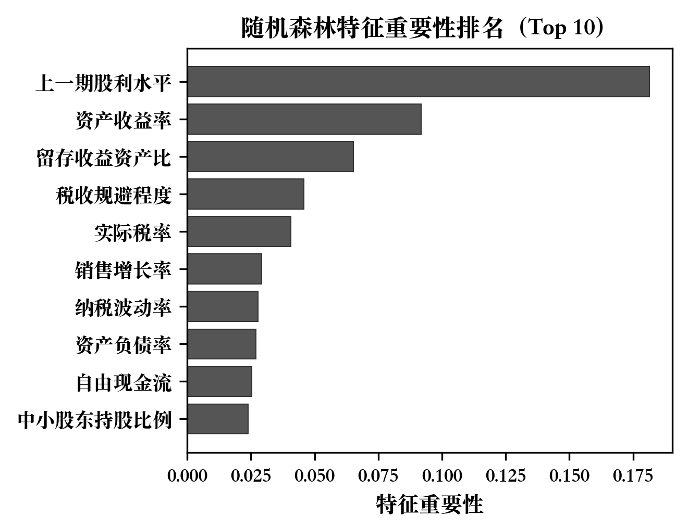
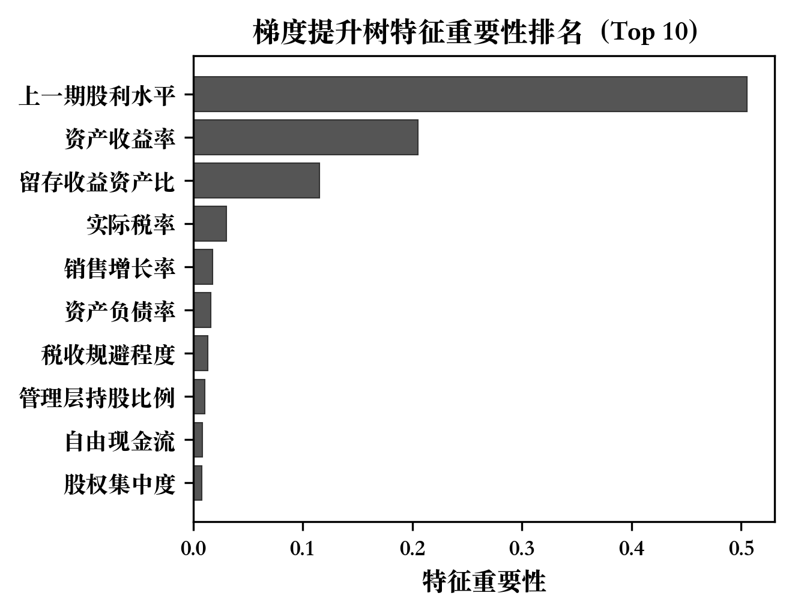
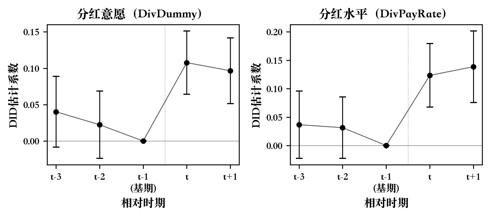
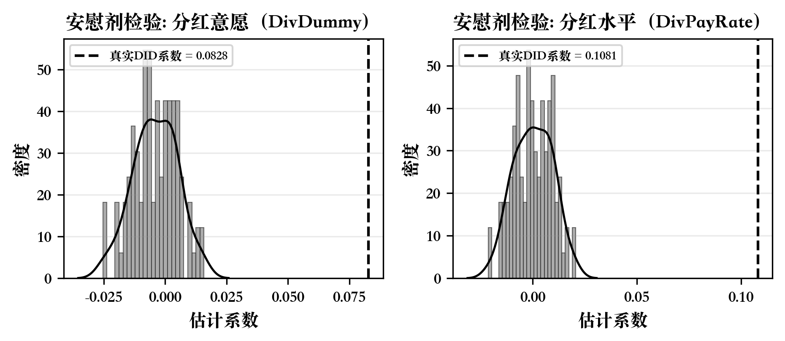

<!-- SOURCE: output/paper/abstract_draft.md -->
<!-- SECTION: 摘要 -->
# 摘要

"公司为何分红"是公司金融领域的经典谜题。本文采用"机器学习预测+准自然实验因果推断"的双路径研究设计，从统计关联与因果识别两个层面系统探究驱动中国上市公司分红决策的关键因素及其对监管政策冲击的响应。第一路径以2006—2022年沪深A股上市公司为样本，运用随机森林和梯度提升树在一年期滚动预测框架下比较71个候选特征的预测贡献，结果表明集成学习模型的样本外预测能力显著优于传统线性方法（RF的R²为0.2510，GBDT为0.2368，OLS仅为0.1565）；特征重要性排序中，上一期股利水平、资产收益率和留存收益资产比稳定居于前三位，代理成本变量（其他应收款资产比等）进入重要性前十，累积局部效应图揭示了掏空程度对分红的非线性抑制效应，主成分分析从降维视角提供了互补验证，假设H1得到支持。第二路径以2023年《上市公司现金分红指引》修订为准自然实验，基于2020—2024年2,306家上市公司样本构建双向固定效应双重差分模型，发现政策使处理组企业的分红概率提高约8.3个百分点、股利支付率提高约10.8个百分点，均在1%水平上显著，该结论在平行趋势检验、安慰剂检验、PSM-DID、Hausman-Taylor估计、熵平衡匹配、排除替代解释和剔除再融资样本七项稳健性检验下保持稳定，假设H2得到支持；异质性分析发现高代理成本企业的政策效应显著更强（Bootstrap组间差异检验p<0.05），假设H3得到支持。本文的发现表明，生命周期与代理成本是理解中国上市公司分红行为的核心经济维度，"硬约束"分红监管对提升企业分红具有显著因果效应，且对代理问题突出的企业效果更为明显，建议监管部门持续完善分红监管机制并关注高代理成本企业的差异化治理。

**关键词：** 上市公司分红；机器学习预测；双重差分法；代理成本；公司治理

# Abstract

"Why do firms pay dividends?" remains a classic puzzle in corporate finance. This paper adopts a dual-pathway research design combining machine learning prediction with quasi-natural experiment causal inference to systematically investigate the key determinants of dividend decisions among Chinese listed companies and their responses to regulatory policy shocks. The first pathway uses a sample of Shanghai and Shenzhen A-share listed companies from 2006 to 2022, employing Random Forest and Gradient Boosting Trees within a one-year rolling prediction framework to compare the predictive contributions of 71 candidate features. Results show that ensemble learning models significantly outperform traditional linear methods in out-of-sample prediction (RF R² = 0.2510, GBDT R² = 0.2368, vs. OLS R² = 0.1565). In the feature importance ranking, lagged dividend level, return on assets, and the retained earnings-to-assets ratio consistently rank among the top three, while agency cost variables (e.g., other receivables-to-assets ratio) rank within the top ten. Accumulated Local Effects plots reveal a nonlinear suppressive effect of tunneling on dividends, and Principal Component Analysis provides complementary validation from a dimensionality reduction perspective, supporting Hypothesis H1. The second pathway treats the 2023 revision of the Guidelines on Cash Dividends of Listed Companies as a quasi-natural experiment. Using a 2020–2024 sample of 2,306 listed companies and a two-way fixed effects difference-in-differences model, the study finds that the policy increased the dividend probability of treated firms by approximately 8.3 percentage points and the dividend payout ratio by approximately 10.8 percentage points, both significant at the 1% level. These findings remain robust across seven sensitivity checks, including parallel trends tests, placebo tests, PSM-DID, Hausman-Taylor estimation, entropy balancing, exclusion of alternative explanations, and removal of refinancing-motivated samples, supporting Hypothesis H2. Heterogeneity analysis reveals that the policy effect is significantly stronger for firms with higher agency costs (bootstrap between-group difference test p < 0.05), supporting Hypothesis H3. The findings indicate that life cycle stage and agency costs are the core economic dimensions for understanding dividend behavior of Chinese listed companies, that "hard-constraint" dividend regulation has a significant causal effect on enhancing corporate dividends, and that the effect is more pronounced for firms with severe agency problems. The paper recommends that regulators continue to improve dividend regulatory mechanisms and adopt differentiated governance for firms with high agency costs.

**Keywords:** Corporate Dividends; Machine Learning Prediction; Difference-in-Differences; Agency Costs; Corporate Governance

<!-- SOURCE: output/paper/chapter1_introduction_draft.md -->
<!-- SECTION: 第一章 绪论 -->
# 第一章 绪论

## 1.1 研究背景

Modigliani and Miller（1961）论证了在无摩擦市场条件下公司价值与利润分配方式无关的理论命题，但全球范围内绝大多数上市公司仍然选择持续稳定地向股东派发现金股利，且分红公告往往引发显著的市场价格调整。围绕这一理论预测与现实行为之间的持久反差——即所谓的"股利之谜"（dividend puzzle），文献从信息传递、委托-代理、公司生命周期和投资者偏好等不同理论视角提出了各有侧重的解释框架，但在哪种机制在何种制度环境下占据主导地位这一问题上，至今尚未形成一致结论。

在中国资本市场，分红问题同时具有学术价值和政策紧迫性。一方面，部分上市公司长期将利润留存于体内而不向投资者分配，这种被市场观察者概括为"重融资、轻回报"的行为模式削弱了中小股东的投资获得感；另一方面，监管层自2001年起持续出台政策文件，将再融资审核与历史分红记录挂钩，试图以行政手段激励企业提高支付水平。2023年12月，证监会修订发布的《上市公司现金分红指引》（以下简称"2023指引"）进一步明确了量化分红底线、强化了未达标企业的披露问责义务、并针对不同盈利水平的企业设定了差异化标准。这一制度调整在政策力度上超越了此前的引导性文件，构成了近年分红监管领域最重要的外生政策冲击，也为运用准自然实验方法评估监管干预的因果效应提供了有利条件。

在方法论层面，传统分红研究主要依赖线性回归框架，通过估计系数的显著性识别分红动因。然而，高维变量之间的共线性和交互效应限制了线性模型的识别能力，预设的函数形式也可能遗漏重要的非线性关系。近年来，机器学习方法在经济学中的应用日益广泛，陈运森等（2024）率先将随机森林和梯度提升树引入中国分红研究，证明了非线性方法在动因识别方面的比较优势。这一方法论进步为从"系数显著性检验"转向"预测重要性评估"提供了新的分析工具。

## 1.2 研究问题与目标

基于上述背景，本文聚焦两个相互关联的核心问题：

**第一，哪些公司特征是驱动中国上市公司分红决策的关键因素？** 既有文献从代理成本、生命周期、融资约束等多个维度探讨了分红动因，但不同变量的相对重要性在各研究中的结论并不完全一致。本文借助机器学习方法的特征重要性评估功能，在高维变量空间中系统筛选和排序预测因子，为回答"何种公司特征主导分红倾向"提供基于样本外预测能力的量化证据。

**第二，外部监管政策能否有效改变企业分红行为？** 2023指引的"硬约束"修订构成了近年来最重要的分红监管冲击，但系统性的因果评估证据仍然有限。本文以该政策为准自然实验，运用双重差分方法估计政策对企业分红意愿和分红水平的因果效应，并检验效应在不同企业群体间的异质性。

围绕上述两个问题，本文提出三项可检验假设：假设H1预期生命周期与代理成本相关变量在机器学习模型中具有最高预测重要性；假设H2预期2023指引对处理组企业的分红意愿和支付水平产生显著的正向因果效应；假设H3预期政策效应在代理问题更突出的企业中更为强烈。

## 1.3 研究思路、方法与技术路线

本文采用"机器学习预测 + 准自然实验因果推断"的双路径研究设计，力图从统计关联与因果识别两个层面互补地回答上述研究问题。

**第一路径：机器学习预测分析（第三章）。** 以2006—2022年沪深A股上市公司为样本，以71个候选特征（含35个公司层面变量和36个行业虚拟变量）为预测因子，采用随机森林（RF）和梯度提升树（GBDT）两种集成学习模型，在"一年期滚动训练"框架下执行16轮样本外预测。通过特征重要性排序和累积局部效应（ALE）图，识别驱动分红行为的关键变量并刻画其非线性效应；辅以主成分分析从降维视角提供互补验证，并在多个子样本上检验结果的稳健性。

**第二路径：DID准自然实验评估（第四章）。** 以2023年《现金分红指引》修订为政策冲击，以2020—2024年沪深A股上市公司为样本，构建双向固定效应DID模型估计政策的平均处理效应。在平行趋势检验、安慰剂检验、PSM-DID、Hausman-Taylor估计、熵平衡匹配等多种识别策略下验证因果效应的稳健性，并从代理成本、产权性质、机构持股和法治水平四个维度考察政策效应的异质性。

两条路径之间存在逻辑联结：第三章通过机器学习识别出的关键动因（代理成本、生命周期变量），为第四章异质性分析中的分组维度提供了实证依据；第四章的因果评估则为第三章发现的统计关联赋予了因果解释的可能。

全文结构如下：第一章为绪论；第二章回顾文献并提出研究假设；第三章报告机器学习预测分析的结果（对应H1）；第四章报告DID准自然实验的结果（对应H2和H3）；第五章总结研究结论、政策启示与研究局限。

## 1.4 可能的创新与不足

本文的可能创新之处包括以下几点。第一，构建了"ML预测 + DID评估"的双路径分析框架，将分红动因识别与政策因果评估整合于统一研究中。现有文献通常将两类问题分别处理，本文尝试在方法与结论层面建立两者的对话，使"何种特征驱动分红"与"政策能否改变分红"得到互补回答。第二，以2023年《现金分红指引》修订这一最新政策冲击为准自然实验，提供了"硬约束"分红监管因果效应的系统性证据。第三，在机器学习可解释性分析中，结合特征重要性排序与主成分降维，从两个互补视角验证了驱动分红行为的核心经济维度。

本文的不足之处需予以说明。第一，机器学习分析与DID分析使用的是两套不同的样本和变量体系，两条路径的结论联结更多基于逻辑推演而非统一的估计框架，整合程度存在进一步提升的空间。第二，DID分析的样本期仅覆盖2020—2024年，政策后窗口期为两年，长期效应有待未来数据延长后进一步检验。第三，本文的处理组与对照组划分基于政策实施前的历史分红水平，虽然论证了其外生性，但无法完全排除所有不可观测混淆因素的影响。第四，受限于数据可得性，部分异质性维度（如产权性质、法治水平）的组间差异未达到统计显著水平，对应结论仅具方向性参考意义。

<!-- SOURCE: output/paper/chapter2_lit_review.md -->
<!-- SECTION: 第二章 文献综述与理论基础 -->
# 第二章 文献综述与理论基础

## 2.1 经典股利理论回顾

学术界围绕"公司为何分红"的讨论已逾半个世纪，至今仍未形成统一解释，Black（1976）将其称为"股利之谜"（dividend puzzle）。争论的起点是 Modigliani and Miller（1961）提出的分红无关性命题：在完美市场条件下，公司的市场价值独立于其利润分配方式。然而，现实中绝大多数上市公司选择持续派息，且股利变动公告通常伴随显著的价格波动，这一事实与理论预设形成了鲜明反差，促使后续研究不断引入现实市场摩擦来弥合理论与经验之间的裂隙。

围绕不同类型的市场摩擦，经典文献形成了四条具有代表性的解释路径。第一条路径关注管理层行为的经验规律。Lintner（1956）通过对美国企业管理者的调研和回归分析，揭示了股利决策中的"锚定与渐进调整"特征——管理者倾向于以前期股利为基准缓慢向目标水平靠拢，而非对盈利波动做即时等比例响应。这一行为模式在其后数十年的数据中被反复证实，构成了分红研究的重要经验起点。第二条路径聚焦信息结构。Miller and Rock（1985）在外部投资者无法完全观察公司真实盈利的前提下，推导出一个均衡结果：高盈利能力的企业愿意承担分红带来的税负成本以区别于低质量企业，分红因而充当了一种具有分离均衡性质的信号。第三条路径着眼于公司内部的权力结构。Jensen（1986）注意到，当企业积累的内部现金超过最优投资所需时，管理层可能将盈余投向私人收益而非股东利益最大化的项目；分红机制通过减少管理层可自由支配的资金规模，在一定程度上抑制了这种代理冲突。La Porta等（2000）将这一逻辑推广至跨国比较，发现股东法律保护程度越高的国家，企业股利支付率越高，将公司层面的治理逻辑延伸至了制度层面。第四条路径则从投资者需求侧出发。Baker and Wurgler（2004）的证据显示，管理层的分红决策会响应市场对分红股票的阶段性估值溢价，在投资者偏好分红时提高派息、反之则降低，体现了供给端对需求端偏好的适应性调整。

需要指出的是，上述四条路径并非相互排斥的竞争性假说，而更接近于从信息摩擦、代理摩擦和行为偏差等不同切面对同一现象的互补刻画。在信息披露体系较为完善的成熟市场中，信号机制的边际解释力已有所减弱，代理逻辑和生命周期特征往往更能捕捉分红行为的截面差异；而在中国这样制度转型尚在进行中的市场中，监管约束、产权安排和投资者结构等制度变量对各机制相对权重的影响更为复杂，需要借助差异化的研究设计加以厘清。

## 2.2 上市公司分红动因的相关实证研究

### 2.2.1 公司治理与代理成本视角

代理成本是解释中国上市公司分红行为差异最为有力的视角之一。与成熟市场中股东-管理者的第一类代理冲突不同，中国资本市场长期以来更为突出的是大股东与中小股东之间的第二类代理冲突。Chen等（2009）研究发现，在中国监管环境下，控股股东可能将分红作为合法的利益输送工具，通过主导利润分配决策将现金从上市公司抽离，使分红行为同时具有"治理改善"与"利益输送"的双重面向。马鹏飞和董竹（2019）进一步发现，大股东掏空程度较高的公司在股利折价现象上更为明显，说明掏空动机会扭曲市场对分红信号的解读。

机构投资者的监督作用是缓解代理问题的重要外部机制。Short等（2002）在英国市场发现机构持股比例与股利水平显著正相关，这一逻辑在中国市场同样得到验证：机构投资者的介入有助于降低信息不对称、强化股东对管理层的约束能力，从而提升公司的分红意愿。陈运森等（2021）则以投服中心作为监管型小股东行权的准自然实验，发现中小股东权利保护的改善能够有效提升公司治理质量和股利支付合规性，为治理机制影响分红行为提供了因果证据。

在变量识别层面，陈运森等（2024）采用机器学习方法对上述代理逻辑进行了系统性验证：其他应收款占总资产比率（大股东掏空的常用代理变量）在随机森林特征重要性排名中名列前茅，且与股利支付率呈负向关系；机构投资者持股比例则表现出显著的正向预测贡献。这表明，代理成本变量不仅在统计上与分红显著相关，其预测力也在样本外滚动预测框架下得到了量化验证。

### 2.2.2 生命周期与融资约束视角

生命周期假说认为，企业处于不同发展阶段时，内部积累资本与外部再投资需求的相对水平存在系统差异，从而影响分红决策：成长期企业通常将利润留存用于扩张，而成熟期企业现金盈余充裕、高质量投资项目减少，更倾向于将超额现金返还股东。Fama and French（2001）在美国市场的大样本研究中，以盈利能力、规模与投资机会为核心变量，系统记录了不同财务特征公司的分红概率分布，发现留存收益占比高的成熟企业显著更可能支付股利——这一发现为生命周期假说提供了直接经验支撑，也确立了"留存收益资产比"作为生命周期阶段代理变量的研究范式。Singh等（2023）将生命周期分析框架引入印度等新兴市场，发现即便在制度环境存在显著差异的情境下，生命周期阶段仍是影响股利政策的重要调节变量，说明这一逻辑具有较强的跨市场稳健性。在中国情境下，陈运森等（2024）的机器学习结果同样确认，留存收益资产比在分红预测中占据最高的特征重要性权重，与生命周期假说的理论预测高度吻合。

融资约束是生命周期逻辑的重要补充。面临严格外部融资约束的企业，在现金流不确定时往往倾向于"预防性储蓄"，压低分红以维持流动性缓冲；而融资渠道畅通的企业则可通过外部资本市场满足再投资需求，从而将盈余更充分地向股东分配。陈运森等（2024）的特征重要性分析显示，融资约束程度在随机森林模型中具有较高的预测贡献，进一步证实了这一机制逻辑。Song等（2025）的最新研究则从供给侧视角出发，发现数字金融的发展通过缓解企业融资约束，显著提升了中国中小上市公司的股利支付倾向，为融资渠道改善影响分红行为提供了外生识别证据。

### 2.2.3 监管政策与市场反应视角

与成熟市场主要依赖市场力量约束企业分红行为不同，中国监管层自2001年起选择了一条行政干预的路径——将上市公司再融资资格与历史分红水平直接挂钩，由此形成了学界所称的"半强制"分红制度。这一制度安排为研究外部监管如何改变企业支付行为提供了一组可观察的政策变异。李常青等（2010）利用事件研究法检验了历次政策颁布前后的股价反应，结果表明资本市场将监管收紧解读为分红概率上升的利好信号，累计超额收益在事件窗口内显著为正。

进一步的因果评估文献则直接估计了政策对分红行为的净效应。魏志华等（2014）将处理组界定为政策前分红水平低于监管门槛的企业，通过双重差分估计发现这些"边际合规者"的分红概率和支付比率在政策后显著上升，而对照组变化不明显，表明政策的行为改变效应集中体现在受约束企业身上。陈云玲（2014）在更长时间跨度上验证了类似结论：每一轮政策强化均可观测到全样本分红水平的阶梯式抬升。刘星等（2016）则在上述框架中引入治理质量的调节效应，报告了一个值得关注的不对称模式——内部治理机制薄弱的公司对政策约束更为敏感，对应的分红提升幅度也更大，提示监管干预可能对治理缺口起到了一定程度的替代补偿作用。

时间推进到2023年12月，证监会修订后的《上市公司现金分红指引》在量化分红门槛、强化披露问责和差异化监管标准方面作出了比此前更为刚性的制度安排，标志着分红监管力度从建议性引导向具有约束力的规范转变。卿小权等（2025）是对这一最新政策冲击进行系统因果评估的早期文献之一，其双重差分估计表明受政策约束的企业在分红意愿和支付水平两个维度上均出现了显著提升，而代理成本高、外部治理环境弱的企业响应幅度更大。在国际文献中，Benkraiem等（2025）和Song等（2025）分别从碳绩效压力和数字金融渗透两个角度揭示了影响分红行为的新兴外生因素，进一步拓展了研究者对企业支付决策受制度环境和技术变革共同塑造的认识。

### 2.2.4 机器学习方法的引入

当研究者试图从数十个候选变量中甄别分红行为的核心驱动因素时，线性回归框架的局限日益凸显。具体而言，高维解释变量之间普遍存在的多重共线性使得单个系数的估计值和符号对模型设定高度敏感，而传统显著性检验在大样本下倾向于拒绝零假设，难以区分"统计显著"与"经济重要"。更关键的是，线性函数形式无法表达变量间的门槛效应和交互作用——例如掏空程度对分红可能存在的非线性抑制效应，或盈利能力与融资约束的联合影响——这类信息在线性框架中会被系统性遗漏。

近年来，以集成决策树为代表的机器学习方法为解决上述问题提供了新的工具选择。Breiman（2001）提出的随机森林通过对数据和特征空间同时进行随机扰动来降低过拟合风险，Friedman（2001）发展的梯度提升算法则以逐步拟合残差的方式构建高精度的加法模型，两者均能自动捕获变量间的非线性关联和高阶交互。陈运森等（2024）率先将这两类模型应用于中国上市公司分红行为的预测与解释。该研究的核心贡献在于：第一，建立了按年度滚动的样本外预测比较框架，使不同模型之间的预测能力差异可以在排除前视偏差的条件下被严格度量；第二，引入 Apley and Zhu（2020）提出的累积局部效应（ALE）图作为可解释性分析工具，将每个变量对分红指标的边际影响从算法内部提取出来并可视化呈现，避免了传统偏依赖图在变量高度相关时的估计偏误。其实证结果显示，留存收益资产比和掏空类代理变量稳定地位于预测贡献的前列，为生命周期假说与代理理论在中国情境下的解释力提供了基于预测框架的定量证据。本文第三章的分析直接继承了这一方法论路径，并在模型超参数设定、可解释性分析手段和稳健性验证维度上做了进一步拓展。

## 2.3 文献评述

综览上述文献，可以归纳出若干较为稳健的研究共识。在机制层面，代理理论与生命周期假说的解释力在中国上市公司中得到了较为一致的验证：代理成本代理变量（掏空指标、机构持股比例）和生命周期代理变量（留存收益资产比）是预测分红行为的核心因子，在多种统计框架下均呈现稳定的显著性和较高的预测贡献。在政策层面，中国历次现金分红监管强化均对分红水平产生了可测量的正向效应，其中合规动机较强、再融资需求明显的企业响应最为显著。在方法论层面，机器学习对传统回归方法的比较优势——更强的样本外预测能力和更系统的变量重要性评估——已在分红研究中得到初步验证。

然而，文献在若干核心问题上仍存在实质性分歧。第一，分红的信号功能在中国市场是否依然有效尚无定论：部分证据表明大股东可能借助分红实施合法掏空，意味着分红并不必然传递正面私有信息，"信号增强"与"利益输送"可能在不同类型公司中并行存在。第二，监管政策究竟实现了实质性的治理改进，还是主要引发了企业的策略性合规，各文献的结论并不一致——尤其是在判断政策能否真正降低代理成本方面。第三，生命周期变量与代理成本变量在解释力排序上的稳定性尚待确认：随着样本期间、行业构成与估计方法的变化，两类变量的相对重要性存在一定波动。

上述共识与分歧共同指向若干可改进之处，构成本文的核心研究动机。其一，现有文献多将"分红动因识别"与"政策因果评估"分别处理，缺乏将动因机制与政策效应整合于统一框架的系统尝试；本文"ML预测 + DID评估"的双路径设计正是为弥补这一结构性空缺而构建的。其二，既有政策评估研究对异质性机制的刻画多依赖分样本回归，缺乏将ML识别出的关键机制变量与政策异质性效应直接联结的分析路径；本文将在第四章异质性分析中尝试建立这一联结。其三，2023年《上市公司现金分红指引》的"硬约束"修订是近年最重要的制度冲击之一，现有的系统性因果证据仍属有限，需要更为严格的识别策略加以评估。据此，本文构建双路径框架，以期从"何种公司特征主导分红倾向"与"监管冲击如何改变分红行为"两个维度提供互补的经验证据。

## 2.4 理论框架与研究假设

依托前述文献，本文围绕三项可检验假设构建理论框架。

**假设H1（预测筛选假设）**：基于代理理论与生命周期假说的核心逻辑，以及陈运森等（2024）在中国A股市场已有的机器学习验证，本文预期，在控制其他特征后，特征重要性排名靠前的变量主要来自两类：一是反映代理成本水平的指标，包括其他应收款占资产比（掏空程度代理）和机构投资者持股比例；二是刻画公司生命周期阶段的指标，以留存收益资产比为核心。代理冲突在本质上决定了管理层将自由现金流用于分配还是截留的意愿，而生命周期阶段则从现金盈余结构上约束或释放公司的分红能力，两者共同构成分红倾向的主要决定因素。第三章将通过随机森林和梯度提升树的滚动预测框架，系统比较43个候选特征的相对预测贡献，对H1加以检验。

**假设H2（政策因果效应假设）**：基于监管约束理论及卿小权等（2025）的初步证据，本文预期2023年《现金分红指引》硬约束修订对处理组公司的股利支付意愿和分红比率均产生了显著的正向因果效应。其理论逻辑在于：硬约束政策通过提高不达标企业的合规成本，迫使原本处于低分红均衡的公司增加股利支付；对于代理冲突较为突出的企业，政策约束还具有压缩管理层可支配自由现金流的额外治理功能。第四章将通过以沪深A股主板2020—2024年数据为基础的双重差分估计、平行趋势检验及系列稳健性检验对H2加以评估。

**假设H3（异质性处理效应假设）**：结合代理理论、生命周期假说与异质性处理效应文献，本文预期政策效应在以下两类公司中更为突出：一是代理问题相对严重、股东-管理层或股东-股东冲突较强的企业，政策约束可压缩管理层对自由现金流的可支配空间，边际效应更大；二是外部治理环境较弱（如法治水平较低地区）或监管压力传导更直接的非国有企业，政策的行为约束效果更强。H3的验证将在第四章的异质性分析部分展开，以代理成本高低为主要分组维度，辅以产权性质、机构持股水平和地区法治水平等调节变量。

<!-- SOURCE: output/paper/chapter3_ml_prediction_draft.md -->
<!-- SECTION: 第三章 机器学习预测分析 -->
# 第三章 上市公司分红的动因预测分析

## 3.1 样本选择与数据来源

本章使用的公司财务与治理数据均来自 CSMAR 数据库，样本期为 2006 至 2022 年，覆盖沪深 A 股全部非金融行业上市公司。为保证数据质量与模型估计的可靠性，依次执行以下筛选步骤：第一，剔除金融行业公司（银行、保险、券商等），因其资产负债结构和利润分配逻辑与非金融企业存在本质差异；第二，剔除 ST/*ST 公司，因其财务异常状态下的分红行为可能受到退市风险等非常规因素主导；第三，删除任一关键解释变量存在缺失值的观测。上述处理方式与陈运森等（2024）保持一致。最终样本包含 31,469 个公司-年度观测值，分布于 17 个年度截面，其中 2006 年截面包含 799 个观测值，至 2022 年增长至 3,636 个，折射出中国资本市场上市公司数量的持续扩张。

## 3.2 变量定义

### 3.2.1 被解释变量

本章采用两类被解释变量刻画上市公司分红行为。（1）**股利支付率**（Dividend_ratio1），即每股现金股利与每股收益之比，为主回归中的连续型响应变量，反映公司利润中向股东分配的比例。全样本均值为 0.2696，标准差为 0.3240，表明中国上市公司整体分红比率适中，但个体间差异显著。（2）**是否发放现金股利**（Dividend），当年发放现金股利取 1，否则取 0，为分类任务的二元响应变量。全样本中约 69.5% 的公司-年度观测值发放了现金股利。

### 3.2.2 解释变量

本章使用 35 个公司层面特征变量和 36 个证监会行业分类虚拟变量，共计 71 个候选预测因子。35 个公司特征可归为以下五类：

**（一）公司治理与代理成本类**（16 个变量）。包括管理费用率、管理层持股比例、独立董事比例、其他应收款资产比（Tunneling，大股东掏空的常用代理变量）、机构投资者持股比例、控股股东股权质押比例等。此类变量刻画了公司内部的利益冲突程度与外部监督强度，是检验代理理论预测分红动因的核心指标。

**（二）生命周期与盈利能力类**（6 个变量）。核心变量为留存收益资产比（Retainedearn_ratio），被广泛视为企业生命周期阶段的代理变量，全样本均值为 0.1625。此外，资产收益率（ROA）、自由现金流、上一期股利水平等反映了公司的盈利能力和分红持续性。

**（三）税收与融资约束类**（5 个变量）。包括实际税率、税收规避程度、纳税波动率、融资约束程度（KZ 指数）和再融资动机等。

**（四）市场环境与估值类**（8 个变量）。包括投资者情绪、托宾 Q、账面市值比、资产负债率、公司规模、分析师跟踪人数、市场化程度和产权性质等。

**（五）行业虚拟变量**（36 个）。按证监会行业分类标准设置，控制行业层面的系统性差异。

## 3.3 机器学习模型

### 3.3.1 预测框架

为确保预测评价的严谨性并排除前视偏差（look-ahead bias），本章采用一年期滚动训练-测试框架（陈运森等，2024）。具体操作为：取第 t 年截面的全部公司-年度观测值构成训练集，第 t+1 年截面构成测试集，依此从 2006→2007 滚动至 2021→2022，共完成 16 轮独立的样本外预测。训练前，以 2006 年截面为基准拟合 StandardScaler 对所有特征进行零均值-单位方差标准化，以消除不同变量量纲对模型分裂准则的干扰。由于训练数据在时间上严格先于测试数据，模型在每一轮预测中仅可利用"当期及之前"的信息，模拟了真实的事前预测场景。据此计算的样本外 R² 反映的是模型借助历史特征预测次年分红行为的真实泛化能力，而非基于全样本的事后拟合优度。

### 3.3.2 模型设定

本章以两类集成学习模型为核心分析工具：

**随机森林（RF）**。Breiman（2001）提出的随机森林通过 bootstrap 重抽样构建大量决策树，并在每个分裂节点随机抽取特征子集，最终取所有树的平均预测值。本章设定树的数量为 5,000 棵，每次分裂候选特征数为 19，以平衡模型的偏差与方差。RF 的特征重要性基于每个变量在所有树中分裂时带来的不纯度减少量（Gini importance）取平均。

**梯度提升树（GBDT）**。Friedman（2001）提出的梯度提升方法以前向逐步加法建模为核心思想，每轮迭代拟合上一轮残差的方向梯度。本章设定迭代次数 3,000 轮、最大树深 4、学习率 0.001、子采样率 0.7，以确保模型充分学习的同时控制过拟合风险。

作为性能基准，本章还报告了以下传统模型的预测结果：OLS 线性回归（仅使用 35 个非行业变量）、Lasso 回归（通过 L1 正则化实现特征选择）、支持向量回归（SVR）和决策树回归。

### 3.3.3 可解释性工具

为将模型的"黑箱"预测还原为具有经济含义的变量效应，本章综合使用两种可解释性工具：（1）**累积局部效应图（ALE）**，由 Apley and Zhu（2020）提出，通过条件分布而非边际分布衡量变量的局部效应，克服了传统偏依赖图（PDP）在变量高度相关时可能产生的误导性。ALE 图展示的是，当某变量值在其分布范围内变化时，模型预测值的累积偏移，直观揭示变量对被解释变量的非线性影响路径。（2）**偏依赖图（PDP）**，展示单一变量在控制其他变量后对预测值的边际效应，在变量间相关性较低时具有良好的直观性。

## 3.4 预测结果比较

### 3.4.1 模型性能对比

表1汇报了各模型在 16 轮滚动预测中的平均性能指标。在样本外预测精度（R²）这一最关键指标上，**随机森林（0.2510）和梯度提升树（0.2368）显著优于所有传统方法**——OLS 的样本外 R² 仅为 0.1565，Lasso 为 0.1805，SVR 为 0.1613，决策树甚至为负值（-0.0155），表明单棵决策树在此任务上几乎没有泛化能力。从 MSE、MAE 和 MedAE 等辅助指标来看，RF 和 GBDT 也全面领先，确认了集成学习方法在捕捉分红决策的非线性与交互效应方面的比较优势。

**表1 各模型预测性能对比（16轮滚动预测平均值）**

| 模型 | 样本内 R² | 样本外 R² | MSE | MAE | MedAE | EVS |
|------|----------|----------|------|------|-------|------|
| OLS | 0.2490 | 0.1565 | 0.0871 | 0.1834 | 0.1254 | 0.1812 |
| Lasso | 0.2386 | 0.1805 | 0.0850 | 0.1794 | 0.1229 | 0.1928 |
| Decision Tree | 0.0446 | -0.0155 | 0.1039 | 0.2167 | 0.1876 | -0.0040 |
| SVR | 0.5964 | 0.1613 | 0.0868 | 0.1788 | 0.1177 | 0.1675 |
| GBDT | 0.6075 | **0.2368** | 0.0790 | 0.1646 | 0.1008 | 0.2518 |
| RF | 0.9018 | **0.2510** | **0.0776** | **0.1624** | **0.0984** | **0.2703** |

注：数据来源于 CSMAR 数据库，作者计算。

值得注意的是，RF 的样本内 R² 高达 0.9018，与样本外 R²（0.2510）之间存在较大落差，反映了随机森林在训练数据上的强拟合特性；GBDT 的样本内 R²（0.6075）则更为温和，与样本外 R²（0.2368）的差距较小，表明其正则化机制更为有效。两种模型在样本外性能上的差异不大（RF 略优约 1.4 个百分点），且均显著优于线性基准，验证了机器学习方法在分红预测中的实用价值。

### 3.4.2 逐年预测趋势

表2汇报了 RF 逐年样本外 R² 的变化趋势。

**表2 RF逐年样本外R²**

| 滚动窗口 | RF 样本外 R² |
|----------|-------------|
| 2006→2007 | 0.1704 |
| 2007→2008 | 0.1347 |
| 2008→2009 | 0.0839 |
| 2009→2010 | 0.1767 |
| 2010→2011 | 0.2722 |
| 2011→2012 | 0.0786 |
| 2012→2013 | 0.1840 |
| 2013→2014 | 0.2616 |
| 2014→2015 | 0.2490 |
| 2015→2016 | 0.2429 |
| 2016→2017 | 0.3217 |
| 2017→2018 | 0.3011 |
| 2018→2019 | 0.3527 |
| 2019→2020 | 0.3981 |
| 2020→2021 | 0.3938 |
| 2021→2022 | 0.3945 |

注：数据来源于 CSMAR 数据库，作者计算。

从 RF 的逐年样本外 R² 来看，预测精度呈现出显著的时间趋势：早期窗口（2006→2007 至 2011→2012）的 R² 波动于 0.08 至 0.27 之间，而后期窗口（2016→2017 至 2021→2022）稳定在 0.30 至 0.39 之间。这一改善可能源于两方面原因：一是随着样本量的增长，模型可学习的结构性信息更为丰富；二是中国上市公司分红行为在半强制分红政策和市场成熟化的双重推动下，逐步呈现更强的可预测性。

## 3.5 特征重要性分析

### 3.5.1 特征重要性排序

表3汇报了 RF 和 GBDT 在 16 轮滚动预测中平均特征重要性排名前 10 的变量。两个模型的排名呈现高度一致性：

**表3 RF与GBDT特征重要性排名（Top 10）**

| 排名 | RF 变量 | RF 重要性 | GBDT 变量 | GBDT 重要性 |
|------|---------|----------|-----------|------------|
| 1 | Dividend_lag | 17.82% | Dividend_lag | 30.46% |
| 2 | ROA | 7.89% | ROA | 12.74% |
| 3 | Retainedearn_ratio | 6.31% | Retainedearn_ratio | 6.66% |
| 4 | Tax_ratio | 4.40% | Tax_ratio | 4.96% |
| 5 | Tax_avoid | 3.91% | Lev | 2.78% |
| 6 | Tax_volatility | 3.30% | Growth | 2.62% |
| 7 | Growth | 2.91% | Tax_volatility | 2.18% |
| 8 | Lev | 2.89% | Da_abs | 2.05% |
| 9 | Tunneling | 2.61% | Institution | 2.04% |
| 10 | Freecash2 | 2.53% | Tunneling | 2.00% |

注：数据来源于 CSMAR 数据库，作者计算。

图1和图2分别以柱状图展示了 RF 和 GBDT 的特征重要性排序全貌。

**图1 随机森林特征重要性排序（16轮滚动平均）**

**图2 梯度提升树特征重要性排序（16轮滚动平均）**

**排名第一的均为上一期股利水平（Dividend_lag）**，在 RF 中贡献了 17.8% 的平均重要性，在 GBDT 中更高达 30.5%。这一结果与 Lintner（1956）的股利平滑理论高度吻合——管理者倾向于维持稳定的分红水平，使上期股利成为当期最强的预测锚。

**排名第二的为资产收益率（ROA）**，在两个模型中分别贡献 7.9% 和 12.7% 的重要性。盈利能力是分红的物质基础，ROA 的高排名符合基本经济逻辑。

**排名第三的为留存收益资产比（Retainedearn_ratio）**，两个模型中均贡献约 6.3%—6.7% 的重要性。这是生命周期理论最核心的代理变量：留存收益占比高的成熟企业，投资机会减少而现金盈余充裕，更倾向于向股东分配利润，验证了 Fama and French（2001）的经典发现在中国市场的适用性。

**代理成本变量同样进入前 10 名**。其他应收款资产比（Tunneling）在 RF 和 GBDT 中分别排名第 9 和第 10，反映了大股东资金占用对分红的抑制效应；机构投资者持股比例（Institution）在两个模型中分别排名第 11 和第 9，说明外部监督力量对分红行为具有正向推动作用。

**税收相关变量表现突出**。实际税率（Tax_ratio）在两个模型中均排名第 4，税收规避程度和纳税波动率也均进入前 10，表明税收因素对分红决策的影响不容忽视，但其具体机制仍待进一步检验。

总体而言，**特征重要性排序支持假设 H1**：生命周期变量（留存收益资产比 Top 3）与代理成本变量（掏空指标 Top 10、机构投资者持股比例 Top 11）是预测分红行为最重要的变量类别之一，与理论预期一致。

### 3.5.2 非线性效应分析

ALE 图进一步揭示了关键变量对股利支付率的非线性影响路径。图3至图6展示了四个核心变量的 RF ALE 图。

**图3 留存收益资产比的累积局部效应（RF）**

**留存收益资产比**的 ALE 图呈现明显的递增趋势：当留存收益资产比从负值区间（表示累积亏损）上升至 0.3 以上时，其对股利支付率的累积局部效应从约 -0.08 上升至 +0.05，且在高值区间效应增速放缓，呈现出"先快后慢"的非线性特征。这一结果表明，企业从亏损期过渡到成熟期的过程中，分红倾向经历了从低到高的系统性转变，且到达高留存收益水平后边际效应趋于饱和——可能反映了成熟企业分红已接近稳态均衡。

**图4 其他应收款资产比（Tunneling）的累积局部效应（RF）**

**其他应收款资产比**的 ALE 图呈现显著的递减趋势：随着该变量从低值向高值变化，累积效应持续为负，且在高值区间（掏空程度严重时）加速下降。这一非线性特征说明，大股东掏空对分红的抑制效应并非线性等比例的，而是在掏空程度超过一定阈值后呈现加速恶化趋势。

**图5 融资约束程度（KZ指数）的累积局部效应（RF）**

**融资约束程度**（KZ 指数）的 ALE 图同样呈递减趋势，表明融资约束越强，股利支付率越低。这与预防性储蓄假说一致：面临严格融资约束的企业更倾向于保留现金以应对流动性风险，压低分红。

**图6 资产收益率（ROA）的累积局部效应（RF）**

**资产收益率**的 ALE 图呈现单调递增趋势且斜率较为稳定，说明盈利能力对分红的边际效应相对线性，是一个"基本面驱动"变量。

此外，图7和图8分别展示了 RF 和 GBDT 的偏依赖图（PDP）网格，呈现 Top 变量对预测值的边际效应全景。

**图7 随机森林偏依赖图（PDP）网格**

**图8 梯度提升树偏依赖图（PDP）网格**

## 3.6 主成分降维与潜在经济维度分析

上述特征重要性分析从"单变量贡献"的角度识别了驱动分红行为的关键预测因子。然而，35 个连续金融特征之间往往存在较强的多重共线性——例如，ROA、留存收益资产比和自由现金流同属盈利与生命周期维度，股权集中度和中小股东持股比例则存在天然的负相关。为从"降维"角度揭示这些特征背后的潜在经济结构，本节对 35 个连续金融特征进行主成分分析（PCA），从互补视角验证特征重要性排序的结论。

### 3.6.1 主成分提取与碎石分析

以 2006 年截面数据为基准（与前文 StandardScaler 拟合策略一致），对标准化后的 35 个连续金融特征执行 PCA。图9的碎石图展示了各主成分的解释方差占比及累积趋势。按照累积解释方差不低于 80% 的标准，需保留前 18 个主成分（累积解释方差为 81.36%），说明 35 个金融特征的信息较为分散，不存在少数几个主成分即可概括大部分变异的情形。前 3 个主成分分别解释了约 9.9%、7.3% 和 5.8% 的方差，单个主成分的解释力相对有限，反映了分红决策受到多维度因素的共同驱动。

**图9 PCA碎石图（35个连续金融特征）**

表4列示了前 18 个主成分的解释方差及各主成分上载荷绝对值最大的前 3 个变量。

**表4 PCA主成分解释方差与关键载荷**

| 主成分 | 解释方差占比 | 累积方差占比 | Top 1 载荷变量 | Top 2 载荷变量 | Top 3 载荷变量 |
|--------|------------|------------|--------------|--------------|--------------|
| PC1 | 9.88% | 9.88% | 资产收益率(+0.40) | 分析师跟踪人数(+0.33) | 留存收益资产比(+0.33) |
| PC2 | 7.30% | 17.18% | 账面市值比(+0.31) | 股权集中度(+0.31) | 公司规模(+0.30) |
| PC3 | 5.76% | 22.94% | 投资者情绪(+0.36) | 机构投资者持股(+0.33) | 管理层持股(-0.29) |
| PC4 | 4.72% | 27.66% | 融资约束程度(+0.48) | 中小股东持股(-0.41) | 股权集中度(+0.33) |
| PC5 | 4.41% | 32.07% | 资产负债率(+0.42) | 董事长持股(+0.33) | 管理层持股(+0.32) |
| PC6 | 4.17% | 36.24% | 每股经营现金流(+0.51) | 自由现金流(+0.46) | 中小股东持股(-0.22) |
| PC7 | 3.78% | 40.02% | 销售增长率(+0.39) | 市场化程度(-0.29) | 管理费用率(-0.29) |
| PC8 | 3.55% | 43.57% | 董事长薪酬(+0.46) | 董事长任期(+0.37) | 机构投资者持股(+0.27) |
| PC9–18 | 37.79% | 81.36% | — | — | — |

注：数据来源于 CSMAR 数据库，PCA 以 2006 年截面为基准拟合，作者计算。PC9–18 因单个解释方差均低于 3.5% 故合并列示。

### 3.6.2 主成分载荷的经济解读

图10以热力图形式展示了前 8 个主成分在全部 35 个特征上的载荷值，直观呈现变量与主成分之间的对应关系。

**图10 PCA载荷热力图（前8个主成分）**

从载荷模式可提炼出若干具有经济含义的潜在维度：PC1 以资产收益率、分析师跟踪人数和留存收益资产比为主导，可解读为**"盈利能力与市场关注度"维度**，集中反映了高盈利、高关注度的成熟企业特征。PC2 以账面市值比、股权集中度和公司规模为主导，代表**"公司规模与估值"维度**。PC3 中投资者情绪和机构持股为正载荷、管理层持股为负载荷，对应**"市场情绪与外部监督"维度**。PC4 以融资约束为最高正载荷并与中小股东持股形成反向关系，可解读为**"融资约束与股权结构"维度**。PC6 中现金流和自由现金流占主导，代表**"现金充裕度"维度**。

值得注意的是，前两个最重要的主成分——PC1（盈利能力与市场关注度）和 PC6（现金充裕度）——与特征重要性排序中 Top 3 的 ROA、留存收益资产比和自由现金流高度吻合。PC3 和 PC4 中出现的机构投资者持股、融资约束、股权集中度等变量也与特征重要性中的代理成本类变量一致，进一步佐证了**假设 H1**：生命周期与代理成本维度是解释分红行为最核心的潜在经济结构。

### 3.6.3 降维后的预测性能检验

为定量评估主成分特征的信息浓缩程度，分别使用 PCA 提取的 18 个主成分和原始 71 个特征训练 RF 与 GBDT 模型，在同一 16 轮滚动框架下对比预测性能。如表5所示，降维后模型的样本外 R² 出现较大幅度下降：RF 从 0.2510 降至 0.0576，GBDT 从 0.2368 降至 0.0818。

**表5 PCA降维特征与原始特征的模型预测性能对比**

| 模型-特征组合 | 样本内 R² | 样本外 R² | MSE | MAE |
|-------------|----------|----------|------|------|
| RF-原始71特征 | 0.9018 | **0.2510** | 0.0776 | 0.1624 |
| RF-PCA(18)特征 | 0.8814 | 0.0576 | 0.0958 | 0.2003 |
| GBDT-原始71特征 | 0.6075 | **0.2368** | 0.0790 | 0.1646 |
| GBDT-PCA(18)特征 | 0.4741 | 0.0818 | 0.0940 | 0.1988 |

注：数据来源于 CSMAR 数据库，PCA 以 2006 年截面为基准拟合（K=18），作者计算。

R² 的显著下降说明两方面信息：其一，PCA 仅对 35 个连续特征进行降维，而原始特征集中的 36 个行业虚拟变量提供了重要的行业异质性信息，这些信息在 PCA 中被排除；其二，PCA 作为线性变换，无法保留特征之间的非线性交互关系，而 RF 和 GBDT 恰恰依赖变量间的高阶交互效应获取预测能力。该结果也从反面说明，行业效应和非线性交互构成了机器学习模型预测分红行为的重要信息来源，这一发现与行业虚拟变量在特征重要性中的集体贡献相吻合。

## 3.7 子样本稳健性检验

为检验上述关键动因识别结果的稳健性，本章进一步在多个子样本上重复一年期滚动预测分析。表6汇报了各子样本的预测性能与 Top 3 特征。

**表6 子样本稳健性检验结果**

| 子样本 | 观测数 | 滚动窗口数 | RF 样本外 R² | GBDT 样本外 R² | RF Top 3 | GBDT Top 3 |
|--------|--------|-----------|-------------|---------------|----------|-----------|
| 全样本 | 31,469 | 16 | 0.2520 | 0.2368 | Dividend_lag, ROA, Retainedearn_ratio | Dividend_lag, ROA, Retainedearn_ratio |
| 国有企业 | 13,294 | 16 | 0.2540 | 0.2237 | Dividend_lag, ROA, Retainedearn_ratio | Dividend_lag, ROA, Retainedearn_ratio |
| 非国有企业 | 18,175 | 16 | 0.2183 | 0.1784 | Dividend_lag, ROA, Retainedearn_ratio | Dividend_lag, ROA, Retainedearn_ratio |
| 高现金流 | 15,588 | 16 | 0.2452 | 0.1872 | Dividend_lag, Retainedearn_ratio, ROA | Dividend_lag, ROA, Retainedearn_ratio |
| 低现金流 | 15,588 | 16 | 0.1913 | 0.1735 | Dividend_lag, ROA, Retainedearn_ratio | Dividend_lag, ROA, Tax_ratio |
| 2012年之前 | 5,722 | 5 | 0.1690 | 0.1516 | Dividend_lag, ROA, Retainedearn_ratio | Dividend_lag, ROA, Retainedearn_ratio |
| 2012年及之后 | 22,421 | 8 | 0.3303 | 0.3203 | Dividend_lag, ROA, Retainedearn_ratio | Dividend_lag, ROA, Retainedearn_ratio |

注：数据来源于 CSMAR 数据库，作者计算。

**按产权性质分组**。将样本分为国有企业（13,294 个观测值）和非国有企业（18,175 个观测值）。国有企业组的 RF 样本外 R² 为 0.2540，GBDT 为 0.2237；非国有企业组的 RF 样本外 R² 为 0.2183，GBDT 为 0.1784。两组子样本的特征重要性前 3 名变量均为上一期股利水平、ROA 和留存收益资产比，与全样本完全一致。国有企业组的预测精度略高于非国有企业组，可能反映了国有企业分红行为的合规驱动特征使其更具可预测性。

**按现金流水平分组**。将样本按自由现金流中位数分为高现金流组和低现金流组（各 15,588 个观测值）。高现金流组的 RF 样本外 R² 为 0.2452，GBDT 为 0.1872；低现金流组的 RF 为 0.1913，GBDT 为 0.1735。值得注意的是，高现金流组中留存收益资产比（RF Top 2）的排名超过了 ROA（RF Top 3），反映了在现金流充裕的企业中，生命周期阶段对分红决策的主导性更为突出；高现金流组的 GBDT 中自由现金流（Freecash2）也进入了前 5 名。

**按时间窗口分组**。将样本分为 2012 年之前（5,722 个观测值）和 2012 年及之后（22,421 个观测值）两个子期。后期子样本的预测精度大幅优于前期——RF 样本外 R² 从 0.1690 提升至 0.3303，GBDT 从 0.1516 提升至 0.3203。特征重要性前 3 名在两个子期均保持稳定。后期预测精度的显著提升可能反映了两方面因素：一是样本量的增长提供了更丰富的训练信息，二是 2012 年后半强制分红政策的持续强化使企业分红行为更加规则化，提高了可预测性。

综上，子样本分析确认了 RF 和 GBDT 识别出的关键动因——生命周期变量、代理成本变量和盈利能力变量——在不同分组口径下均保持稳健，支持假设 H1。

## 3.8 本章小结

本章通过一年期滚动预测框架，系统比较了 6 种模型在预测中国上市公司股利支付率方面的性能，并利用特征重要性和 ALE 图识别了驱动分红行为的关键因素。主要发现包括：

**第一**，集成学习方法（RF 和 GBDT）的样本外预测精度显著优于传统线性模型，RF 的平均样本外 R² 为 0.2510，GBDT 为 0.2368，而 OLS 仅为 0.1565，验证了非线性方法在分红预测中的比较优势。

**第二**，特征重要性分析表明，上一期股利水平、资产收益率和留存收益资产比是预测分红行为最重要的三个变量，在 RF 和 GBDT 中均稳定居于前三名。其中，留存收益资产比作为生命周期代理变量的突出地位，与 Fama and French（2001）和陈运森等（2024）的发现一致。

**第三**，代理成本变量（其他应收款资产比、机构投资者持股比例）和融资约束变量同样进入重要性排名前列，且通过 ALE 图呈现出经济直觉一致的非线性效应模式，为代理理论和融资约束假说在中国情境下的适用性提供了补充证据。

**第四**，上述关键动因识别结果在按产权性质、现金流水平和时间窗口划分的子样本中均保持稳健，**假设 H1 得到支持**。

**第五**，主成分分析从降维视角提供了互补验证。对 35 个连续金融特征的 PCA 显示，需 18 个主成分方能解释 80% 以上的总方差，说明分红决策的驱动结构较为多维。前几个主成分可分别解读为"盈利能力与市场关注度""公司规模与估值""市场情绪与外部监督""融资约束与股权结构""现金充裕度"等潜在维度，其载荷模式与特征重要性排序中的 Top 变量高度吻合。降维后的预测性能显著下降则说明行业效应和非线性交互构成了集成学习模型的重要信息来源。

综上，特征重要性排序与主成分降维的**双重验证**共同表明，生命周期、代理成本和盈利能力是驱动中国上市公司分红行为最核心的经济维度。这些被机器学习系统性筛选出的关键动因——尤其是生命周期变量和代理成本变量——是否以及如何受到外部监管政策的影响？第四章将以 2023 年《现金分红指引》修订为准自然实验，通过双重差分方法对这一问题展开因果评估。

<!-- SOURCE: output/paper/chapter4_did_evaluation_draft.md -->
<!-- SECTION: 第四章 DID因果评估 -->
# 第四章 基于政策准自然实验的因果效应评估

第三章的机器学习分析从预测视角识别出生命周期、代理成本和盈利能力是驱动中国上市公司分红行为的核心经济维度。然而，预测分析本质上揭示的是变量间的统计关联，难以回答"外部监管政策能否有效改变企业分红行为"这一因果问题。本章以2023年《上市公司现金分红指引》修订为准自然实验，运用双重差分（DID）方法评估该政策对上市公司分红意愿和分红水平的因果效应，并检验政策效应在不同企业群体间的异质性，为假设H2和H3提供实证证据。

## 4.1 政策背景与准自然实验设计

### 4.1.1 政策背景

如第一章所述，中国的分红监管经历了从引导性建议到与再融资挂钩的渐进演化。2023年12月修订发布的《上市公司现金分红指引》（以下简称"2023指引"）在三个关键维度上实质性提升了监管的刚性程度：其一，设定了可量化的分红底线——要求最近三年累计现金分红不低于年均净利润的30%或累计分红总额不低于5,000万元；其二，强化了不达标企业的披露问责——未满足分红条件的公司须公开说明原因并提交整改方案；其三，引入了差异化监管标准——根据公司盈利状况和现金流特征制定梯度化的分红要求，避免对不同经营特征的企业适用同一尺度。

上述制度安排使2023指引成为一次在实施范围、时间节点和政策内容上均具有明确边界的监管冲击，满足准自然实验方法对外生政策变异的基本要求。

### 4.1.2 处理组与对照组划分

本章基于政策实施前（2020—2022年）企业的历史分红行为划分处理组和对照组。**处理组**（treat=1）为政策实施前现金分红未达监管门槛的公司，具体标准为：2020—2022年年均现金分红金额低于年均净利润的30%，或累计现金分红低于5000万元。**对照组**（treat=0）为政策实施前已满足分红门槛的公司，该类企业在政策实施前已具有较高分红水平，受政策的边际约束较弱。

该分组策略的外生性基于以下论证：第一，处理变量取决于政策实施前三年的历史分红水平，公司无法在政策发布前预判并策略性调整分组归属；第二，2023指引对所有A股上市公司同时生效，不存在自选择进入处理组的通道；第三，政策时点在样本期中明确固定，不随公司行为变化。

## 4.2 双重差分模型设定

本章采用双向固定效应DID模型，基准回归方程如下：

$$Y_{it} = \alpha_i + \lambda_t + \beta \cdot DID_{it} + \gamma' X_{it} + \varepsilon_{it}$$

其中，$Y_{it}$为被解释变量，包括分红意愿（DivDummy）和分红水平（DivPayRate）；$\alpha_i$为公司固定效应，控制不随时间变化的个体异质性；$\lambda_t$为年份固定效应，控制宏观时间趋势；$DID_{it} = treat_i \times post_t$为核心解释变量，$treat_i$为处理组虚拟变量，$post_t$为政策实施后虚拟变量（2023年及之后取1）；$X_{it}$为控制变量向量；$\varepsilon_{it}$为误差项。标准误聚类到公司层面，以纠正组内自相关导致的标准误低估问题。核心参数$\beta$衡量的是政策冲击对处理组分红行为的平均处理效应（ATT）。

## 4.3 变量与数据

### 4.3.1 样本选择

本章以2020—2024年沪深A股上市公司为研究样本，数据来源于CSMAR数据库。剔除金融行业和ST公司后，最终获得2,306家上市公司的9,004个公司-年度观测值。样本期覆盖政策前3年（2020—2022年）和政策后2年（2023—2024年），其中处理组4,879个观测值（54.2%），对照组4,125个观测值（45.8%）。

### 4.3.2 变量定义

**被解释变量**包括两个：（1）分红意愿（DivDummy），当年发放现金股利取1，否则取0，全样本均值为0.914；（2）分红水平（DivPayRate），即现金股利支付率，全样本均值为0.420。

**控制变量**包括11个公司层面特征：公司规模（SIZE）、上市年龄（AGE）、资产负债率（LEV）、资产收益率（ROA）、营业收入增长率（GROWTH）、经营现金流与总资产之比（CFO）、前五大股东持股集中度（TOP）、独立董事比例（INDEP）、管理层持股比例（MH）、地区银行业集中度（HHI_BANK）和市场化程度指数（MKT）。

### 4.3.3 描述性统计

表7汇报了主要变量的描述性统计结果。

**表7 第四章主要变量描述性统计**

| 变量 | N | 均值 | 标准差 | 最小值 | P25 | 中位数 | P75 | 最大值 |
|------|-------|------|--------|--------|------|--------|------|--------|
| DivDummy | 9,004 | 0.914 | 0.281 | 0 | 1 | 1 | 1 | 1 |
| DivPayRate | 9,004 | 0.420 | 0.371 | 0 | 0.210 | 0.330 | 0.511 | 2.353 |
| treat | 9,004 | 0.542 | 0.498 | 0 | 0 | 1 | 1 | 1 |
| post | 9,004 | 0.378 | 0.485 | 0 | 0 | 0 | 1 | 1 |
| SIZE | 9,004 | 22.839 | 1.351 | 20.399 | 21.842 | 22.652 | 23.633 | 26.951 |
| AGE | 9,004 | 2.363 | 0.869 | 0 | 1.792 | 2.565 | 3.135 | 3.466 |
| LEV | 9,004 | 0.422 | 0.181 | 0.070 | 0.279 | 0.422 | 0.556 | 0.823 |
| ROA | 9,004 | 0.055 | 0.044 | 0.002 | 0.023 | 0.045 | 0.076 | 0.225 |
| GROWTH | 9,004 | 0.117 | 0.278 | -0.468 | -0.036 | 0.078 | 0.212 | 1.443 |
| CFO | 9,004 | 0.063 | 0.061 | -0.107 | 0.027 | 0.060 | 0.098 | 0.244 |

注：数据来源于CSMAR数据库，作者计算。限于篇幅，仅列示部分变量。

## 4.4 因果效应评估

### 4.4.1 平行趋势检验

双重差分方法的核心假设是：在不存在政策干预的反事实情形下，处理组与对照组的被解释变量应遵循相同的时间趋势。为验证这一假设，本章采用事件研究法估计动态DID模型，以政策实施前一年（t-1，即2022年）为基准期，检验政策前各期的处理效应是否显著异于零。

图11展示了DivDummy和DivPayRate的事件研究系数及其99%置信区间。

**图11 平行趋势检验（事件研究图）**

对于分红意愿（DivDummy），t-3期系数为0.0402（t=2.127），在99%置信水平下不显著（置信区间包含零），t-2期系数为0.0224（t=1.249），同样不显著，表明政策前处理组与对照组的分红意愿趋势平行。政策实施当年（t=0）系数跳升至0.1077（t=6.379，1%水平显著），政策后一年（t+1）系数为0.0965（t=5.519，1%水平显著），呈现出政策实施后的明显"断裂"。对于分红水平（DivPayRate），政策前各期系数均不显著（t-3: 0.0366, t=1.597; t-2: 0.0314, t=1.499），政策实施后系数显著为正且逐年递增（t=0: 0.1234; t+1: 0.1386），平行趋势假设得到支持。

### 4.4.2 基准回归结果

表8汇报了基准DID回归结果。在控制公司固定效应和年份固定效应后，DID系数在所有规格中均在1%水平上显著为正。

**表8 基准DID回归结果**

| | (1) DivDummy | (2) DivDummy | (3) DivPayRate | (4) DivPayRate |
|---|---|---|---|---|
| did | 0.0805*** | 0.0828*** | 0.1238*** | 0.1081*** |
| | (6.669) | (6.764) | (7.065) | (6.412) |
| 控制变量 | 否 | 是 | 否 | 是 |
| 公司FE | 是 | 是 | 是 | 是 |
| 年份FE | 是 | 是 | 是 | 是 |
| N | 9,004 | 9,004 | 9,004 | 9,004 |
| R²(组内) | 0.024 | 0.041 | 0.042 | 0.073 |

注：括号内为t值，基于公司层面聚类稳健标准误。\*\*\* p<0.01, \*\* p<0.05, \* p<0.1。数据来源于CSMAR数据库，作者计算。

以加入控制变量的规格为基准，DID系数在分红意愿（DivDummy）上为0.0828（t=6.764），表明2023指引使处理组企业的分红概率相对于对照组**提高了约8.3个百分点**。DID系数在分红水平（DivPayRate）上为0.1081（t=6.412），表明政策使处理组企业的股利支付率相对于对照组**提高了约10.8个百分点**。上述结果在加入和不加入控制变量的两种规格下均高度稳定，**假设H2得到支持**：监管政策冲击显著提升了企业的现金分红意愿与支付水平。

### 4.4.3 稳健性检验

为确保基准回归结果的可靠性，本章从多个维度进行稳健性检验。

**（一）安慰剂检验。** 为排除基准结果由随机因素驱动的可能性，本章参照参考文献的做法进行100次随机政策时间的安慰剂检验：每次迭代中，对每家公司随机抽取一个年份作为伪政策时点，据此重新构造伪DID变量并估计系数。该检验仅随机化政策时间而保持处理组身份不变，严格遵循"反事实政策时间"的安慰剂逻辑。图12展示了安慰剂系数的核密度分布。

**图12 安慰剂检验（100次随机模拟）**

如图12所示，安慰剂系数均集中分布在零值附近（DivDummy: 均值=-0.0040, 标准差=0.0091; DivPayRate: 均值=0.0003, 标准差=0.0092），呈近似正态分布，而真实DID系数（DivDummy: 0.0828; DivPayRate: 0.1081，红色虚线）远离安慰剂分布的尾部（超过3个标准差之外），确认了基准回归捕捉到的是真实的政策效应而非统计噪声。

**（二）PSM-DID。** 为缓解处理组与对照组在可观测特征上的潜在不平衡，本章采用倾向得分匹配（PSM）方法：以全部控制变量为协变量，使用Logit模型估计倾向得分，并进行10近邻匹配（卡尺0.05，共同支撑域条件）。匹配后剔除未匹配观测，得到8,937个有效观测值。PSM-DID结果显示，DID系数在DivDummy上为0.0837（t=7.92），在DivPayRate上为0.1089（t=7.45），均在1%水平上显著，与基准回归高度一致。

**（三）排除替代性解释。** 为排除资本留存和资产扩张作为竞争性解释的可能性，本章在基准模型中加入DID与资本留存率（Capital_AR）、DID与资产增长率（Asset_GR）的交互项。结果显示，DID主效应始终显著为正（DivDummy: 0.0801—0.0851; DivPayRate: 0.1044—0.1099），而交互项均不显著，表明政策效应独立于资本留存和资产扩张行为。

**（四）剔除再融资样本。** 为排除再融资动机对分红行为的干扰，本章剔除样本期内存在再融资行为的公司（159个观测值）后重新估计。结果显示，DID系数在DivDummy上为0.0854（t值保持显著），在DivPayRate上为0.1078，与基准回归结论一致。

**（五）Hausman-Taylor估计。** 考虑到DID变量可能受不可观测的时不变因素影响，本章采用Hausman-Taylor工具变量方法，将DID变量设为时变内生变量，纳入年份和行业虚拟变量进行估计。结果显示，DID系数在DivDummy上为0.0798（z=8.59），在DivPayRate上为0.0960（z=7.79），均在1%水平上显著，与基准回归结论一致。

**（六）熵平衡匹配。** 作为PSM-DID的替代方案，本章进一步采用熵平衡（Entropy Balancing）方法：通过对控制组重新赋权，使其在所有控制变量的一阶矩上与处理组精确匹配，随后以熵平衡权重进行加权回归。结果显示，DID系数在DivDummy上为0.0917（t=7.31），在DivPayRate上为0.1106（t=5.71），均在1%水平上显著，进一步确认了基准结论的稳健性。

表9汇总了上述稳健性检验结果。

**表9 稳健性检验结果汇总**

| 稳健性检验 | DivDummy did系数 | 显著性 | DivPayRate did系数 | 显著性 | N |
|-----------|-----------------|--------|-------------------|--------|-------|
| 基准回归 | 0.0828 | *** | 0.1081 | *** | 9,004 |
| PSM-DID | 0.0837 | *** | 0.1089 | *** | 8,937 |
| Hausman-Taylor估计 | 0.0798 | *** | 0.0960 | *** | 9,004 |
| 熵平衡匹配 | 0.0917 | *** | 0.1106 | *** | 9,004 |
| 排除资本留存（did主效应） | 0.0851 | *** | 0.1099 | *** | 9,004 |
| 排除资产增长（did主效应） | 0.0801 | *** | 0.1044 | *** | 9,004 |
| 剔除再融资样本 | 0.0854 | *** | 0.1078 | *** | 8,845 |

注：PSM-DID采用Logit模型10近邻匹配（卡尺0.05），Hausman-Taylor将did设为时变内生变量，熵平衡使控制变量一阶矩精确匹配。\*\*\* p<0.01, \*\* p<0.05, \* p<0.1。数据来源于CSMAR数据库，作者计算。

综合上述七项稳健性检验，基准回归得出的政策正向因果效应在多种估计方法、匹配策略和样本口径下均保持高度稳健。DID系数在0.0798—0.0917（DivDummy）和0.0960—0.1106（DivPayRate）的区间内波动，核心结论不受方法选择的影响。

### 4.4.4 异质性分析

为检验假设H3——政策效应在不同企业群体间的异质性——本章从代理成本、产权性质、机构持股和法治水平四个维度进行分组回归，并通过Bootstrap组间差异检验（bdiff命令，200次重复抽样）考察组间差异的统计显著性。表10汇报了异质性分析结果。

**表10 异质性分析结果**

| 异质性维度 | 分组 | DivDummy did系数 | 显著性 | DivPayRate did系数 | 显著性 |
|-----------|------|-----------------|--------|-------------------|--------|
| **代理成本** | 低代理成本 | 0.0538 | *** | 0.0791 | *** |
| | 高代理成本 | 0.1067 | *** | 0.1435 | *** |
| | 组间差异 | 0.0529 | ** | 0.0644 | ** |
| **产权性质** | 非国有企业 | 0.0995 | *** | 0.1234 | *** |
| | 国有企业 | 0.0645 | *** | 0.1004 | *** |
| | 组间差异 | 0.0350 | | 0.0230 | |
| **机构持股** | 低机构持股 | 0.0855 | *** | 0.1116 | *** |
| | 高机构持股 | 0.0598 | * | 0.0854 | ** |
| | 组间差异 | 0.0257 | | 0.0262 | |
| **法治水平** | 低法治水平 | 0.0909 | *** | 0.1248 | *** |
| | 高法治水平 | 0.0681 | *** | 0.0848 | *** |
| | 组间差异 | 0.0228 | | 0.0400 | |

注：组间差异基于Bootstrap差异检验（bdiff, 200次重复抽样, seed=123）。组间差异系数为绝对值，方向详见正文。\*\*\* p<0.01, \*\* p<0.05, \* p<0.1。数据来源于CSMAR数据库，作者计算。

**按代理成本分组。** 这是与假设H3最直接相关的异质性维度。高代理成本组的DID系数（DivDummy: 0.1067; DivPayRate: 0.1435）显著大于低代理成本组（DivDummy: 0.0538; DivPayRate: 0.0791），且组间差异在5%水平上统计显著（DivDummy: diff=0.053, p=0.025; DivPayRate: diff=0.064, p=0.020）。这一结果表明，**政策对代理问题更突出的企业产生了更强的分红提升效应**，与假设H3的预期一致。其经济含义在于：代理成本高的企业在政策干预前更倾向于侵占或留存利润，2023指引通过设定分红底线和强化信息披露要求，有效约束了管理层和大股东的自利行为，迫使其将更多利润分配给股东。

**按产权性质分组。** 非国有企业组的DID系数（DivDummy: 0.0995; DivPayRate: 0.1234）高于国有企业组（DivDummy: 0.0645; DivPayRate: 0.1004），但组间差异未达到统计显著水平。这一结果可从两方面理解：国有企业通常面临更强的合规压力和行政约束，其分红行为本身受政策影响的边际空间较小；非国有企业在政策前的分红自主性更大，因此受政策的边际冲击更为明显。

**按机构持股水平分组。** 低机构持股组的政策效应（DivDummy: 0.0855; DivPayRate: 0.1116）高于高机构持股组（DivDummy: 0.0598; DivPayRate: 0.0854），但组间差异不显著。这与预期一致：机构投资者作为外部监督力量，在政策实施前已通过投票权和对话机制推动企业分红，使得政策的边际贡献相对较小。

**按法治水平分组。** 低法治水平地区的政策效应（DivDummy: 0.0909; DivPayRate: 0.1248）略高于高法治水平地区（DivDummy: 0.0681; DivPayRate: 0.0848），组间差异不显著。可能的解释是：法治水平较低的地区，企业对股东权益的保护相对薄弱，政策的强制约束对这些企业的边际效应更大。

综合异质性分析结果，**假设H3得到支持**：代理问题更突出的企业对政策冲击的响应显著更强，组间差异在5%水平上具有统计显著性。产权性质、机构持股和法治水平维度虽呈现出方向一致的异质性模式（均为外部治理较弱的企业政策效应更强），但组间差异未达到常规统计显著水平，提供了方向性证据。

### 4.4.5 经济后果分析

本章进一步考察政策冲击是否产生了积极的市场后果。以交易量、换手率、买卖价差和错误定价为被解释变量，使用DID模型估计政策对市场微观结构的影响。表11汇报了经济后果分析结果。

**表11 经济后果分析**

| 被解释变量 | did系数 | t值 | 显著性 | N |
|-----------|--------|------|--------|------|
| 交易量（当月） | 0.0754 | 2.160 | ** | 9,003 |
| 交易量（次月） | 0.0603 | 1.638 | | 9,001 |
| 换手率（当月） | 0.1785 | 2.156 | ** | 9,003 |
| 换手率（次月） | 0.1529 | 1.733 | * | 9,001 |
| 买卖价差（当月） | -0.0011 | -1.496 | | 9,003 |
| 买卖价差（次月） | -0.0012 | -1.696 | * | 9,001 |
| 错误定价（当月） | -0.0510 | -2.136 | ** | 9,003 |
| 错误定价（次月） | -0.0530 | -2.042 | ** | 9,001 |

注：控制变量包括SIZE1、AGE、LEV、ROA、CFO、INDEP、TOP、MH、MB、PRICE、BETA（错误定价模型不含MB和PRICE）。公司FE和年份FE均已控制，标准误聚类到公司层面。\*\*\* p<0.01, \*\* p<0.05, \* p<0.1。

结果显示，政策冲击显著提高了处理组企业的**交易量**（当月系数0.0754，5%水平显著）和**换手率**（当月系数0.1785，5%水平显著），表明分红政策改善了市场流动性。同时，政策显著降低了处理组企业的**错误定价程度**（当月和次月系数均在5%水平显著为负），说明分红政策通过提升信息透明度和改善公司治理，有助于提高市场定价效率。买卖价差呈下降趋势但统计显著性较弱，提供了市场交易成本降低的边际证据。

## 4.5 本章小结

本章以2023年《上市公司现金分红指引》修订为准自然实验，运用双重差分方法系统评估了分红监管政策的因果效应。主要发现如下：

**第一**，基准回归结果显示，2023指引显著提升了处理组企业的分红意愿（约8.3个百分点）和分红水平（约10.8个百分点），**假设H2得到支持**。该结果在平行趋势检验、安慰剂检验、PSM-DID、Hausman-Taylor估计、熵平衡匹配、排除替代性解释和剔除再融资样本等七项稳健性检验下均保持稳定，DID系数在0.0798—0.0917（DivDummy）和0.0960—0.1106（DivPayRate）的区间内波动。

**第二**，异质性分析表明，政策效应在代理成本高的企业中显著更强（Bootstrap组间差异检验在5%水平上显著），**假设H3得到支持**。这一发现从因果推断角度呼应了第三章机器学习分析中代理成本变量（Tunneling）进入特征重要性Top 10的结论——代理问题不仅是预测分红行为的重要因素，也是调节政策效应强度的关键机制。

**第三**，经济后果分析表明，分红政策产生了积极的市场效应：处理组企业的交易量和换手率显著提高，错误定价程度显著降低，说明政策通过改善公司治理和信息透明度，提升了市场流动性和定价效率。

综上，本章从因果推断视角为监管政策的有效性提供了实证支持，并揭示了代理成本作为政策效应异质性调节因素的重要角色。结合第三章的机器学习预测证据，本文构建了"相关性识别（ML）→因果验证（DID）"的互补分析框架，从多个维度回答了"上市公司为何分红"以及"政策能否改变分红行为"这两个核心问题。

<!-- SOURCE: output/paper/chapter5_conclusion_draft.md -->
<!-- SECTION: 第五章 结论与启示 -->
# 第五章 研究结论、启示与展望

## 5.1 研究结论

本文以"上市公司为何分红"为核心问题，采用"机器学习预测 + DID准自然实验"的双路径研究设计，从统计关联与因果识别两个层面提供了互补的经验证据。主要研究结论如下。

**第一，生命周期与代理成本变量是预测中国上市公司分红行为最重要的因素，假设H1得到支持。** 第三章以2006—2022年沪深A股上市公司为样本，通过随机森林和梯度提升树的一年期滚动预测框架，系统比较了71个候选特征的预测贡献。结果表明：集成学习模型的样本外R²显著优于传统线性方法（RF为0.2510，OLS仅为0.1565）；特征重要性排序中，上一期股利水平、资产收益率和留存收益资产比稳定居于前三名，其中留存收益资产比作为生命周期代理变量的突出地位验证了Fama and French（2001）的经典发现在中国市场的适用性；代理成本变量（其他应收款资产比、机构投资者持股比例）同样进入重要性前列，且ALE图揭示了掏空程度对分红的非线性抑制效应。上述关键动因在按产权性质、现金流水平和时间窗口划分的七个子样本中均保持稳健。主成分分析进一步从降维视角提供了互补验证——前两个最重要的潜在经济维度分别对应"盈利能力与市场关注度"和"现金充裕度"，与特征重要性排序的结论高度吻合。

**第二，2023年《现金分红指引》修订显著提升了企业分红意愿和分红水平，假设H2得到支持。** 第四章以2020—2024年沪深A股上市公司为样本，构建双向固定效应DID模型评估政策的因果效应。基准回归结果显示，政策使处理组企业的分红概率提高了约8.3个百分点（DID系数0.0828，1%水平显著），股利支付率提高了约10.8个百分点（DID系数0.1081，1%水平显著）。这一结论在七项稳健性检验（平行趋势检验、安慰剂检验、PSM-DID、Hausman-Taylor估计、熵平衡匹配、排除替代性解释、剔除再融资样本）下均保持稳定，DID系数在0.0798—0.0917（DivDummy）和0.0960—0.1106（DivPayRate）的窄区间内波动。

**第三，政策效应在代理问题更突出的企业中显著更强，假设H3得到支持。** 异质性分析表明，高代理成本企业的DID系数（DivDummy: 0.1067; DivPayRate: 0.1435）显著大于低代理成本企业（DivDummy: 0.0538; DivPayRate: 0.0791），Bootstrap组间差异检验在5%水平上具有统计显著性。这一发现从因果推断角度呼应了第三章中代理成本变量进入特征重要性前列的结论——代理问题不仅是预测分红行为的重要统计因素，也是调节政策效应强度的关键机制。产权性质、机构持股和法治水平维度呈现出方向一致的异质性模式（外部治理较弱的企业政策效应更强），但组间差异未达到常规统计显著水平，提供了方向性证据。

**第四，分红政策产生了积极的市场后果。** 经济后果分析显示，政策冲击显著提高了处理组企业的交易量和换手率，并显著降低了错误定价程度，表明分红监管通过改善公司治理和信息透明度，有助于提升市场流动性和定价效率。

## 5.2 政策启示

基于上述研究结论，本文提出以下政策启示。

**第一，应持续完善分红监管的"硬约束"机制。** 本文的DID评估表明，2023指引对提升企业分红意愿和水平具有显著的因果效应，且效果在多种稳健性检验下保持稳定。这意味着，以量化门槛和强制信息披露为核心的"硬约束"机制在推动企业合理分红方面是有效的。监管部门可在评估政策长期效果的基础上，适时优化量化标准，使分红监管与企业经营实际更加匹配。

**第二，监管政策应关注代理成本较高企业的差异化治理。** 异质性分析发现，政策对代理问题突出的企业产生了更强的分红提升效应，说明这些企业在政策干预前存在更大的利润截留空间。监管部门在制定和执行分红政策时，可对大股东资金占用较严重、内部治理机制相对薄弱的企业给予更多关注，通过分红监管与公司治理监管的协同，压缩利益输送空间，切实保护中小投资者权益。

**第三，应充分发挥机构投资者和外部治理机制对分红行为的引导作用。** 机器学习分析表明，机构投资者持股比例对分红行为具有正向预测贡献；异质性分析也显示，机构投资者持股较高的企业在政策实施前已具有较好的分红水平，政策的边际效应相对较小。这意味着，培育和壮大机构投资者队伍，可以从市场化角度形成对企业分红行为的持续约束，与行政监管形成互补。

**第四，企业在制定分红政策时应兼顾生命周期阶段和融资需求。** 特征重要性分析表明，留存收益资产比和融资约束程度是影响分红决策的重要因素，处于不同生命周期阶段和融资环境的企业应采取差异化的分红策略。对于成熟期、现金盈余充裕的企业，积极分红不仅符合股东利益，也有助于向市场传递正面信号；对于成长期、融资约束较强的企业，则应在满足监管底线要求的前提下，合理平衡分红与再投资的关系。

## 5.3 研究局限与未来展望

本文的研究存在以下局限，有待未来进一步完善。

**第一，双路径分析的样本与变量体系尚未完全统一。** 第三章机器学习分析使用2006—2022年的数据和71个特征变量，第四章DID分析使用2020—2024年的数据和11个控制变量，两条路径的结论联结主要通过逻辑推演实现。未来研究可探索在统一的样本和变量框架下，将机器学习的特征选择功能与因果推断方法有机结合，例如利用双重机器学习（double/debiased machine learning）方法同时实现高维控制变量选择和因果效应估计。

**第二，DID分析的政策后窗口期较短。** 本文样本覆盖2023—2024年两年的政策后期数据，能够捕捉政策的短期效应，但长期效应——包括企业分红行为是否出现回归趋势、政策是否引发策略性合规等——有待随着数据积累进一步检验。

**第三，部分异质性维度的组间差异未达到统计显著水平。** 产权性质、机构持股和法治水平维度的异质性分析虽呈现方向一致的模式，但组间差异不显著，可能受限于样本量和分组变量的度量精度。未来研究可利用更长的面板数据和更精细的异质性度量指标加以深入考察。

**第四，本文未涉及股票回购等替代分配方式的分析。** 随着中国资本市场股票回购制度的逐步完善，部分企业可能通过回购替代现金分红进行利润分配。未来研究可将回购纳入总支付框架，考察监管政策对企业综合利润分配行为的影响。

# 参考文献

[1] 陈运森，袁薇，李哲. 监管型小股东行权的有效性研究：基于投服中心的经验证据[J]. 管理世界, 2021, (6): 142-158.

[2] 陈运森，周金泳，彭嘉续. 中国上市公司分红的动因研究——基于机器学习的证据[J]. 中国工业经济, 2024, (5): 155-173.

[3] 陈云玲. 半强制分红政策的实施效果研究[J]. 金融研究, 2014, (8): 162-177.

[4] 李常青，魏志华，吴世农. 半强制分红政策的市场反应研究[J]. 经济研究, 2010, (3): 144-155.

[5] 刘星，谭伟荣，李宁. 半强制分红政策、公司治理与现金股利政策[J]. 南开管理评论, 2016, (5): 104-114.

[6] 马鹏飞，董竹. 股利折价之谜——基于大股东掏空与监管迎合的探索[J]. 南开管理评论, 2019, (3): 159-172.

[7] 卿小权，赵雪晴，赵一茗. 现金分红"硬约束"政策与上市公司股利分配行为[J]. 财经研究, 2025, 51(9): 153-168.

[8] 魏志华，李茂良，李常青. 半强制分红政策与中国上市公司分红行为[J]. 经济研究, 2014, (6): 100-114.

[9] Apley D W, Zhu J. Visualizing the effects of predictor variables in black box supervised learning models[J]. Journal of the Royal Statistical Society: Series B, 2020, 82(4): 1059-1086.

[10] Baker M, Wurgler J. Appearing and disappearing dividends: The link to catering incentives[J]. Journal of Financial Economics, 2004, 73(2): 271-288.

[11] Benkraiem R, Berrich O, Lakhal N, et al. Balancing ecology and finance: The impact of carbon performance on dividend payout policy[J]. Research in International Business and Finance, 2025, 74: 102710.

[12] Breiman L. Random forests[J]. Machine Learning, 2001, 45: 5-32.

[13] Chen D, Jian M, Xu M. Dividends for tunneling in a regulated economy: The case of China[J]. Pacific-Basin Finance Journal, 2009, 17(2): 209-223.

[14] Fama E F, French K R. Disappearing dividends: Changing firm characteristics or lower propensity to pay?[J]. Journal of Financial Economics, 2001, 60(1): 3-43.

[15] Friedman J H. Greedy function approximation: A gradient boosting machine[J]. Annals of Statistics, 2001, 29(5): 1189-1232.

[16] Jensen M C. Agency costs of free cash flow, corporate finance, and takeovers[J]. American Economic Review, 1986, 76(2): 323-329.

[17] La Porta R, Lopez-de-Silanes F, Shleifer A, et al. Agency problems and dividend policies around the world[J]. Journal of Finance, 2000, 55(1): 1-33.

[18] Lintner J. Distribution of incomes of corporations among dividends, retained earnings, and taxes[J]. The Review of Economics and Statistics, 1956, 38(2): 97-113.

[19] Miller M H, Rock K. Dividend policy under asymmetric information[J]. Journal of Finance, 1985, 40(4): 1031-1051.

[20] Modigliani F, Miller M H. Dividend policy, growth, and the valuation of shares[J]. The Journal of Business, 1961, 34(4): 411-433.

[21] Short H, Zhang H, Keasey K. The link between dividend policy and institutional ownership[J]. Journal of Corporate Finance, 2002, 8(2): 105-122.

[22] Singh R, Gupta C P, Chaudhary P. Dividend policy and corporate life cycle: A study of Indian companies[J]. Managerial Finance, 2023, 49(11): 1722-1749.

[23] Song Y, Lee S, Wang B. Digital finance and dividend policy: Evidence from China[J]. Pacific-Basin Finance Journal, 2025, 90: 102704.
